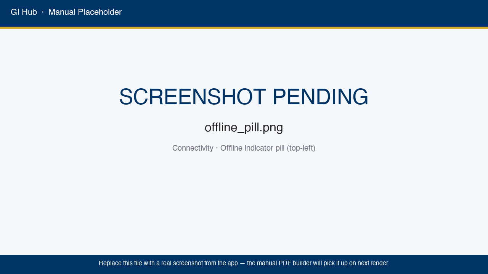
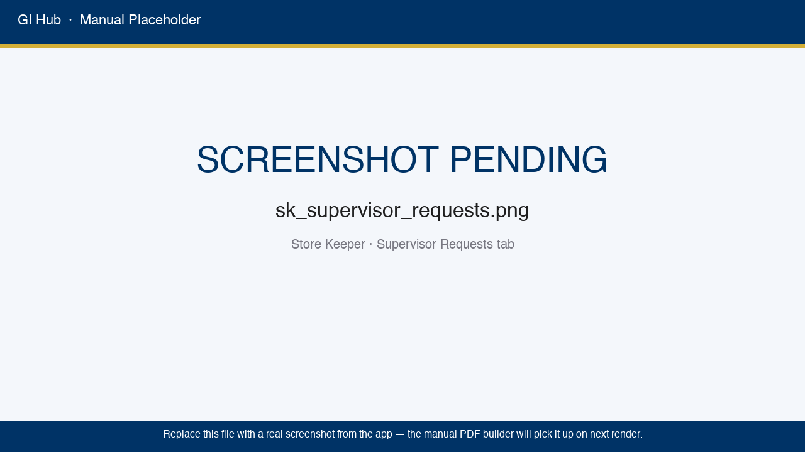
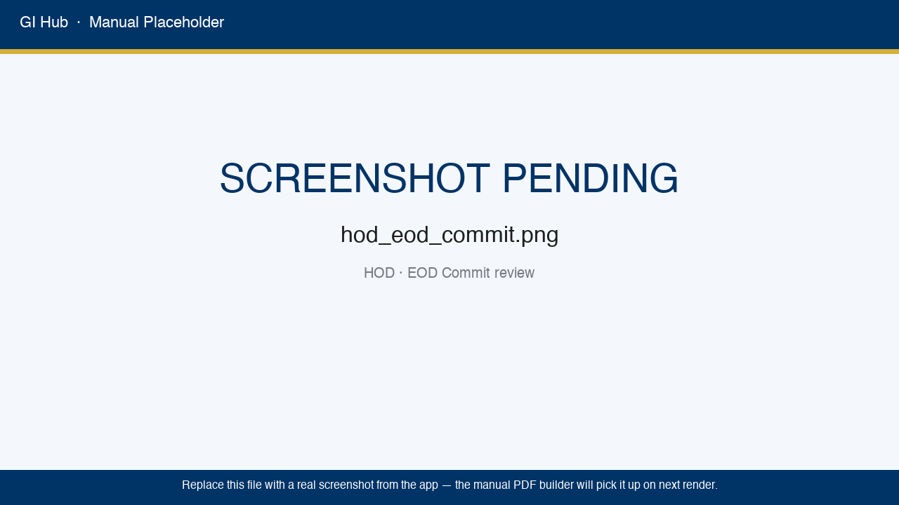
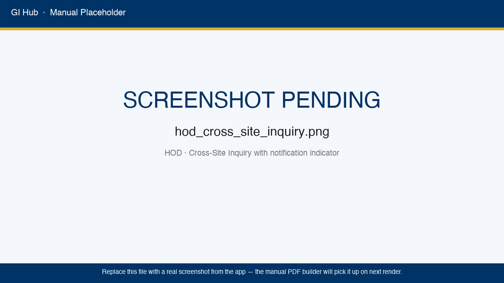
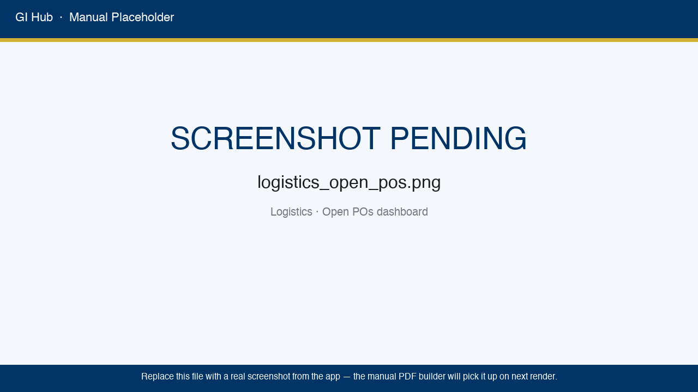
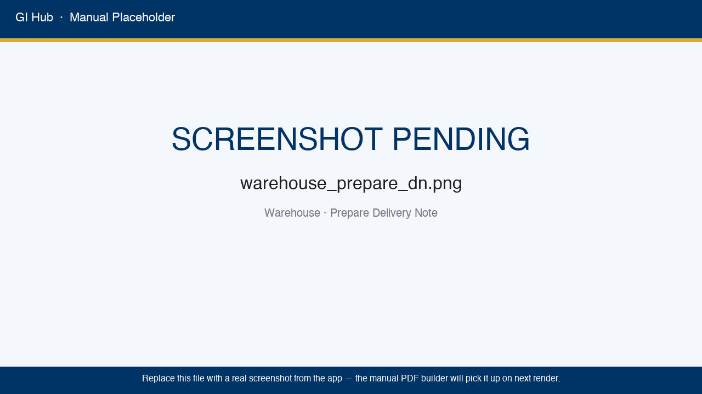
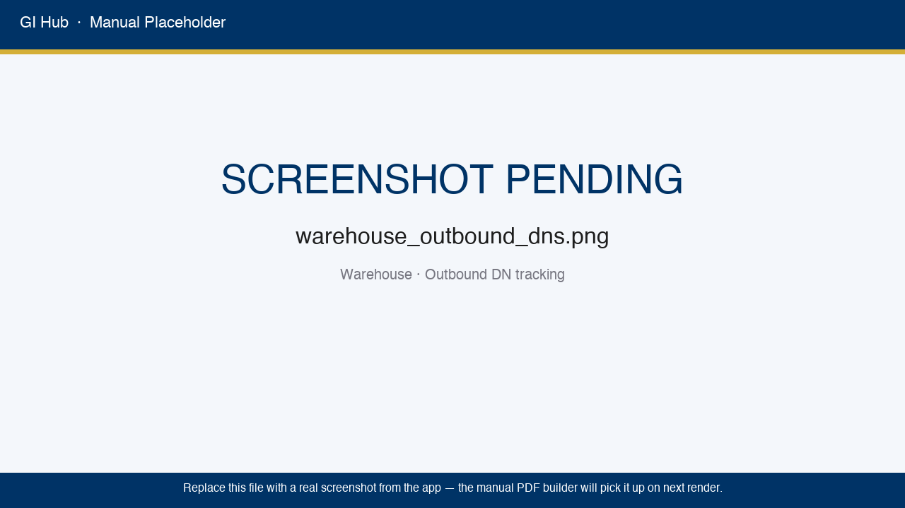

# General Industries Hub — Product Manual & User Catalogue

**Version 3.0** · Multi-Site Warehouse Inventory ERP + Procurement Chain
**Document Scope:** Complete operational reference for every role, page, tab, and element built into the system.
**Companion documents:** the Standard Operating Procedure, for day-to-day procedure organised by task rather than by screen; and the architecture reference, for whoever administers the server.

---

## Table of Contents

1. [Introduction & System Overview](#1-introduction--system-overview)
2. [Roles, Permissions & Page Access](#2-roles-permissions--page-access)
3. [Login, Sidebar & Common Elements](#3-login-sidebar--common-elements)
4. [Store Keeper Manual](#4-store-keeper-manual)
5. [Supervisor Manual](#5-supervisor-manual)
6. [HOD (Head of Department) Manual](#6-hod-head-of-department-manual)
7. [Admin Manual](#7-admin-manual)
8. [Reports Module — Detailed Reference (HOD / Admin / Supervisor)](#8-reports-module--detailed-reference)
9. [Automated Notifications — WhatsApp & Email & In-app Bell](#9-automated-notifications--whatsapp--email)
10. [Data Model & Concept Reference](#10-data-model--concept-reference)
11. [Status Codes, Reason Codes & Glossary](#11-status-codes-reason-codes--glossary)
12. [FAQ — Master Index by Role](#12-faq--master-index-by-role)
13. [2026-06 Feature Update — What Changed](#13-2026-06-feature-update--what-changed)
14. [Logistics Portal Manual (NEW in v3.0)](#14-logistics-portal-manual)
15. [Warehouse Portal Manual (NEW in v3.0)](#15-warehouse-portal-manual)
16. [Cross-Role Procurement Walk-through (NEW in v3.0)](#16-cross-role-procurement-walk-through)
17. [Operations & Hosting — the after-launch chapter](#17-operations--hosting--the-after-launch-chapter)
18. [Material Estimator (SME) Manual](#18-material-estimator-sme-manual)
19. [Man-Hours & Manpower Tracking Manual (NEW)](#19-man-hours--manpower-tracking-manual)
20. [Auditor (View-Only) Manual (NEW)](#20-auditor-view-only-manual)
21. [2026-08 Feature Update — What Changed](#21-2026-08-feature-update--what-changed) — including **§21.12 Phase 9**

---

# 1. Introduction & System Overview

## 1.1 What the system does

The General Industries (GI) Hub is a **multi-site warehouse inventory, procurement
and asset-management system**. It tracks every material movement — issues,
receipts, returns and corrections — through a two-stage approval process, and
gives you live stock figures, oldest-stock-first discipline on anything with an
expiry date, stock valuation, serialised tool and equipment tracking, and a
complete audit trail across every site you manage.

It runs in a web browser on a phone, a tablet or a desktop, and is also
available as an installable app for Windows, macOS and Android.

## 1.2 Core principles

| Principle | What it means |
|---|---|
| **Stock is calculated, never stored** | Stock on hand is always **received, minus consumed, minus returned**, recalculated from the movement history every time it is shown. No running total is kept anywhere, so no running total can drift out of step with reality. |
| **Two-stage approval** | Store Keepers stage entries → HOD reviews and commits at End-of-Day. Nothing touches the permanent ledger without HOD approval. |
| **Site isolation** | HODs and Supervisors see only their own site's stock. Only Admin sees all sites. Cross-site moves require formal request + approval. |
| **Audit-first** | Every consequential action is recorded with the user's name, the exact time and what changed. Even a deletion leaves a trace. |
| **Nothing to maintain** | Upgrades apply themselves when the system starts. Nobody has to run a database update by hand. |
| **Procurement chain** | One continuous workflow from a site's request through to material on the shelf. Logistics owns purchase orders; Warehouse owns physical receiving and delivery notes; the Site HOD approves what is being sent; the Store Keeper confirms it arrived. Every handover is recorded. |
| **RL/BL strict separation** | Rubber Lining and Brick Lining items NEVER share a PO line group, a DN, or a warehouse aggregation. The system rejects mixed-family DNs by design and tags each line with its family on insert. |
| **Warehouse-blind pricing** | Warehouse users can see materials and quantities but NEVER see Unit_Price, Total_Price, or any monetary header field on a PO. Three independent enforcement layers guarantee this. |

## 1.3 The transaction lifecycle (the heart of the system)

Every stock movement travels the same four steps. Nothing reaches the permanent
record until a Head of Department has approved it.

| Step | Who does it | What happens | Where it sits afterwards |
|---|---|---|---|
| 1 | Store Keeper | Enters the issue, receipt or return on the Entry Log | Staged, awaiting approval |
| 2 | Head of Department | Reviews it at End-of-Day and may edit the quantity, approve, or reject with a reason | Still staged until they decide |
| 3 | System | Commits the approved entry to the permanent stock record | Permanent — stock figures move now |
| 4 | System | Sends the WhatsApp and in-app notifications, and writes the audit entry | Permanent audit history |

Receipts, issues, returns and stock adjustments all follow this same shape. A
rejected entry never reaches step 3, so it never affects a stock figure — but
the rejection itself is still recorded, together with the reason.

### 1.3a The procurement chain

Buying material is a relay. Each role does one thing and hands over to the
next, and every handover appears in the receiving role's own queue.

| Step | Role | Action | Lands in |
|---|---|---|---|
| 1 | Site HOD | Submits a Purchase Request | Logistics — Incoming PRs |
| 2 | Logistics | Issues the Purchase Order | Site HOD is notified; Admin sees it for oversight |
| 3 | Logistics | Assigns the order (or individual lines) to a warehouse | Warehouse — Incoming Assignments |
| 4 | Warehouse | Acknowledges, then records the physical arrival from the vendor | Warehouse — Receiving |
| 5 | Warehouse | Prepares the Delivery Note | Logistics — DN approval queue |
| 6 | Logistics | Approves the delivery date | Site HOD — DN Approvals |
| 7 | Site HOD | Approves the contents | Store Keeper — Incoming DNs |
| 8 | Store Keeper | Confirms physical arrival on site | Permanent stock record; the delivery closes |

Three side-paths exist for when things do not go to plan:

- **Vendor returns** — any role can raise one. The order line reopens so the
  material can be re-delivered.
- **Reschedules** — Warehouse or Site HOD request a new date; Logistics decides.
- **Force-closure** — Logistics only, for an order that will never complete.
  Both Admin and the Site HOD are notified automatically.

A Delivery Note may never mix Rubber Lining and Brick Lining material. The
system refuses to create one, rather than warning about it.

## 1.4 Currency, dates, units

- **Currency:** Saudi Riyal (SAR) throughout.
- **Dates:** shown as `DD/MM/YYYY` or `DD MMM YYYY`.
- **Time zone:** the site's local time. Audit entries record the time to the second.
- **Units of measure:** each item carries its own unit — pieces, boxes, rolls,
  cans, metres, kilograms. **There is no automatic conversion:** an item is
  issued in the same unit it was received in. If a material arrives in boxes and
  is used in pieces, record the conversion in the item's description and keep one
  unit for both directions.

---

# 2. Roles, Permissions & Page Access

## 2.1 Role hierarchy

Roles are ranked, but the ranking is not a straight line — two pairs sit side by
side at the same level and differ only in what they are scoped to.

| Level | Role | Scoped to |
|:---:|---|---|
| 0 | Store Keeper | One site |
| 1 | Warehouse User | One warehouse |
| 1 | Supervisor | One site |
| 1 | Quality Control (QC) | One site **or** one warehouse — never both |
| 2 | Head of Department | One site |
| 2 | Head of Qualities (QC-HOD) | **All sites**, Surface Shield only, read + escalate |
| 3 | Logistics | All sites |
| 3 | Auditor | All sites, read-only |
| 4 | Admin | Everything |

**The Head of Qualities is level 2 but reads across every site, and that is not
a contradiction.** Cross-site reach normally comes from being level 3 — and
level 3 would also have handed this role every endpoint the rank admits, which
is most of the system. Instead it is level 2 with a *named* cross-site
exemption, and the rank grants it nothing at all: a level check refuses it
outright, so it reaches only what names the role explicitly. Its whole surface
is the Quality Oversight page. See §23.

**The QC role is scoped on one of two axes, and exactly one.** Material is
inspected either where it arrives (a warehouse) or where it lands (a site), and
which one depends on how your operation is organised. A QC account is therefore
created against a site or against a warehouse, and an account carrying neither —
or both — sees nothing at all rather than everything. That is deliberate: an
inspector with an unclear remit is a bigger problem than an inspector with none.

## 2.2 Page access matrix — which role can open which page

⚠️ **A higher rank does not open a lower role's workspace.** The Logistics
Portal, Warehouse Portal, Entry Log, HOD Portal, Supervisor Portal, Material
Estimator and Man-Hours pages are locked to their own role exactly — Logistics
outranks a Head of Department but still cannot open the HOD Portal. **Read that
caveat together with the table below it, not instead of it:** the caveat says a
page is locked to "its own role", and the table is what names that role. A
Head of Department **can** open Man-Hours and the Material Estimator; those two
are locked to *the HOD*, not away from them. Admin is the single exception and
reaches every workspace deliberately, for support.

| Page | Store Keeper | Warehouse User | Supervisor | QC | HOD | Logistics | QC-HOD | Auditor | Admin |
|------|:---:|:---:|:---:|:---:|:---:|:---:|:---:|:---:|:---:|
| 📦 Live Dashboard | ✅ | ✅ | ✅ | ❌ | ✅ | ✅ | ❌ | ✅ | ✅ |
| 📊 Stock | ✅ | ✅ | ✅ | ✅ | ✅ | ✅ | ❌ | ✅ | ✅ |
| 📍 Rack Locator | ✅ | ✅ | ❌ | ❌ | ❌ | ✅ | ❌ | ❌ | ✅ |
| 🎯 Assets | ✅ | ✅ | ✅ | ❌ | ✅ | ✅ | ❌ | ✅ | ✅ |
| 📝 Entry Log (all tabs) | ✅ | ❌ | ❌ | ❌ | ❌ | ❌ | ❌ | ❌ | ✅ (shadow) |
| 🛡️ Supervisor Portal | ❌ | ❌ | ✅ | ❌ | ❌ | ❌ | ❌ | ❌ | ✅ (shadow) |
| 📋 HOD Portal → Approvals | ❌ | ❌ | ❌ | ❌ | ✅ | ❌ | ❌ | ❌ | ✅ |
| 📋 HOD Portal → Executive Summary, Burn Rate, Documents, Low Stock, PRs, Cross-Site | ❌ | ❌ | ❌ | ❌ | ✅ | ❌ | ❌ | ✅ (read) | ✅ |
| 🧪 Lining Coverage | ❌ | ❌ | ❌ | ❌ | ✅ | ✅ | ❌ | ✅ | ✅ |
| 📥 Bulk Excel Import | ❌ | ❌ | ❌ | ❌ | ✅ | ❌ | ❌ | ❌ | ✅ |
| 🏷️ WBS & Work Types | ❌ | ❌ | ❌ | ❌ | ✅ | ❌ | ❌ | ❌ | ✅ |
| 🧪 Material Estimator (SME) | ❌ | ❌ | ❌ | ❌ | ✅ | ❌ | ❌ | ✅ (read) | ✅ |
| 🕒 Man-Hours / Manpower Tracking | ❌ | ❌ | ❌ | ❌ | ✅ | ❌ | ❌ | ❌ | ✅ |
| 🧾 Execution Entries | ✅ | ❌ | ✅ | ❌ | ✅ | ❌ | ❌ | ❌ | ✅ |
| 📊 Reports | ❌ | ❌ | ❌ | ❌ | ✅ | ✅ | ❌ | ✅ (read + download) | ✅ |
| 🚚 Logistics Portal (Procurement) | ❌ | ❌ | ❌ | ❌ | ❌ | ✅ | ❌ | ❌ | ✅ (shadow) |
| 🏭 Warehouse Portal (Receiving & DN) | ❌ | ✅ | ❌ | ❌ | ❌ | ✅ | ❌ | ❌ | ✅ (shadow) |
| 🧪 Quality → Inspections | ✅ (read) | ✅ (read) | ❌ | ✅ (decides) | ✅ (read) | ✅ (read) | ❌ | ✅ (read) | ✅ |
| 👥 Quality → QC Accounts | ❌ | ✅ | ❌ | ❌ | ✅ | ✅ | ❌ | ❌ | ✅ |
| 🛡️ Quality Oversight (§23) | ❌ | ❌ | ❌ | ❌ | ❌ | ❌ | ✅ | ❌ | ✅ |
| ⏳ Safety & People → PPE Forecast | ✅ | ❌ | ❌ | ❌ | ✅ | ✅ | ❌ | ❌ | ✅ |
| 🛡️ Safety & People → PPE Usable Time | ✅ | ❌ | ❌ | ❌ | ✅ | ❌ | ❌ | ❌ | ✅ |
| 👤 Safety & People → Employees | ✅ | ❌ | ✅ | ❌ | ✅ | ❌ | ❌ | ✅ | ✅ |
| 🗂️ Records (Inventory, ledgers, POs, PRs) | ❌ | ❌ | ❌ | ❌ | ❌ | ✅ | ❌ | ✅ (read) | ✅ |
| 💰 Valuation & 30-Day Burn (§24.3) | ❌ | ❌ | ❌ | ❌ | ✅ | ❌ | ❌ | ✅ | ✅ |
| 🛡️ Admin Portal | ❌ | ❌ | ❌ | ❌ | ❌ | ❌ | ❌ | ❌ | ✅ |
| 📄 Documents · 🔐 Security · 🎓 Training · 💬 Feedback | ✅ | ✅ | ✅ | ✅ | ✅ | ✅ | ✅ | ✅ | ✅ |

**Where each role lands after signing in:** Store Keeper → Entry Log → Issue
Stock · Warehouse User → Warehouse Portal · Supervisor → Supervisor Portal ·
QC → Quality → Inspections · HOD → HOD Portal → Approvals · Logistics →
Logistics Portal · Head of Qualities → Quality Oversight · Auditor →
Dashboard · Admin → Admin Portal → Console.

## 2.3 What each role can do

One list per role, in plain words. If you only want to know whether *your*
account can do a thing, read your own entry — each is complete on its own.

### 2.3.1 Store Keeper — what a Store Keeper can and cannot do

**Can:** open the Entry Log and post every stock movement — receive, issue,
return, adjust, count, returnable items, OCR import; see Incoming Deliveries
and Supervisor Requests; open the Dashboard, Stock, Rack Locator, Assets, PPE
Forecast, PPE Usable Time, Employees and Execution Entries; read quality
inspections; download documents.

**Cannot:** approve anything (an HOD approves what a Store Keeper stages);
open the HOD, Supervisor, Logistics or Warehouse portals; open Reports,
Records, the Material Estimator or Man-Hours; see another site's stock.

**Scope:** one site.

### 2.3.2 Supervisor — what a Supervisor can and cannot do

**Can:** raise material requests from the Supervisor Portal; post Execution
Entries; open the Dashboard, Stock, Assets and Employees.

**Cannot:** post stock movements (the Entry Log is the Store Keeper's);
approve requests; open Reports, Records, the Material Estimator, Man-Hours or
any other role's portal.

**Scope:** one site.

### 2.3.3 Quality Control (QC) — what an inspector can and cannot do

**Can:** decide inspections — pass, fail or hold — from Quality → Inspections;
open the Stock page to see what is waiting and what their decision released.

**Cannot:** open the Dashboard, post any stock movement, approve a purchase,
create QC accounts, or move themselves between sites (that is an Admin
decision). See §22.

**Scope:** exactly one site **or** exactly one warehouse — never both, never
neither.

### 2.3.4 Head of Department (HOD) — what an HOD can and cannot do

**Can — and this is the question people ask most:** open the **🕒 Man-Hours /
Manpower Tracking page** and the **🧪 Material Estimator**. Both are exact-locked
to the HOD (and Admin for support); the lock is what *admits* an HOD, not what
excludes them. That includes all thirteen Man-Hours tabs — roster, timesheets,
estimator, variance, scorecard, employee-wise, the four execution views, the
Manpower Planner and the SME Session Plan (§19).

Also: approve or reject everything the site stages (receipts, issues, returns,
adjustments, counts); create and submit Purchase Requisitions to Logistics;
raise Cross-Site Requests; run Reports; open the Executive Summary, Burn Rate,
Low Stock, Lining Coverage, Document Library and Bulk Excel Import; create QC
accounts for their site; post Execution Entries; open PPE Forecast, PPE Usable
Time and Employees.

**Cannot:** open the Logistics Portal, the Warehouse Portal, the Supervisor
Portal, the Entry Log, Quality Oversight or the Admin Portal; raise a Purchase
Order (Logistics does that); see another site's stock — though they may
*request* material from one.

**Scope:** one site.

### 2.3.5 Head of Qualities (QC-HOD) — what this role can and cannot do

**Can:** open the **Quality Oversight** page and nothing else. Across **every
site and warehouse**, but only for **Surface Shield** material: the controlled
category is filtered in the database on every query, so it is the boundary of
the role rather than a filter on a page. Seven views — overview, Surface
Shield purchase orders, the MTC register, where it is used, stagnation and
expiry, escalations, and the 90/60-day thresholds. They may **raise and close
escalations** and **retune those two thresholds**.

**Cannot:** approve or reject a quality inspection; move, issue or receive
stock; raise a PR or PO; open any other portal or page; see PPE, tools,
consumables or any other category. See §23.

**Scope:** all sites and all warehouses; Surface Shield only.

### 2.3.6 Logistics Coordinator — what Logistics can and cannot do

**Can:** run the whole procurement chain from the Logistics Portal — receive
submitted PRs, raise Purchase Orders, assign POs to warehouses, manage vendors,
track DN status; open Records (inventory, ledgers, POs, PRs), Reports, the
Warehouse Portal, Lining Coverage, the Rack Locator, PPE Forecast, and quality
inspections; create QC accounts.

**Cannot:** open the HOD Portal, the Entry Log, the Supervisor Portal, the
Material Estimator, Man-Hours or the Admin Portal — outranking a role does not
open its workspace.

**Scope:** all sites, no site lock.

### 2.3.7 Warehouse Operator — what a Warehouse User can and cannot do

**Can:** receive against POs, prepare and dispatch Delivery Notes from the
Warehouse Portal; open the Dashboard, Stock, Rack Locator and Assets; read
quality inspections; create QC accounts for their warehouse.

**Cannot:** open the Logistics Portal, the HOD Portal, the Entry Log, Reports,
Records, the Material Estimator or Man-Hours.

**Scope:** one warehouse.

### 2.3.8 Auditor — what a view-only Auditor can and cannot do

**Can:** read across every site — Dashboard, Stock, Assets, Records, Reports
(including downloads), Lining Coverage, the Material Estimator, the HOD
Portal's read-only views (Executive Summary, Burn Rate, Documents, Low Stock,
PRs, Cross-Site Requests), Employees and quality inspections.

**Cannot:** change anything at all, anywhere. Every write route is refused by
the server, not merely hidden. Not Man-Hours, not the Entry Log, not any
approval. See §20.

**Scope:** all sites, read-only.

### 2.3.9 Administrator — what an Admin can do

Everything, including every other role's workspace as a support shadow, plus
the Admin Portal: users, access requests, overdue actions, inventory master,
the audit log and the console.

## 2.4 Site scope by role

| Role | What they see |
|------|---|
| Store Keeper | Their own site only — they cannot view another site's stock. |
| Warehouse User | Their own warehouse only — POs assigned to them, DNs they've prepared, items received from vendors. Tied to `users.Warehouse_ID`. |
| Supervisor | Their own site only — Reports, Live Dashboard, Burn Rate all site-locked. |
| Quality Control (QC) | Whichever single place they were created against: one site, or one warehouse. A site QC sees inspections raised at that site and has no warehouse business at all; a warehouse QC is pinned to its warehouse exactly as a Warehouse User is. An account with no binding, or with both, sees an empty list — it never falls back to seeing everything. Moving a QC to another site is a request, decided by an Admin, not something the QC or their HOD can do alone. |
| HOD | Their own site only — but they can REQUEST material from other sites (Cross-Site tab) and submit PRs to Logistics. |
| Logistics | All sites globally for PRs and POs they manage. No site lock — they sit above the site boundary. |
| Head of Qualities | All sites globally, but ONLY Surface Shield material — every query on their page is filtered to the controlled category in the database, so the category is the boundary of the role rather than a filter on a page. They read, and they send escalations; they cannot approve an inspection, move stock, raise a PR or open any other portal. See §23. |
| Auditor | All sites globally, **read-only**. Sits at level 3 so it is not site-locked — an auditor pinned to one site could not audit. It can open the Dashboard, Stock, Records, Reports and Lining Coverage and change nothing anywhere. See §20. |
| Admin | All sites + all warehouses globally — has the "All Sites" filter on every multi-site view; warehouse picker in sidebar when shadowing the Warehouse Portal. |

## 2.5 Default seeded accounts

The first time the app starts, these accounts are created. **Change the passwords immediately.**

| Username | Password | Role |
|---|---|---|
| admin | admin2026 | Admin |
| hod | hod2026 | HOD |
| supervisor | super2026 | Supervisor |
| worker | floor2026 | Store Keeper |

**No default `logistics`, `warehouse_user`, `qc`, `qc_hod` or `auditor` accounts are seeded.** All of them are strictly admin-created — go to **Admin Portal → 👥 Users → Add user**. This is intentional: the procurement chain has commercial visibility (Logistics sees prices, Warehouse routes inventory) and seeded credentials would be a security liability. When you create a `warehouse_user`, set their `Warehouse_ID` to one of the values from **Admin Portal → 🗄️ Master DB Editor → `warehouses` table** — without it, the user lands on the Warehouse Portal and sees an error telling them to ask Admin.

---

# 3. Login, Sidebar & Common Elements

## 3.1 Login screen

**Elements:**

- **Username text box** — your assigned username (case-sensitive).
- **Password text box** — masked input. Min 8 characters policy enforced on creation.
- **🔑 Sign In button** — checks your credentials and takes you straight to the first page your role can open.
- **"Don't have an account? Request access" link** — opens a self-service registration form.

**Registration form elements:**

- **Username** — must be unique
- **Password / Confirm Password**
- **Role requested** — selectbox: Store Keeper / Supervisor / HOD (Admin role cannot be self-requested)
- **Site_ID** — which site to associate the account with
- **Phone Number** — used for WhatsApp alerts (format: `+966 5X XXX XXXX`)
- **Submit Request button** — creates a `pending_users` row + audit log + WhatsApp alert to all admins

Admin must approve via Admin Portal → Users tab before the user can log in.

## 3.2 Sidebar (visible after login)

Every page shares this sidebar. Reading top to bottom:

| Element | Purpose | Notes |
|---|---|---|
| **GI Hub bolt icon + version** | Branding | Shows `v3.0.0` |
| **Role card** | Your username + role badge | Color-coded: grey=Store Keeper, emerald=Warehouse, blue=Supervisor, indigo=HOD, sky=Logistics, gold=Admin |
| **🔔 Notifications bell (NEW v3.0)** | Unread count + inbox dialog | Red badge if N>0, primary button changes to `"Open inbox (N unread)"`. Modal shows recent procurement events with mark-read controls. See §3.6 |
| **"Navigate to:" radio** | Page picker | Only shows pages allowed by your role |
| **INVENTORY ALERTS section** | Compact stock-alert badge | Visible to Supervisor/HOD/Admin only. Shows count of items below minimum (or "All levels adequate" if clear) |
| **Bug/Feature reporting** | Opens a dialog | See §3.4 |
| **Theme toggle** | Dark / Light mode switch | Persists per-session |
| **🚪 Sign Out button** | Ends the session | Audit-logs the LOGOUT event |

## 3.3 Brand header (top of every page)

| Variant | Used by | Visual |
|---|---|---|
| Standard header | Live Dashboard, Entry Log | Gold subtitle accent + current date |
| HOD header | HOD Portal | Purple subtitle accent + current date |
| Admin header | Admin Portal | Gold accent + green/amber pulse chip ("All systems operational" / "Degraded") + current date |

## 3.4 Bug / Feature reporting dialog

Available to every user from the sidebar:

- **Type selectbox** — Bug Report / Feature Request
- **Page dropdown** — which page the issue/idea relates to (Live Dashboard, Entry Log, HOD Portal, Admin Portal, Reports, Other)
- **Description textarea** — up to 200 characters
- **Submit button** — writes to `bug_reports` table with user, timestamp, type, page, description. Visible to Admin in the Admin Portal Reports & Bugs tab for triage.

## 3.6 Notifications bell (NEW in v3.0)

Sits between the role card and the navigation radio. Every signed-in user sees their own personalised inbox of procurement-chain events.

**The button:**
- **No unread:** `"Open inbox"` (secondary button, no badge)
- **1+ unread:** `"Open inbox (N unread)"` (primary button, red pill badge with the count, capped at "99+")

**The inbox dialog (click the button):**
- **Only unread toggle** — on by default. Flip off to see your full history.
- **Per-notification card** — colour-coded left border by severity:
  - 🔴 Critical (red) — force-closures, T-0 delivery reminders
  - 🟡 Warning (amber) — T-1/T-2 reminders, reschedule requests
  - 🟢 Success (green) — DN approved / received successfully
  - 🔵 Info (blue) — PR submitted, PO issued, assignments
- **Per-row 👁 Mark read** — flips just that notification
- **Bulk ✅ Mark all as read** — flips every visible row (respecting the role + site + warehouse scope you'd see normally)

**What gets sent here:**
| Event you'll see | Triggered by |
|---|---|
| New PR from a site (Logistics only) | Site HOD pressing "🚚 Submit PR(s) to Logistics" |
| PO issued (Site HOD) | Logistics creating a PO against your site's PR |
| PO assigned to warehouse (Warehouse only) | Logistics routing a PO to your WH |
| DN awaiting your approval (HOD) | Logistics approving a DN delivery date |
| Incoming DN ready to receive (SK) | HOD approving DN content |
| Reschedule requested (Logistics) | Warehouse or HOD asking to push a date |
| Reschedule decided (requester) | Logistics approve/reject |
| Force-closure (Admin + originating HOD) | Logistics force-closing a PR/PO/line |
| Vendor return raised (Logistics) | Any role raising a return |
| Delivery reminder T-2 / T-1 / T-0 | The daily sweep job (see §9) |

The bell is tolerant — if the notification lookup fails, the badge silently shows 0 instead of breaking the sidebar. In-app notifications ALWAYS fire; the WhatsApp side is gated by the per-event WhatsApp toggles in the system settings (see §9).

## 3.5 Overdue Returnable banner (Store Keepers only)

When a Store Keeper logs in and there are overdue returnable items at their site, a red banner appears at the top of any page they navigate to:

> ⚠️ **OVERDUE ITEMS — Action Required:** N borrowed item(s) past expected return: **<item names>**. Go to the **Returnable Items** tab to follow up.

---

# 4. Store Keeper Manual

The Store Keeper is the warehouse-floor operator. They see only the **Entry Log** page and the sidebar shell.

## 4.1 Pages visible

- 📝 Entry Log
- 📍 Locator — find which rack a material is on, or scan a rack to see what
  should be on it (see §21.8)
- 🎯 Assets — the serialised tools and equipment register, with its own record
  and location history for each physical item (see §21.7)

The Locator and Assets pages are available to **every role**, Store Keeper
included. They are deliberately placed at the top of the menu rather than buried
inside a portal, because the people who need them are usually standing in the
warehouse holding a scanner.

## 4.2 Entry Log — Tab structure

The Entry Log has **four tabs**:

1. 📋 Consumption Log — record material issued out
2. 📦 Receipt Staging — record material arriving in
3. 🔄 Returnable Items — track tools/items temporarily issued
4. 🧮 Stock Count — submit physical-count reconciliations

---

## 4.3 Entry Log → 📋 Consumption Log

This is where every material consumed by site operations is recorded.

### 4.3.1 Top section: Bulk OCR upload (expander)

**📷 Upload Handwritten Consumption List (OCR)** — for when you have a handwritten list to bulk-stage instead of typing each row.

| Element | Purpose |
|---|---|
| **Input method radio** | Switch between "Image upload (vision AI)" and "Paste text" |
| **File uploader** | Upload PNG/JPG/JPEG/WEBP of handwritten list (vision model reads it) |
| **🔎 Extract rows from image button** | Triggers vision AI extraction → preview rows |
| **Paste text area** | Alternative — paste tab/comma/pipe-separated rows |
| **🔎 Parse pasted rows button** | Parse the textarea |
| **OCR Review grid** | Editable preview of extracted rows with ambiguous-match pickers |
| **Confirm All & Stage button** | Pushes all reviewed rows into `pending_issues` |

### 4.3.2 Mobile camera barcode/QR scanner (expander)

**📷 Barcode / QR Scanner** — opens the browser camera and reads SAP codes off labels.

| Element | Purpose |
|---|---|
| **Camera feed** | Live preview (requires camera permission) |
| **Manual SAP code entry text box** | Fallback if camera unavailable — also accepts pasted scanner output |
| **Detected code display** | Shows the last successfully scanned code in green |

When a code is scanned, the material selectbox auto-populates so you don't have to search.

### 4.3.3 ➕ Scan / Add New Item to Queue (main expander, expanded by default)

This is the workhorse panel. Reading top to bottom:

#### A. Recently-scanned ring buffer

| Element | Purpose |
|---|---|
| **⏱️ Recent: pills** | Up to 5 quick-tap buttons showing your last 5 items (SAP code + truncated description). Tapping one auto-fills the material selectbox. |

#### B. 1. Select Material

| Element | Purpose |
|---|---|
| **Search by SAP Code or Description selectbox** | Type-ahead search across the inventory master. Format: `[SAP_Code] Description`. |

When you pick a material, two cards appear automatically:

#### C. Item Snapshot card

A compact dark card showing:
- **SAP code** (gold monospace)
- **Material description** (bold)
- **3-stat strip:**
  - 🏠 SITE STOCK (color-coded: red=empty, amber=below min, green=ok)
  - 🔥 30-DAY BURN (units consumed last 30 days)
  - 📊 DAILY RATE
- **Inline 70×22 SVG sparkline** — last 30 days consumption trend
- **Status badge** bottom-right (OK / Low / Below Min / Empty)

#### D. FEFO panel (lot suggestion)

If lots exist for this item at your site:

| Element | Purpose |
|---|---|
| **🏷️ FEFO — First Expiry, First Out header** (amber) | Banner |
| **Per-lot row** | Lot number (monospace) · ×qty (dim) · "Exp <date>" (amber if <90d, red if expired) · **USE FIRST** badge on the first row |

The system will automatically attach the top-FEFO lot number to your consumption row when you submit.

#### E. 🔄 Pull from a different lot (FEFO override) — expander

Only renders when 2 or more open lots exist for this item at your site.

| Element | Purpose |
|---|---|
| **Lot to pull from instead selectbox** | Default: "Keep FEFO suggestion". Other options: all other open lots with expiry + remaining qty shown |
| **Reason for override text box (200 char max)** | Mandatory. Min 5 characters to activate the override |
| **Amber confirmation banner** | Appears once override is active: "FEFO override active: pulling from <chosen> instead of <suggested>" |

When activated:
- Your consumption row gets `Lot_Number = chosen` + `FEFO_Override = reason`
- Audit log entry `FEFO_OVERRIDE` is written with full context
- A WhatsApp alert is queued to the site HOD in real time

#### F. 2. Fill Entry Details (dynamic form)

The form shows a field for every detail an issue entry carries. Every required field is marked with an asterisk.

| Field | Type | Purpose |
|---|---|---|
| **Date** | Date picker (default: today) | When the consumption happened |
| **Quantity** | Number input (min 0.1) | How much you're issuing. Above this field is a **stock badge** showing current site stock; a red ⚠️ warning appears if you type more than available. |
| **Work_Type** | Selectbox (sourced from `system_settings.Work_Type`) | Classification: PM Work, Breakdown, Project, Shutdown, Inspection, etc. |
| **Issued_By** | Text (auto-filled with your username) | Who handed it over |
| **Issued_To** | Text (smart-defaults from your last entry) | Recipient personnel/department |
| **Tank_No** | Text | Equipment tag if applicable |
| **Serial_No** | Text (optional) | Item serial number if tracked |
| **PR_Number** | Text (smart-default) | Linked purchase request if applicable |
| **Remarks** | Text (optional) | Free-form notes |

**Hidden side-effects:**
- `Site_ID` is auto-set to your site
- `Lot_Number` is auto-set to FEFO top suggestion (or your override)
- `status` is set to `'draft'` until you submit

#### G. ⚠️ Override Expiry Warning (amber card with checkbox)

If the system detects a short-dated batch at your site for this item, it will **hard-block** the Add to Grid button until you check this box, confirming you've physically pulled from the expiring batch first.

#### H. Add to Grid ⬇️ button

Validates that:
- A material is selected
- No required fields are empty
- Quantity ≤ current site stock (over-issue guard)
- Expiry override is checked when needed

On success: the entry is added to your staging queue as a draft, a "✅ Added to staging queue" confirmation appears, and the page refreshes.

### 4.3.4 Staging Queue section

| Element | Purpose |
|---|---|
| **📋 Staging Queue header + count badge** | Shows how many draft rows you've accumulated |
| **Data editor table** | Edit any row inline before submitting |
| **💾 Save Draft Edits button** | Persists edits in-place (rows stay as drafts) |
| **📨 Submit Grid to HOD button** | Moves every draft row to awaiting-HOD-approval and queues a WhatsApp alert to the site HOD with the full item list |

After submission, the rows are locked from your view — they appear in HOD Portal → EOD Commit tab for approval.

---

## 4.4 Entry Log → 📦 Receipt Staging

For when materials arrive at your site.

### 4.4.1 📷 Upload Delivery Note (OCR) — expander

Identical lane structure to consumption OCR — upload an image of the delivery note OR paste text. Vision AI extracts rows for bulk staging.

### 4.4.2 ➕ Add Receipt to Queue — expander (expanded by default)

#### A. 1. Select Material

| Element | Purpose |
|---|---|
| **Search by SAP Code or Description selectbox** | Same type-ahead search as consumption |

When picked, a blue-tinted info card shows:
- 📋 **Mat Code**
- **UOM**

#### B. 2. Fill Receipt Details (dynamic form)

| Field | Type | Purpose |
|---|---|---|
| **Date** | Date picker (today) | Delivery date |
| **Quantity** | Number input | Units received |
| **Supplier** | Text (optional) | Vendor name |
| **Lot_Number** | Text (optional) | If blank + Expiry_Date is set, system auto-generates `LOT-YYYYMMDD-SAP` |
| **Expiry_Date** | Date picker (optional) | Lot expiry — when set, triggers lot master entry |
| **PR_Number** | Text (optional) | Link to an open Purchase Request |
| **Serial_No / Vehicle_No / DN_No / Pallet_No / Mob_From / Mob_To / Prepared_by / Driver_Name** | Text (optional) | Logistics tracking fields |
| **Remarks** | Text | Free notes |

#### C. Add to Receipt Queue ⬇️ button

Checks that a material is picked and every required field is filled, then adds the line to your receipt draft queue.

### 4.4.0 🚚 Incoming Delivery Notes from Warehouse (NEW in v3.0)

A new expander appears at the TOP of the Receipt Staging tab. It's only populated when the Warehouse has prepared a DN bound for your site AND your HOD has approved it. If empty, the expander shows: *"Nothing inbound. Logistics → HOD-approved DNs will appear here for you to confirm physical receipt."*

When DNs are inbound, each appears as its own container:

| Element | Purpose |
|---|---|
| **DN header line** | `DN <number> · PO <number> · Warehouse <id> · DN Date <date>` |
| **Line count + total qty** | At-a-glance: how many SKUs, how many units total |
| **View lines expander** | Material_Code, Description, Qty, UOM, Lot_Number, Expiry_Date, Remarks — read-only preview of every line |
| **✅ Mark as Received button** | Confirms physical receipt. One receipt is recorded per delivery line, each keeping its delivery note, warehouse and originating order so the trail is complete; the delivery closes and leaves your list. Stock figures update immediately — the Live Dashboard shows the new quantity the same minute. |

**When to use:**
- The Warehouse delivered the materials physically to your site
- HOD already approved the DN content (you'll see it appear without any action)
- You've inspected the goods and they match the DN qty + lot

**When NOT to use:**
- Direct deliveries from supplier to your site (those go through the existing Add Receipt to Queue → Submit to HOD flow below; the email-driven PR/PO path remains supported)
- Partial receipts (the current flow assumes you confirm the full DN qty — for partials, raise a Vendor Return on the diff after confirming and ask your HOD)

This is the FINAL step in the procurement chain. After you click Mark as Received:
- Logistics sees a "DN received at site" entry in their notifications
- Warehouse sees the same
- The PO and PR move toward closure if this DN completes the order

### 4.4.3 Receipt Draft Queue section

| Element | Purpose |
|---|---|
| **📋 Receipt Draft Queue header + count badge** | Number of drafts you've accumulated |
| **Data editor table** | Inline edit before submit |
| **💾 Save Draft Edits button** | Persists |
| **📨 Submit to HOD for Approval button** | Moves your drafts to awaiting-HOD-approval and sends the HOD a WhatsApp alert with the item list |

---

## 4.5 Entry Log → 🔄 Returnable Items

For tools, gauges, fittings temporarily handed to personnel — items that should come back.

### 4.5.0 📷 Smart Scan workflow (new — 2026-06)

A two-step camera flow sits at the top of the tab. Use it to skip typing borrower + tool details by hand; the existing manual form still works exactly as before and stays visible underneath.

**Step 1 — Scan the employee badge**

1. Click into the **📷 Smart Scan (Beta)** expander.
2. Hold the borrower's printed badge in front of the camera. (Badges are generated in **Admin Portal → 👷 Employees → Roster + Badges** — see §7.6.)
3. The system decodes the QR (which carries only the ID_Number, no PII), looks it up in the Employees master, and shows:
   - ✅ **Green success card** — `EMP-1042 · Ahmed Ali (+9665…)` — the borrower's name + phone are now staged.
   - 🚫 **Red error card** — Badge couldn't be read OR the employee is inactive/suspended. Re-snap or use the manual form.

**Step 2 — Scan the tool**

4. After a successful badge scan, a second camera input appears. Point it at the tool.
5. The active image-recognition model (managed in **Admin Portal → 🛠️ Tool Catalogue**, which is also where a new model is trained and promoted) classifies the image. Three outcomes:
   - **Confidence ≥ 0.75** → ✅ Auto-fill. The detected tool name + borrower details flow into the manual form below; review and click "Issue Item 📤".
   - **Confidence 0.30–0.74** → ⚠️ A "Top candidates" radio appears. Pick the right one and click "Use this tool". The form pre-fills.
   - **No active CV model** OR **confidence < 0.30** → 🤖 An info banner explains the fallback. Borrower fields stay pre-filled; type the tool name into the manual form yourself.

**Click "🔄 Start over (clear scan)"** any time to reset and scan a different borrower.

**What happens if the AI is wrong**

You're never locked in. Every Smart Scan write-through goes into the *manual* form's fields — Name, Phone, Material name. Edit anything that's wrong before clicking "Issue Item 📤". The submitted record records that the camera made the identification, and how confident it was, so admin reports can later show adoption and accuracy. Manually-corrected loans are not tagged as camera-identified — that's intentional, see §10 for the data model details.

**Automatic WhatsApp reminders (Phase 6E)**

Once a loan is in the system, the WhatsApp worker fires four reminders automatically. The cadence and recipient list is:

| Offset | Severity | In-app | WhatsApp |
|---|---|---|---|
| **T−2h** (2 hours before due) | info | Site SK badge | Borrower |
| **T−0** (due now) | warning | Site SK badge | Borrower |
| **T+2h** (2 hours overdue) | warning | Site SK badge | Borrower + every Site SK |
| **T+24h** (24 hours overdue) | critical | Site SK + Supervisor badges | Borrower + every Site SK + every Site Supervisor |

The borrower's phone is taken first from the Employees master (for badge-scanned loans) and falls back to the phone number typed on the loan itself for older or manually-entered loans. The system remembers which reminders it has already sent for each loan, so restarting the reminder service mid-day never causes double-fires. Admins can mute any of the four events with the per-event WhatsApp toggles if a particular escalation gets too noisy.

### 4.5.1 ➕ Issue a Returnable Item — expander (expanded by default)

| Field | Type | Purpose |
|---|---|---|
| **Material / Tool Name** | Text | What you're handing out |
| **UOM** | Text (e.g., Pcs, Set) | Unit |
| **Quantity** | Number (min 0.1) | How many |
| **Borrower Name** | Text | Person taking custody |
| **Borrower WhatsApp Number** | Text (optional, `+966 ...`) | For overdue alerts |
| **Expected Return Date** | Date (default: tomorrow) | When you expect it back |
| **Expected Return Time** | Selectbox: `04:15 PM`, `06:15 PM`, `Custom Time...` | Time-of-day expectation |
| **Issue Item 📤 button** | Validates name+borrower, writes to `returnable_items` |

### 4.5.2 Currently Borrowed Items section

Shows all borrowed (not yet returned) items at your site.

- **Overdue red banner** — when one or more items are past their expected return time
- **Borrowed items table (styled HTML)** with columns: ID, Material, UOM, Qty, Borrower, Phone, Given Time, Expected Return, **Status** (pill: green "On Loan" / red "⚠️ Overdue")
- **Mark as Returned section:**
  - **Selectbox** of borrowed items
  - **✅ Mark as Returned button** — marks the loan returned, refreshes the figures, and confirms on screen

---

## 4.6 Entry Log → 🧮 Stock Count

For reconciling physical shelf count with system stock when they don't match (damage, expiry disposal, miscount, found-extra).

### 4.6.1 1. Select Material to Count

| Element | Purpose |
|---|---|
| **Search by SAP Code or Description selectbox** | Pick the material to reconcile |
| **Help caption** | Explains when to use this tab |

### 4.6.2 2. Enter Count Details (only renders after picking a material)

#### Left column

| Element | Purpose |
|---|---|
| **📊 System Qty card** | Read-only dashboard showing current stock at your site (auto-fetched) |
| **🔢 Counted Qty input** | What you actually count on the shelf right now (defaults to system qty) |
| **Variance preview banner** | Color-coded: green "➕ Found N extra" or red "➖ Short by N" or grey "No variance" |

#### Right column

| Element | Purpose |
|---|---|
| **🏷️ Reason Code selectbox** | 9 options. Default depends on variance direction. |
| **📝 Notes textarea (300 char max)** | Free explanation: "found behind shelf 3", "damaged in transit", etc. |

**Reason codes:**

| Code | Label |
|---|---|
| `cycle_count` | 🔄 Cycle count correction |
| `damaged` | 🔨 Damaged / unusable |
| `expired_disposal` | 🗑️ Expired — disposed |
| `miscount_in` | ➕ Miscount — found extra |
| `miscount_out` | ➖ Miscount — short |
| `lost` | ❓ Lost / unaccounted |
| `theft` | 🚨 Suspected theft |
| `return_to_supplier` | ↩️ Returned to supplier |
| `other` | ❔ Other (see notes) |

### 4.6.3 Submit section

| Element | Purpose |
|---|---|
| **Amber warning banner** | "Submitting this sends the count to your HOD for approval. No stock changes until they approve." |
| **📤 Submit Count for HOD Approval button** | Disabled while the variance is 0. On success the count is filed as a stock adjustment awaiting HOD approval, a WhatsApp with the count details goes to the site HOD, and the submission is audit-logged. |

### 4.6.4 Recent Adjustments at This Site (history)

Read-only table showing: ID, SAP Code, Material Name, Variance, Reason, Status, Submitted By, Submitted At.

---

## 4.7 Store Keeper — Use Cases

### Use Case 1: Issue 10 Pipe Gaskets to PM Work

1. Log in → Entry Log → 📋 Consumption Log tab
2. Open **➕ Scan / Add New Item to Queue**
3. Search "Pipe Gasket" → pick from dropdown
4. Read the stock badge (e.g., "🟢 156 Pcs"), confirm FEFO lot suggestion
5. Quantity: **10**
6. Work_Type: **PM Work**
7. Issued_To: name of recipient
8. Tank_No / PR_Number: as applicable
9. Click **Add to Grid ⬇️**
10. Repeat for any other items in this batch
11. Review the Staging Queue table → edit if needed → click **📨 Submit Grid to HOD**

The row(s) are now in HOD's EOD queue. Stock won't decrease until HOD commits EOD.

### Use Case 2: Receive a delivery of 200 units with expiry date

1. Entry Log → 📦 Receipt Staging tab
2. Open **➕ Add Receipt to Queue**
3. Pick material, fill Quantity (200), Supplier, **Expiry_Date** (e.g., 2027-06-11)
4. Lot_Number: leave blank (system will generate `LOT-20260611-<SAP>`) OR type the supplier's lot ID
5. PR_Number: link if applicable
6. Click **Add to Receipt Queue ⬇️**
7. Click **📨 Submit to HOD for Approval** when done staging

### Use Case 3: Found 5 extra units of an item (physical count > system)

1. Entry Log → 🧮 Stock Count tab
2. Pick the item from the dropdown
3. Read the System Qty card (e.g., "95")
4. Counted Qty: **100**
5. The variance banner turns green: "➕ Found 5 extra"
6. Reason: **➕ Miscount — found extra**
7. Notes: e.g., "Found in box behind shelf 3"
8. Click **📤 Submit Count for HOD Approval**

HOD will approve in HOD Portal → 🧮 Adjustments. After approval, your live stock matches reality and a synthetic receipt row of +5 is posted to the ledger.

### Use Case 4: Issue a tool to a borrower

1. Entry Log → 🔄 Returnable Items tab
2. ➕ Issue a Returnable Item
3. Material: **Torque Wrench 1/2"**, UOM: **Pcs**, Qty: **1**
4. Borrower Name, WhatsApp Number, Expected Return: today 06:15 PM
5. Click **Issue Item 📤**

If the item is not returned by 06:15 PM, the borrower (and you) get a WhatsApp alert.

### Use Case 5: FEFO override (the right bin is blocked)

1. Entry Log → Consumption Log → pick material with 2+ open lots
2. Scroll to FEFO panel — note the suggested lot (earliest expiry)
3. Open **🔄 Pull from a different lot** expander
4. Pick a different lot from the dropdown
5. Type a reason ≥ 5 chars (e.g., "FEFO bin blocked by pallet, clearing 1700")
6. Amber confirmation banner appears
7. Fill quantity + other fields
8. Click **Add to Grid ⬇️**

Your HOD gets a real-time WhatsApp alert documenting the override.

## 4.8 Store Keeper — FAQ

**Q: I can't see Live Dashboard, HOD Portal, or Reports. Did I lose access?**
A: No — Store Keepers only have access to Entry Log by design. If you need to view stock, ask your Supervisor or HOD.

**Q: I submitted to HOD by mistake. Can I cancel?**
A: Not directly. Contact your HOD — they can reject the row in their EOD Commit review.

**Q: The "Add to Grid" button is disabled or the form rejects my entry.**
A: Check three things: (a) is quantity > current stock? (b) is the expiry override needed but unchecked? (c) are all required `*` fields filled?

**Q: I tried to issue 20 but the system says only 15 available.**
A: Believe the system. Either physically recount, or if there is genuinely 20 and the system disagrees, use the 🧮 Stock Count tab to log a +5 adjustment.

**Q: I don't have a barcode scanner. How do I quick-find items?**
A: Type a partial SAP code or description in the selectbox — it has type-ahead search. Or use the Recently-scanned pills if you've used the item recently.

**Q: WhatsApp alerts aren't reaching the HOD when I submit.**
A: HOD's phone number must be set in their user profile. Tell the HOD to update it via Admin (or check with Admin directly).

**Q: My borrowed item is overdue but I haven't received an alert.**
A: WhatsApp alerts are sent by a background service. Ask your Admin to confirm it is running — queued messages send as soon as it is back, so nothing is lost in the meantime.

**Q: I uploaded an OCR image and it extracted wrong items.**
A: The OCR review grid lets you fix every row before staging. Pick the correct material from the suggested-matches dropdown, or type it manually.

**Q: How do I see my recent activity?**
A: Submitted/approved items don't show on your screen. Ask HOD or Admin to filter the audit log by your username.

---

## 4.9 Printing a consumption form

**Where:** Execution Entries (`/execution`) → **Print a consumption form**.
Store Keeper, Supervisor and HOD.

The field fills these in by hand and photographs them; the app reads the photo.
Everything about the form's design exists to make that reading reliable.

### 4.9.1 What is already printed, and what you write

The form prints **every material for the system** — name, component, SAP code
and unit — so **nobody ever writes a material name by hand**. Reading
handwritten names is the one thing the vision model is genuinely bad at, and a
name that is already printed cannot be misread.

You write three things at the top — **Date**, **Equipment / Tank No.** and
**Area done (m²)** — then, on **every row**, the **quantity used** and the
**lot / batch number** for that material, and your name at the bottom.

⚠️ **The lot is per row, not per form.** One system draws several materials and
each one arrives from a different batch, with its own certificate. Writing a
single batch number at the top would be right about one material and wrong
about the rest — and the certificate check at approval looks at the lot for
*each* material, so a batch on the wrong line clears a check for material that
was never used.

⚠️ **The four small black squares in the corners are not decoration.** They are
what lets the app square up your photograph and show you the right row. Keep
them in frame.

⚠️ **The date box is blank on purpose.** Forms are printed in batches and used
today or tomorrow, so a pre-printed date would be wrong on half of them — and
the date decides which day's progress your work lands on. The small date in the
footer is when the *blank* was printed: it tells you if you are holding old
paper.

⚠️ **There are no spare rows.** Only materials in the system's recipe can be
recorded. Write **0** for anything you did not use; never add a material by
hand, because there is no box for it and the app cannot match it.

### 4.9.2 ⚠️ Rows that look almost identical

Some systems list the same product several times as separate components. LSC8
prints "Cumicrete PU MF 300 - 3mm" four times — as **Comp-A**, **Comp-B**,
**Comp-C** and **Comp-D**, each with its own SAP code.

They are different materials with different quantities. Check the component
letter, not just the product name.

### 4.9.3 The QR code

The square in the top-right holds the site, the system, the sub-activity, this
sheet's own number, **and which page of the form it is**. It is read by a
scanner, not by the AI, which is why none of those things can be got wrong.

⚠️ **Photograph the whole page, including the QR.** A photo that crops it out
cannot be matched to anything, and you will be asked to retake it.

⚠️ **A long form has more than one page, and each page has its own code.**
Photograph and upload **every** page. Upload them in any order — they all join
the same entry. Until they are all in, the missing pages' materials read **0**,
and the app tells you which page it is still waiting for.

Do not submit an entry that is still waiting for a page. Those materials would
be recorded as unused, and the figures would look entirely reasonable.

### 4.9.4 ⚠️ Every download is a new sheet

Downloading the form twice gives you **two different sheets with two different
numbers** — not two copies of one form.

That is deliberate. The app has to be able to tell "you printed a second sheet"
from "you photographed the same sheet twice", and it does that by the number on
the paper. If you print a spare, it is a genuinely separate form.

An HOD can see every form printed and not yet filed, and who printed it.

### 4.9.5 Printing several at once — and ⚠️ never photocopying one

Set **Forms** to the number you need and press Download. You get **one PDF
containing that many forms**, each with its **own** number and its **own** QR
code, and each printed **SHEET 3 OF 50** at the top so you can sort the pile
and see if one is missing.

⚠️ **Never photocopy a form.** This is the most important sentence on this
page. A photocopy repeats the QR code, and the QR code is how the app knows
*which sheet* it is looking at. Two sheets carrying one code cannot be told
apart: the second one you send in will either be refused as already filed, or
worse, filed against the first one's tank. If you need fifty, print fifty here.

⚠️ **The number is FORMS, not pieces of paper.** A system with more than 18
materials prints as several pages — that is still **one** form, with **one** QR
across its pages. The line under the box does the arithmetic for you and
changes as you type:

> 50 forms × 2 pages = 100 A4 sheets

Check that line before you send it to a printer.

You can print up to **200** forms in one go. Above that, print in runs: a
download that fails halfway leaves the app holding records for paper that never
reached you, and those show as outstanding sheets until somebody clears them.

### 4.9.6 If the materials change after you print

If someone edits the system's recipe after your form was printed — adds a
material, reorders them, changes a code — the app will **refuse the photo** and
ask for a fresh form.

It is not being awkward. The app matches your handwriting to materials by row
*position*, so a sheet printed against different rows would file your quantities
against the wrong materials — and the numbers would look perfectly reasonable.
Changing a material's **rate** is fine and does not invalidate printed paper.

## 4.9a Surface Shield material issued from the store — where its area is recorded

*Phase 13.*

**The gap this closes.** When a Surface Shield material is issued from the
general Inventory, the ledger records that a drum left the shelf. It does not
record **what that drum covered** — which system, which vessel, how many square
metres. So the estimator could not see it and nobody could compare it against
the recipe.

Every such issue now appears in a queue until somebody says what it was for.

### 4.9a.1 What the Store Keeper does

Nothing new, and one optional extra.

You already pick the **Lining System Code** before issuing a Surface Shields
material — that has not changed. Beside it there is now an **Equipment / tank**
box, filtered to the equipment that system actually applies to.

⚠️ **Leave it blank if you do not know.** You are handing over a drum; where it
ends up is often decided in the plant. A guess here becomes a wrong attribution
later, and the queue will simply ask. A blank is not a failure.

⚠️ **You are never asked for the area.** You cannot know it — the drum leaves
before it is applied. That question belongs to the person who applied it.

### 4.9a.2 What the field does — the queue

**Where:** Execution Entries → the Surface Shield consumption queue. Store
Keeper, Supervisor and HOD.

The queue lists every Surface Shield consumption with no area recorded against
it, **oldest first**. For each one you supply three things:

| | |
|---|---|
| **System Code** | Pre-selected when the store keeper already chose one. Otherwise pick from the list — it offers only the systems whose recipe actually contains that material. |
| **Equipment / tank** | Filtered to the equipment carrying the system code you picked. |
| **Area covered (m²)** | What that material actually covered. |

⚠️ **The system code is asked, never guessed.** If the app cannot tell which
system a draw was for, it offers you the candidates rather than choosing one.
A guessed code compares the draw against the **wrong** benchmark — and a wrong
benchmark looks finished, where a blank looks unfinished. Unfinished is safer.

⚠️ **The queue reaches back.** It is not an inbox that starts today: it holds
**every** unattributed Surface Shield consumption, including issues from months
ago and rows brought in by an Excel import. Expect it to be long the first time
you open it, and work oldest first.

⚠️ **Consumption filed from a printed form is NOT in this queue, and must not
be.** A photographed consumption form already recorded its system, its
equipment and its area, and the area has already been credited. Adding it here
would count the same drum against the same vessel twice.

### 4.9a.3 What happens to the numbers

Nothing is deducted. The stock left the shelf when it was issued; this records
**what it was for**, not that it went.

Each submission is compared against the recipe: `rate × area` is what the
system expected, and the difference is the variance. Every row then goes to the
**HOD** — see §4.9a.4.

> ⚠️ **Your estimator figures do not move.** Readiness, completion, achievable
> area and the buy list are calculated from the Material Estimator's own
> workbook figures and are untouched by any of this. What you gain is
> visibility of what was actually drawn, beside the plan.

### 4.9a.4 ⚠️ Every row goes to the HOD — the ±10% band decides the order

**Every** Surface Shield consumption is reviewed, whatever the variance. There
is no band inside which a row files itself.

What the **±10%** tolerance does is set **priority**. A draw more than 10% above
or below the benchmark is flagged **High Priority** and sits at the top of the
HOD's queue; the rest follow, oldest first.

⚠️ **A variance that cannot be calculated is High Priority too.** If the recipe
has no line for that material in that system, there is no benchmark to compare
against — and "we cannot work this out" is exactly the thing worth looking at.
It is not treated as zero.

An admin can change the band. Doing so re-orders the queue and **changes
nothing about rows already filed** — each one keeps the reading it was measured
against at the time.

## 4.10 Filing a consumption form

**Where:** Execution Entries (`/execution`).

This replaced the old store-keeper-first flow on 27 August 2026. The record now
starts with the paper you filled in.

    You fill the form  →  Store Keeper verifies  →  HOD approves

### 4.10.1 Step 1 — photograph it

Upload the photo under **Upload a filled form**. JPG, PNG, HEIC or PDF.

⚠️ **Photograph the whole page, including the QR code.** The QR is what tells the
app which form this is — a photo without it cannot be matched to anything and
will be refused.

⚠️ **Only forms printed from "Print a consumption form" belong here.** A
handwritten consumables sheet or a supplier's delivery note has no QR code and
never will. Those are read in **Entry → OCR Import** instead — and if you upload
one here by mistake, the refusal will say so and link you to the right page.

**Reading a page takes minutes, not seconds, and the card now tells you how
many.** You will see a live counter and the usual time for that kind of page:
roughly **6½ minutes for a printed consumption form**, 3½ for a 30-row
handwritten sheet, 1½ for a delivery note. A dense or badly-lit page takes
longer and the card says so rather than pretending to be nearly finished.

You can leave the page; the read carries on and the result will be waiting.

> ⚠️ **If it says "This read was interrupted", it means the server process doing
> the reading stopped** — not that your page was bad. Waiting longer will not
> help; press **Read it again**. This is the honest version of a problem that
> used to look like the page simply never finishing: before 2026-09-02 the card
> claimed "usually takes under a minute" and then showed a spinner with no
> elapsed time, so a perfectly good six-minute read and a dead worker looked
> identical, and people quite reasonably gave up on both.

### 4.10.2 Step 2 — check every figure

The app opens a draft with what it read. Beside each row is **the crop of your
photograph it read that number from**, so you are checking against the paper and
not against memory.

⚠️ **Where the handwriting was not certain, the box is left EMPTY rather than
guessed.** Those rows are listed at the top and marked in gold with what was
actually written. Type the real number in. A guessed figure would post straight
to stock with nobody questioning it.

Then correct anything else, pick the equipment from the list if it was not read,
and give the two reasons — material and manpower — which are required on every
entry, even one with no variance at all.

### 4.10.3 Step 3 — the store keeper verifies

It goes to the **store keeper**, not to the HOD. They check your quantities
against what actually left the shelf and may change them — every change costs a
written reason, shows to the HOD in **red**, and you are told about it before
the entry is approved rather than after.

Blasting and buffing skip this step: there is no material to verify.

### 4.10.4 Step 4 — the HOD approves

⚠️ **Approval is what deducts the material and posts the area.** Nothing before
it moves a quantity, which is what makes correcting a figure safe at every
earlier step.

The HOD sees the whole chain on each row:

| Colour | What it is |
| --- | --- |
| grey | what the camera read |
| amber | what you filed |
| red | what the store keeper corrected |
| purple | what the HOD settled on |

A row everybody agreed on shows one number and the word "agreed". The colours
only appear where something actually changed — which is what makes a red one
worth looking at.

⚠️ **Rejection is final.** A rejected entry cannot be revived; raise a new one
from a fresh form.

### 4.10.5 ⚠️ Store keepers: stop raising a separate issue

The execution entry is now the **only** way lining material leaves the ledger.
Raising a material issue for the same drum as well would deduct it twice — and
nothing would show it until somebody counted the shelf.

### 4.10.6 ⚠️ When a certificate is missing

If a Surface Shield material has no test certificate or no quality clearance,
the HOD's screen says so **before** they press approve, naming the lines.

The material has already been applied by then, so this is a paperwork gap rather
than something anyone can prevent. The HOD may approve anyway — the button says
**"Approve WITHOUT clearance"** and will not work until a reason is typed — and
the **Head of Qualities is notified every time**.

Often the simpler fix is a corrected lot number: the check runs *after* the
HOD's edits, so fixing the batch can clear it with no override at all.

### 4.10.7 Things the app will refuse, and why

**The same sheet twice.** Each printed form is filed once. Two people
photographing one form, or one person retrying on a bad signal, produce
different files of identical paper — the number on the sheet is the only thing
that can tell.

**A form printed before the materials changed.** If someone edits the system's
recipe after your sheet was printed, the rows no longer line up. The app matches
your handwriting to materials by row *position*, so your quantities would be
filed against the wrong materials and would look entirely reasonable. Print a
fresh form and copy the figures across.

**A form printed for another site.**

**A photo it could not read.** It says so rather than creating a blank entry — a
blank entry that gets submitted is a consumption of zero, recorded silently.

# 5. Supervisor Manual

The Supervisor monitors a single site's stock, generates reports, and provides oversight. They cannot approve transactions (that's HOD).

## 5.1 Pages visible

- 📦 Live Dashboard
- 🛡️ Supervisor Portal — Request Material for workers
- 📝 Entry Log (same interface as Store Keeper — see §4)

## 5.2 Live Dashboard

The Live Dashboard is the at-a-glance view of every catalogue item with current stock, value, and status.

### 5.2.1 Brand header

Reads "Live Warehouse Stock Dashboard" — gold subtitle + today's date.

### 5.2.2 Hero metric strip (4 cards)

| Card | Source | Tone logic |
|---|---|---|
| **Catalogue items** | Count of rows in `inventory` | Neutral |
| **Total stock value** | Sum of Current_Stock × Unit_Cost, all sites — formatted as `SAR 1,234` / `SAR 1.2M` | Neutral. Delta: "standard cost · all sites" or "set Unit_Cost in Admin → DB Editor" if 0 |
| **Below minimum** | Count | Green=0, Amber<10, Red>=10. Delta: "all healthy" or "needs reorder" |
| **Expiring / expired** | Count | Green=0, Amber<10, Red>=10. Delta: "shelf-life clear" or "review HOD Portal" |

### 5.2.3 🤖 Ask in plain English (AI search) — expander (when the local AI assistant is switched on)

Available when the local AI service is installed and running on the server:

| Element | Purpose |
|---|---|
| **Your question text input** | Ask in ordinary words, e.g., "items below minimum at site B" |
| **Search button** | The local AI turns your question into a database lookup and runs it in read-only mode |
| **Clear button** | Resets the panel |
| **Result table** | Returned rows |
| **Show the lookup the AI built** | Reveals the read-only query the assistant produced, so you can check it before trusting the answer. It can only read — it is never allowed to change anything. |

If the local AI service is not running, an amber card explains how an Admin starts it.

### 5.2.4 Burn alert banner

Appears at the top of the table area when there are items burning to zero within the configured window (default 7 days). Color-coded amber/red.

### 5.2.5 Main inventory grid

| Column | Source | Notes |
|---|---|---|
| SAP_Code | `inventory.SAP_Code` | Primary key |
| Equipment_Description | `inventory.Equipment_Description` | Material name |
| UOM | `inventory.UOM` | Unit of measure |
| Total_Returned | Computed | Sum from `returns` table |
| Current_Stock | Computed identity math | `Received - Consumed - Returned` |
| Minimum_Qty | `inventory.Minimum_Qty` | Reorder threshold |
| Unit_Cost | `inventory.Unit_Cost` | Set via Admin → DB Editor |
| Stock_Value | Computed | `Current_Stock × Unit_Cost`, rounded 2 dp |
| **Status** | Computed badge | OK / Low / Below Min / Empty, shown as a colour-coded pill |

You can sort by any column — sorting by `Stock_Value` shows your biggest SAR exposure first.

### 5.2.6 Expanders below the grid

| Expander | Content |
|---|---|
| **📉 Stock vs Minimum Threshold** | Horizontal bar chart, sorted by criticality. Each bar = item; gold line markers = minimum threshold. Color: red=empty, amber=below min, orange=close, green=ok. Capped at 20 items. |
| **🔥 Burn Rate Forecast (30-Day)** | Plotly chart with daily-burn-rate bars + vertical line at the 30-day alert threshold. Colors: red <10 days, amber <30, green >30. |
| **📊 Top Consumed Items** | Bar chart of top 10 items by 30-day consumption, blue→gold gradient. |

## 5.3 Reports

Supervisor sees the full Reports module but with site scope locked to their site (cannot pick "All Sites"). See §8 for the full Reports reference.

## 5.4 Supervisor — Use Cases

### Use Case 1: Daily morning check

1. Log in → Live Dashboard
2. Read the 4 hero cards — note any below-minimum or expiring items
3. Sort grid by Stock_Value descending → check no over-stocked items
4. Sort by Status → spot Empty / Below Min items
5. Open 🔥 Burn Rate Forecast expander → check the next 30 days

### Use Case 2: Generate end-of-month report for management

1. Reports → 📊 Generate Report
2. Pick **📅 Monthly Summary**
3. From date: 1st of month; To: today
4. Site: locked to your site
5. Format: **PDF**
6. Click **▶ Generate Report**
7. Review the preview (includes SAR-value columns: Issued_Value_SAR, Received_Value_SAR, Closing_Value_SAR)
8. Click **↓ Download PDF**

### Use Case 3: Investigate why an item ran out

1. Live Dashboard → search the item (or click its row)
2. Open 🔥 Burn Rate expander — see the daily rate trend
3. Reports → **📈 Burn Rate Analysis** → date range last 30 days → generate
4. Filter the result table for the SAP code → see daily breakdown
5. Reports → **📋 Daily Consumption** → narrow down which Work_Type drove the spike

## 5.5 Supervisor — FAQ

**Q: I can only see my own site. Why can't I see other sites' stock?**
A: By design — site isolation. Only Admin sees all sites. If you need to know another site's stock for a transfer, ask your HOD to file a Cross-Site Request.

**Q: Total stock value shows SAR 0. What's wrong?**
A: Items have no `Unit_Cost` set. Ask Admin to enter costs in Admin → Master DB Editor → inventory table.

**Q: AI search says "Ollama not running."**
A: Local AI is optional. An Admin has to install the local AI service and download the language model it uses. Without it, the system still works — you just type into the standard grid filters.

**Q: The Stock_Value column is empty for some items.**
A: Those items have `Unit_Cost = 0`. The valuation is correct — they're tracked in qty but not in money.

**Q: I can't approve any transactions.**
A: Correct. Supervisors monitor; HODs approve. Talk to your HOD.

**Q: Can I export the Live Dashboard grid?**
A: Yes — every table has a download button for CSV or Excel. For a formal, branded report use Reports and generate one.

---

# 6. HOD (Head of Department) Manual

The HOD owns their site's inventory ledger. Every transaction flows through their approval. The HOD Portal has **16 tabs** as of v3.0 — covering EOD, Cross-Site, Burn Rate, Receipts, Returns, Adjustments, PRs, Shelf-Life, Notifications, My Requests, Site Config, the new 👷 Employees tab (Phase 7A), DOC, QR Approval, 🚚 DN Approvals, 🚚 In-Transit.

## 6.1 Pages visible

- 📦 Live Dashboard (see §5.2)
- 📝 Entry Log (see §4 — HODs can also stage entries)
- 📋 HOD Portal — **detailed below**
- 📊 Reports (see §8)

## 6.2 HOD Portal overview

### 6.2.1 Page header

Reads "HOD Management Portal" — purple subtitle + today's date.
- **Page title:** "📋 HOD Portal" + "Managing Site: <SITE_ID>"

### 6.2.2 Hero metric strip (4 cards)

| Card | Source | Notes |
|---|---|---|
| **Site stock value** | Total value of stock held at your site | Delta: SAR consumed in the last 30 days — site-scoped |
| **Below minimum (site)** | Count of items at your site below their reorder threshold | Green/amber/red |
| **Expiring / expired** | Count of short-dated and expired items at your site | Green/amber/red |
| **Pending receipts to approve** | Receipts at your site waiting on your approval | Neutral or amber |

### 6.2.3 Tab strip (10 tabs)

1. 📤 EOD Commit
2. 🌐 Cross-Site
3. 📈 Burn Rate
4. 📬 Pending Receipts
5. 🧮 Adjustments
6. 📋 Purchase Requests
7. 📥 Receive Material
8. ⚠️ Shelf-Life
9. 🔔 Notifications
10. ✅ My Requests

---

## 6.3 HOD Portal → 📤 EOD Commit

The single most consequential action in the system: committing the day's staged consumption to the permanent ledger.

### 6.3.1 Top section

| Element | Purpose |
|---|---|
| **Header** | "📤 End-of-Day Commit (<SITE>)" with intro caption |

### 6.3.2 4-card stat strip

| Card | Source |
|---|---|
| 📋 Total entries | Total pending rows at your site |
| ⏳ Pending | Status = pending |
| ⚠️ Flagged | Status = flagged |
| ✅ Approved | Status = approved |

### 6.3.3 Filter pills

| Pill | Action |
|---|---|
| All / Pending / Flagged / Approved / Rejected | Filters the table below to that status |

### 6.3.4 Top action bar

| Button | Action |
|---|---|
| **✅ Approve All Pending** | Approves every pending row in one action. Disabled when there are none. |
| **📤 Commit EOD to Master** | Opens the type-COMMIT modal. See §6.3.7 |

### 6.3.5 Main pending-issues table

Custom dark-themed HTML table showing **every column from the staging row** (joined with inventory for descriptions):

| Column | Source |
|---|---|
| Date | pending_issues.Date |
| SAP | pending_issues.SAP_Code |
| Mat Code | inventory.Material_Code |
| Material | inventory.Equipment_Description |
| UOM | inventory.UOM |
| Qty | pending_issues.Quantity |
| Work Type | pending_issues.Work_Type |
| PR | pending_issues.PR_Number |
| Tank | pending_issues.Tank_No |
| Serial | pending_issues.Serial_No |
| Issued By | pending_issues.Issued_By |
| Issued To | pending_issues.Issued_To |
| Remarks | pending_issues.Remarks |
| **Status** | Colored pill (pending / flagged / approved / rejected / committed) |

The table also reflects `Lot_Number` and `FEFO_Override` columns when present (visible by editing the row).

### 6.3.6 Row Actions panel (per-row Approve/Reject)

Below the table, top 20 actionable rows render as cards:

| Element | Purpose |
|---|---|
| **Card line 1** | SAP · Material Code · Material name · **Qty UOM** |
| **Card line 2** | Date · Work Type · PR · Tank · Serial · By · To · Remarks (only fields with values) |
| **✓ button** | Approve this single row |
| **✗ button** | Reject this single row |

### 6.3.7 EOD Commit confirmation modal (type-COMMIT dialog)

When you click **📤 Commit EOD to Master**:

**Step 1 — pre-flight: negative-stock guard**

Before committing, the system checks that nothing would push stock below zero. If anything would:

| Element | Purpose |
|---|---|
| **🛑 Red error banner** | "Cannot commit — N item(s) would go negative" |
| **Violation table** | SAP · Material · Current Stock · Trying to Consume · Deficit |
| **💡 Hint banner** | "Common fixes: receive inbound stock first, raise a stock adjustment, or reduce the consumption to fit available stock." |
| **Close button** | Cancels — fix the staging rows and try again |

**Step 2 — confirm (only if no violations)**

| Element | Purpose |
|---|---|
| **Warning banner** | "You are about to commit N pending row(s)..." |
| **Type COMMIT text input** | Must type exactly `COMMIT` to enable the button |
| **Cancel button** | Abort |
| **Confirm Commit button (red)** | Moves every approved row out of staging and into the permanent consumption ledger, refreshes the stock figures, and — if the commit leaves anything below its minimum — queues a post-EOD low-stock alert to the HOD. |

A confirmation appears once the commit succeeds.

### 6.3.8 Flagged-items banner

If there are flagged rows: amber banner appears below the table reminding the HOD to verify with the store keeper before committing.

---

## 6.4 HOD Portal → 🌐 Cross-Site

For requesting material from another branch.

### 6.4.1 Top section

| Element | Purpose |
|---|---|
| **Intro caption** | Explains the > 5-item escalation rule |

### 6.4.2 Single-target inquiry flow (left/right columns)

**Left column:**

| Element | Purpose |
|---|---|
| **Select Target Branch selectbox** | List of all sites except yours |
| **Select Material selectbox** | Type-ahead search across inventory |
| **Quantity Needed number input** | Min 1 |
| **Justification / Notes textarea** | Why you need this transfer |

**Right column:**

| Element | Purpose |
|---|---|
| **📊 Live Stock at <target> header** | Shows availability at the target site |
| **Available Quantity metric** | Live stock at target |
| **Suggested Transfer Qty metric** | Whichever is smaller — the quantity you asked for, or the quantity actually available at the target site |
| **➕ Add to List button** | Adds to the cart |

### 6.4.3 🛒 Your Request Cart section

| Element | Purpose |
|---|---|
| **Cart table (styled HTML)** | Columns: Target Site · SAP · Description · Qty · Notes |
| **📨 Submit All Requests to Admin button** | Creates a `requests` row per cart item, queues WhatsApp to all admins, **AND** (if >5 items) escalates to the target-site HOD via separate WhatsApp + audit log |
| **🗑️ Clear List button** | Empties the cart |

### 6.4.4 📥 Incoming Cross-Site Requests panel (bottom)

Where a HOD sees requests **addressed to their site** from other HODs.

| Element | Purpose |
|---|---|
| **Intro caption** | "Requests addressed to <site>" |
| **Incoming table (styled HTML)** | From · SAP · Material · Qty · By · Notes · When |
| **Per-row Approve / Reject controls** (top 10) | ✓ Approve and ✗ Reject buttons |
| Approval action | Marks the request approved and writes an audit entry |
| Rejection action | Marks the request rejected, also audited |

---

## 6.5 HOD Portal → 📈 Burn Rate

Predictive analysis of which items will run out and when.

### 6.5.1 Compact horizontal-bar chart (top 10)

A sleek card with:
- **Header row:** "Monthly Consumption · Top 10" + legend chips (red=High / amber=Mid / green=Low)
- **Per-row line:** material name (truncated) · gradient bar (color reflects burn intensity proportional to max) · monthly figure with UOM · days-remaining badge (red if ≤7d, amber if ≤30d, green if >30d)

### 6.5.2 Burn alert banner (above the Plotly chart)

Auto-renders if items are projected to hit zero within the alert window.

### 6.5.3 Full Plotly burn rate chart

Daily-burn-rate bars with vertical line at 30-day alert threshold. Color-coded.

### 6.5.4 Detailed forecast table

Columns: SAP_Code · Equipment_Description · UOM · Current_Stock · Daily_Burn_Rate · Days_Remaining

Sortable + exportable.

---

## 6.6 HOD Portal → 📬 Pending Receipts

Approve or reject receipts staged by Store Keepers.

### 6.6.1 Header + count banner

Amber banner: "⏳ N pending receipt(s) require your approval before stock levels update."

### 6.6.2 ✅ Approve All button

Approves every pending receipt at your site in one action. For each one, the system:
1. Works through every pending receipt in turn
2. Records the delivery (creating a lot record where an expiry date was entered)
3. Posts it to the permanent receipts ledger
4. Auto-closes the PR if it is now fully fulfilled
5. Removes the staged row
6. Refreshes the stock figures, writes an audit entry, and confirms with a success message

### 6.6.3 Receipt table

Columns: Date · SAP · Equipment_Description · UOM · Quantity · Supplier · PR_Number · Site_ID · **Status pill**

### 6.6.4 Per-row Reject controls (top 10)

| Element | Purpose |
|---|---|
| **Card line** | SAP · Qty UOM · Supplier |
| **✗ Reject button** | Marks the row rejected rather than deleting it, so the history is preserved, and records your reason in the audit log |

---

## 6.7 HOD Portal → 🧮 Adjustments

Approve physical-count reconciliations submitted by Store Keepers from the Entry Log → Stock Count tab.

### 6.7.1 3-card stat strip

| Card | Source |
|---|---|
| ⏳ Pending | Count of pending adjustments at your site |
| ➖ Shortfalls | Variance < 0 count |
| ➕ Surpluses | Variance > 0 count |

### 6.7.2 Pending adjustments table

Columns: # · SAP · Material · UOM · System · Counted · **Variance** (red for negative, green for positive) · Reason · By · When

### 6.7.3 Per-row Approve/Reject

Below the table:

| Element | Purpose |
|---|---|
| **Card line 1** | SAP · Material · System X → Counted Y · Variance |
| **Card line 2** | Reason label · submitted by · notes |
| **✓ button** | Approves the adjustment and, in the same step, **posts a matching correcting entry to the ledger** — a shortfall is written as a consumption entry marked "stock adjustment"; a surplus is written as a receipt from supplier "stock adjustment". The adjustment keeps a reference to the ledger entry it created, so the two can always be tied together in an audit. |
| **✗ button** | Rejects the adjustment. The row is kept, marked rejected, so the audit trail stays complete. |

### 6.7.4 Recent Adjustments History (last 30)

Columns: # · SAP · Material · Variance · Reason · **Status pill** · Submitted By · Approved By · Ledger Ref

---

## 6.8 HOD Portal → 📋 Purchase Requests

Manage Purchase Requests (PRs) for your site.

### 6.8.1 ➕ Create New PR (manual entry) — expander

| Field | Purpose |
|---|---|
| **PR Number** | Free text, required (e.g., `3001234567`) |
| **Material selectbox** | Picks from inventory; auto-fills Material_Code, Material_Name, UOM via blue-tinted info card |
| **Requested Qty** | Min 0.01 |
| **Preferred Supplier** | Optional |
| **Estimated Cost (SAR)** | Optional |
| **UOM** | Auto-filled, editable |
| **Notes** | Optional |
| **📋 Create PR Draft button** | Creates the PR as an open request in draft state |

### 6.8.2 📄 Upload PR PDF (details read automatically from the file) — expander

| Element | Purpose |
|---|---|
| **File uploader (PDF only)** | Upload Purchase Request PDF |
| **Process Upload button** | Reads the PR number and the material codes (anything in the GI-XXXXXXX format) out of the document, matches them against the material codes in the inventory master, and creates the PR lines |
| **Result banner** | Green success or amber warning (if some materials unmatched) |

### 6.8.3 Current PRs table

Columns: PR No. · SAP · Material · UOM · Qty Req · Qty Pending · Supplier · Est. SAR · **Workflow pill**

**Qty Pending = Requested Qty − everything already received against that PR number.**

### 6.8.4a 🚚 Submit PR(s) to Logistics Portal (NEW in v3.0)

A new expander sits between the PR list and the email/PDF block. It opens the procurement-chain path — handing off your PR to the in-app Logistics queue instead of (or in addition to) the legacy email path.

| Element | Purpose |
|---|---|
| **Multi-select** | All open PRs at your site that haven't yet been submitted to Logistics |
| **📨 Submit Selected to Logistics button** | The PR is marked as submitted to Logistics and appears in Logistics Portal → 📥 Incoming PRs. A "PR submitted to Logistics" notification fires to the Logistics inbox, and to WhatsApp if that event is enabled. |

The legacy email path (§6.8.4) **still works** — your team can use it for direct-to-vendor relationships that don't go through central Logistics. Both paths coexist. The email path is marked for future deprecation once procurement chain adoption reaches the agreed threshold.

### 6.8.4 📧 Notify Logistics section

Shown whenever at least one PR is still open:

| Element | Purpose |
|---|---|
| **Select PR for Actions selectbox** | Pick from open PRs |
| **📧 Draft Outlook Email button** | Opens email client with HTML table of pending items. Mac: opens Mail.app via AppleScript with formatted HTML table. Windows: opens Outlook via COM with HTMLBody. Fallback: mailto: with monospace plain-text table. |
| **📥 Download PR PDF button** | Generates a PDF record with columns: Material Code · Description · Req. Qty · **Received** · **Pending** · Status. Auto-saved metadata: Site, Generated By, Timestamp. |

---

## 6.9 HOD Portal → 📥 Receive Material

For HOD-direct receipts (when a HOD logs a delivery themselves, e.g., direct purchases or HQ deliveries).

### 6.9.1 PR linker

| Element | Purpose |
|---|---|
| **🔗 Link to Open PR selectbox** | Filters the material list to items in that PR, or "None (Direct Purchase)" for free-form |

### 6.9.2 Receipt form (st.form, clears on submit)

| Field | Type | Purpose |
|---|---|---|
| **Select Material** | Selectbox | From inventory or filtered to PR items |
| **Quantity Received** | Number (min 0.1) | Units arrived |
| **Delivery Date** | Date (today) | When |
| **Expiry Date** | Date (optional) | Lot expiry trigger |
| **Logistics extras** | Text inputs | All non-system columns on `receipts` (Vehicle_No, Driver_Name, DN_No, Supplier, Remarks, etc.) |
| **💾 Save Receipt button** | Posts straight to the receipts ledger, and creates a lot record if an expiry date is set. Auto-closes the PR if it is now fulfilled, and refreshes the stock figures. |

### 6.9.3 📋 Receipt History (last 50)

Below the form, a table showing recent receipts for this site: entry no. · Date · SAP · Material · Quantity · Supplier · PR_Number · Expiry_Date.

---

## 6.10 HOD Portal → ⚠️ Shelf-Life

Lots at risk of expiry.

### 6.10.1 3-card stat strip

| Card | Source |
|---|---|
| 🔴 Expired | Lots with days_left < 0 |
| 🟠 Critical (≤30d) | Days_left 0–30 |
| 🟡 Warning (≤90d) | Days_left 31–90 |

### 6.10.2 Action-required banner

When `expired_n > 0`: red banner instructing physical isolation + disposal.

### 6.10.3 Shelf-life table (top 30, sorted by days-left ascending)

Columns: SAP · Material · Lot · Qty · Expiry (color-coded) · **Days Left** · **Status pill**

### 6.10.4 🗑️ Log Disposal button

Bulk-logs an audit event for the expired count. Note: this does NOT post a stock adjustment automatically — for proper inventory reduction, use the Adjustments flow with reason `expired_disposal`.

---

## 6.11 HOD Portal → 🔔 Notifications

Manual WhatsApp sends + alert threshold tuning.

### 6.11.1 📤 Send Manual WhatsApp card

| Field | Purpose |
|---|---|
| **Recipient phone number** | E.g., `+966 5X XXX XXXX` |
| **Message textarea** | Up to several hundred characters |
| **📱 Send WhatsApp button** | Adds the message to the outbound queue; the background sending service picks it up from there. The send is audit-logged as a manual WhatsApp. |

### 6.11.2 ⚙️ Alert Thresholds card

Three sliders. Each is remembered until it is changed again:

| Slider | Range | Default | What it controls |
|---|---|---|---|
| Low stock alert (days of supply) | 1–60 | 5 | How few days of cover before an item counts as low |
| Burn-rate warning (days remaining) | 1–60 | 7 | How close to running out before the burn banner appears |
| Expiry warning (days before) | 1–120 | 30 | How far ahead of expiry an item starts being flagged |

**💾 Save Thresholds button** — saves the values and writes an audit entry recording the change.

> Note: The Notification Log table moved to Admin Portal → WhatsApp Console for global visibility.

---

## 6.12 HOD Portal → ✅ My Requests

Outbound cross-site requests YOU have made.

### 6.12.1 Outbound requests table (styled HTML)

Columns: # · To Site · SAP · Qty · **Status pill** · Created

### 6.12.2 Mark Incoming Transfers as Received

Shown whenever at least one of your requests has been approved:

| Element | Purpose |
|---|---|
| **Select Approved Request selectbox** | List of approved request IDs |
| **Confirm Delivery Received button** | Marks the request fulfilled and refreshes the stock figures. This is where you confirm the transfer physically arrived. |

---

## 6.15 HOD Portal → 🚚 DN Approvals (NEW in v3.0)

This is your approval queue for Delivery Notes inbound to your site. The Warehouse has prepared them, Logistics has approved the delivery date — now you confirm the **content** (what's actually arriving, in what qty).

### 6.15.1 Empty state

If nothing's pending: an empty-state card reads *"No DNs awaiting your approval — They appear here after Logistics signs off the delivery date."* No action needed.

### 6.15.2 Per-DN cards

Each pending DN renders as its own bordered container with two columns:

**Left column:**
- **Header line:** `DN <number> · PO <number> · From Warehouse <id>`
- **Subline:** DN Date · Vehicle No · Driver Name
- **View lines expander:** Read-only preview of every line item (Material_Code, Description, Qty, UOM, rl_bl_family, Lot_Number, Expiry_Date, Remarks)

**Right column (Decide popover):**
- **Notes textbox** (required if rejecting)
- **✅ Approve button** (primary) — flips DN to `pending_sk` and mirrors lines into `pending_receipts` so SK sees them
- **❌ Reject button** — flips DN to `rejected` with your reason; Warehouse gets pinged to redo

### 6.15.3 When to approve

- DN qty matches what your site needs (matches the PR line you originally raised)
- RL/BL family is correct
- Lot + expiry are acceptable (not over-expiry)
- The originating PO is the right one (not a misroute)

### 6.15.4 When to reject

- Wrong qty (e.g. site asked for 100, DN says 200 — too much exposure)
- Wrong material (the Material_Code doesn't match the PR you raised)
- Lot has insufficient remaining shelf life
- Vehicle / driver details suggest a routing problem

**Always include a clear rejection reason.** The Warehouse user sees the reason verbatim in their bell inbox and on the bounced DN. Sloppy reasons cost a rebuild cycle.

---

## 6.16 HOD Portal → 🚚 In-Transit (NEW in v3.0)

A read-only window onto the procurement chain for your site. Use this tab when a user asks *"when is X arriving?"* or *"why didn't Y arrive yesterday?"*. Three sub-tabs.

### 6.16.1 Sub-tab: 🚚 Active in-transit

KPI strip at the top with counts per pipeline state:
- **At Logistics** — DN drafted by Warehouse, waiting on Logistics date approval
- **Logistics approved** — date confirmed, waiting on YOU
- **Awaiting my approval** — same as Logistics approved (highlighted gold)
- **Pending SK receipt** — you've approved, SK has it in their tab

Below the KPI strip, each in-transit DN renders as a card:

| Element | Purpose |
|---|---|
| **DN header** | `DN <number>` (gold) + RL/BL chip (orange for RL, purple for BL) |
| **Subline** | `PO <number>` · `Warehouse <id>` · `ETA <date>` · `<line count>` line(s), `<total qty>` units |
| **Status pill (right)** | Colour-coded pipeline state |
| **View lines expander** | Read-only line preview |
| **🔁 Request reschedule popover** | Date picker (defaults to ETA + 3 days, min=today) + reason textarea + Submit button. Submits to Logistics. |

The reschedule UI is deliberately frictionless:
- Date is pre-filled so a quick "+3 days" submission is one click
- `min_value=today` prevents accidentally picking yesterday
- Same-date submission warns instead of wasting a round-trip
- Caption "📨 Goes to Logistics" makes the destination unambiguous

### 6.16.2 Sub-tab: 🔁 My reschedule requests

KPI strip: Pending / Approved / Rejected counts.

Custom table showing your full reschedule history for THIS site:

| Column | Source |
|---|---|
| PO No. | the linked PO |
| DN No. | the linked DN (if any) |
| From | current_date when you raised the request |
| Requested | the new date you asked for (gold, monospace, with arrow) |
| Reason | your justification (tooltip-truncated) |
| Status | pill — pending / approved / rejected |
| Decided by | Logistics user who handled it |
| Notes | decision notes from Logistics |

### 6.16.3 Sub-tab: 🛑 Force-closures affecting me

Read-only audit table showing every PR / PO / line that Logistics force-closed, scoped to your site. Where a closure record itself carries no site, the system traces it back through its parent PR or PO, so nothing goes missing from your list.

| Column | Source |
|---|---|
| Type | "PR closed" / "PO closed" / "Line closed" badge |
| Target | The closed ref (PR number / PO number / line id) |
| PR No. | Linked PR (if applicable) |
| PO No. | Linked PO (if applicable) |
| Reason | Logistics' force-close reason |
| Closed by | Logistics user who closed it |
| When | Timestamp |

50 most recent shown.

---

## 6.13 HOD — Use Cases

### Use Case 1: Approve and commit the day's consumption

1. HOD Portal → 📤 EOD Commit
2. Review the 4-card stat strip
3. Sort/filter using the filter pills
4. For each row: read the full detail card (line 1 = essentials, line 2 = all fields)
5. Click ✓ to approve or ✗ to reject individual rows
6. Optionally click ✅ Approve All Pending for a clean batch
7. Click 📤 Commit EOD to Master
8. **If pre-flight blocks:** read the violation table, close, fix the offending rows (reduce qty, drop, or receive stock first), then re-open
9. **If pre-flight passes:** type `COMMIT` exactly, click Confirm Commit
10. Watch the 🎈 balloons. 🎉

### Use Case 2: Approve a Store Keeper's physical count adjustment

1. HOD Portal → 🧮 Adjustments
2. Read the pending table — variance and reason are color-coded
3. For each adjustment, decide: did the Store Keeper count accurately?
4. ✓ Approve → system posts a synthetic ledger row (receipt or consumption), live stock updates immediately
5. ✗ Reject → audit-logged; Store Keeper sees a status update

### Use Case 3: Request material from another site

1. HOD Portal → 🌐 Cross-Site
2. Pick target site → pick material → see live availability
3. Add to cart, repeat
4. **If cart > 5 items:** an automatic WhatsApp escalation to the target HOD will fire on submit. Document why in Justification.
5. Click 📨 Submit All Requests to Admin
6. Watch the ✅ My Requests tab — when status flips to "approved", you can mark it as fulfilled once received

### Use Case 4: Approve an incoming bulk request from another HOD

1. HOD Portal → 🌐 Cross-Site → scroll to 📥 Incoming Cross-Site Requests
2. Review the request table
3. ✓ Approve → physical handoff begins
4. ✗ Reject → use when the request is unjustified or your stock is too tight

### Use Case 5: Raise a Purchase Request

**Option A: manual entry**
1. HOD Portal → 📋 Purchase Requests
2. ➕ Create New PR
3. Type PR Number, pick Material (auto-fills SAP, MatCode, UOM), Qty, Supplier, Est. Cost SAR, Notes
4. Click 📋 Create PR Draft

**Option B: PDF upload**
1. 📄 Upload PR PDF
2. Drop the PDF in
3. Click Process Upload
4. System auto-extracts PR number + items, creates pr_master rows

### Use Case 6: Notify logistics about a pending PR

1. HOD Portal → 📋 Purchase Requests
2. Select open PR in the email dropdown
3. 📧 Draft Outlook Email → Mail/Outlook opens with HTML table pre-filled
4. Review/send
5. Also: 📥 Download PR PDF for your records

## 6.14 HOD — FAQ

**Q: The EOD commit modal won't let me commit — keeps showing the violation table.**
A: Pre-flight is blocking because consuming the staged amount would create negative stock. Either: (a) reduce qty on the violating rows in the EOD table, (b) commit pending receipts first to top up stock, (c) raise a stock adjustment to correct any system-vs-physical discrepancy.

**Q: A Store Keeper claims they submitted but I don't see anything.**
A: Check the filter pills (you may be filtering by Approved/Rejected only). Switch to "All" or "Pending".

**Q: I approved an adjustment but the live stock didn't change.**
A: It should change within 30 seconds — the stock figures refresh on that cycle. Refresh the page. If it still doesn't, check the audit log for the adjustment-approved entry to confirm the correcting ledger entry was posted.

**Q: I got a WhatsApp about a "bulk cross-site request" — what is it?**
A: Another HOD at a different site has requested more than 5 items from your site. Go to Cross-Site → 📥 Incoming to review.

**Q: My burn rate forecast looks wrong — items aren't appearing.**
A: Items with fewer than ~3 consumption events in the last 30 days have insufficient data and may be omitted. Increase the window via Settings if needed.

**Q: I can't see a receipt I just approved. Did it work?**
A: Approving via "Approve All" commits all pending receipts at once. Check the Live Dashboard for updated stock. The receipt now lives in `receipts` table, not `pending_receipts`.

**Q: The Outlook email button does nothing on my Mac.**
A: Make sure Mail.app or Outlook is installed and the system has permission to open it. The fallback is mailto: (plain-text monospace table) which works in any browser default mail handler.

**Q: PR PDF upload didn't recognize some items.**
A: The extractor matches material codes in the format `GI-XXXXXXX`. Items not in your inventory's `Material_Code` field will be flagged in the warning. Add the missing items to inventory first.

**Q: Cross-site request stuck in 'pending' — why isn't Admin approving?**
A: Admin sees all pending in Admin Portal → 📨 Pending Requests. If urgent, queue a WhatsApp from Notifications. Or for >5 items, the target-site HOD can also approve directly.

**Q: I want to see all FEFO overrides logged by my Store Keepers.**
A: Filter Admin → 📜 Audit Logs by the FEFO override action. Every consumption entry that used an override also carries the override reason on the row itself.

---

# 7. Admin Manual

The Admin is the system owner. The Admin Portal has **11 tabs** as of v3.0 — the original 10 (Overview, Pending Requests, Global Sites, Users, Master DB Editor, Audit Logs, WhatsApp Console, Settings, Access Control, Reports & Bugs) plus the new **🚚 Logistics Oversight** tab. Admins do NOT see HOD Portal (intentional — Admin uses Admin Portal for cross-site work). Admins CAN see the Logistics Portal and Warehouse Portal as shadow access — when entering the Warehouse Portal, a sidebar dropdown lets the admin pick which warehouse to view as.

## 7.1 Pages visible

- 📦 Live Dashboard (global — sees all sites combined)
- 📝 Entry Log (can stage entries themselves)
- 🛡️ Admin Portal — **detailed below**
- 📊 Reports (with "All Sites" filter unlocked)

## 7.2 Admin Portal overview

### 7.2.1 Page header

Gold subtitle + pulse status chip (green "All systems operational", or amber "Degraded — see Overview" when more than 20 items are low on stock across all sites).

### 7.2.2 Hero strip (3 cards)

| Card | Source |
|---|---|
| **Sites managed** | Count of distinct sites |
| **Pending cross-site requests** | Transfer requests still waiting on a decision |
| **Critical items (all sites)** | Below-minimum count plus expiring/expired count, summed across every site |

### 7.2.3 Tab strip (9 tabs)

1. 🖥️ Overview
2. 📨 Pending Requests
3. 🏢 Global Sites
4. 👥 Users
5. 🗄️ Master DB Editor
6. 📜 Audit Logs
7. 📱 WhatsApp Console
8. ⚙️ Settings
9. 🔑 Access Control

---

## 7.3 Admin Portal → 🖥️ Overview

System health at a glance.

### 7.3.1 4-card KPI strip (technical)

| Card | Source |
|---|---|
| 🗄️ **DB size** | How much space the database file takes up on disk (MB) |
| 👥 **Users** | Count of non-suspended users |
| 📊 **Total transactions** | Every consumption and receipt entry ever recorded |
| 📜 **Audit events** | All-time count of audit-log entries |

### 7.3.2 4-card valuation strip (financial)

| Card | Source |
|---|---|
| 💰 **Total stock value** | all sites |
| 🏭 **Biggest-value site** | The single site holding the most stock value, and its share of the total |
| 🔥 **30-day consumption value** | Value of everything consumed in the last 30 days |
| 📦 **Pending receipts value** | Placeholder — it reads the estimated cost carried on the Purchase Requests |

### 7.3.3 🔧 Service Health card

Per-service row with a pulse dot + status + note:

| Service | Up indicator | Source |
|---|---|---|
| Database | Reachable, with its current size |
| WhatsApp Queue | The outbound message queue is reachable | Pending count or "queue clear" |
| Ollama / AI | The local AI service answers, when AI is switched on | "ready" / "not reachable" |
| Mail / SMTP | Informational | "Outlook + mailto fallback" |

### 7.3.4 📊 Database Stats card

8 row counts:
- Inventory items
- Consumption rows
- Receipt rows
- Pending issues
- Pending receipts
- Open PR lines
- WhatsApp queue size
- Audit events

### 7.3.5 📋 Live Activity Feed (last 12)

Per-row card, drawn from the audit log:
- A red, amber or green severity icon, set automatically from the kind of action recorded
- Timestamp (gold monospace)
- Action name
- Target table pill
- "<user> · 
" line

---

## 7.4 Admin Portal → 📨 Pending Requests

Approve or reject cross-site material requests from HODs.

### 7.4.1 Pending requests data editor

Editable table with a ☑️ Select checkbox column (every other column is read-only). It lists every cross-site request still waiting for a decision.

### 7.4.2 Admin Notes text input

Optional when approving; **required when rejecting** — the requester is shown the reason, so a rejection is never unexplained.

### 7.4.3 Action buttons

| Button | Action |
|---|---|
| **✅ Approve Selected** | For each selected row: looks up the material code and description, then marks the request approved. Each requester then gets one WhatsApp listing their items plus your notes, and each target site's HOD gets a "TRANSFER ORDER" WhatsApp with packing instructions. |
| **❌ Reject Selected** | Works through the selected rows the same way but marks them rejected. Notes are MANDATORY for rejection. Each rejected requester gets a WhatsApp with the reason. |

---

## 7.5 Admin Portal → 🏢 Global Sites

Cross-site inventory viewer (read-only).

| Element | Purpose |
|---|---|
| **Site selectbox** | "All Sites (Global)" or pick one |
| **Inventory table** | Live stock for the chosen site, or for every site at once |

Useful before approving a cross-site request to confirm the target site really has the stock.

---

## 7.6 Admin Portal → 👥 Users

Delegates entirely to the system which provides:

| Section | Purpose |
|---|---|
| **Pending registration requests** | Approve / reject self-registered users |
| **Active users table** | All users with role, site, phone |
| **Edit user form** | Change role, site, phone, suspend/activate |
| **Add user form** | Create user directly (Admin shortcut) |
| **Password reset action** | Generates temporary password, audit-logged |

---

## 7.7 Admin Portal → 🗄️ Master DB Editor

**This is the most powerful tab. Use with care.** It lets an Admin view and edit the contents of any table, and change which columns that table has.

### 7.7.1 Table selector

| Element | Purpose |
|---|---|
| **Select Table dropdown** | Lists every data table in the system, including lots, stock corrections, reported issues and settings. |

### 7.7.2 Action radio

3 modes:

#### Mode A: 📝 View / Edit Data

| Element | Purpose |
|---|---|
| **Row count caption** | "<N> rows in `<table>`" |
| **📄 Export as PDF button** | Produces a PDF of the whole table |
| **Data editor table** | Edit any cell. Password hashes are masked as `••••••••`. |
| **🏷️ Print Label checkbox column** | Only on `inventory` table — select items to print QR labels |
| **💾 Save Table Updates button** | **Clears the whole table and re-writes every row from what is on screen.** The edit is audit-logged, and the stock and settings figures are refreshed. |
| **🖨️ Generate QR Labels for Selected button** | Only on inventory — A print sheet for items where label checkbox is checked |
| **📥 Download QR Labels PDF button** | Appears after generation |

> ⚠️ **The Save action is destructive.** It deletes all rows and re-inserts. If anything fails mid-write you may lose data. Industry best-practice is to make ledger tables immutable; this tab bypasses that — Admin discretion required.

#### Mode B: ➕ Add New Entry

Form generation depends on the table:

- **For `users`**: warns to use User Management tab instead (safer)
- **For `receipts`**: opens the full Logistics Receipt form (Site, Open PR linker, Material, Qty, Date, Expiry, Supplier, Remarks). It records the delivery the same way the Logistics portal does, and creates a lot record if an expiry date is entered.
- **For any "transaction table"** (has SAP_Code, isn't inventory): 2-section form — Section 1 picks material (shows MatCode + UOM info card), Section 2 dynamically generates inputs for every editable column.
- **For inventory itself**: dynamic 3-column form for all editable columns.

#### Mode C: ⚙️ Manage Columns

| Element | Purpose |
|---|---|
| **➕ Add Column section** | Type a column name and click Add — a new free-text column is appended to the table |
| **✏️ Rename Column section** | Pick a column, type the new name, click Rename |
| **🗑️ Drop Column section** | Pick a column and delete it. **This destroys the data in that column and cannot be undone** — take a backup first, every time. |

> The `users` table is protected — its columns cannot be changed here, because the sign-in system owns that table. Use the Users tab instead.

---

## 7.8 Admin Portal → 📜 Audit Logs

Complete forensic record.

### 7.8.1 Filter row

| Filter | Source |
|---|---|
| **User selectbox** | DISTINCT usernames + "All Users" |
| **Action selectbox** | DISTINCT action_types + "All Actions" |
| **Target selectbox** | DISTINCT target_tables + "All Targets" |
| **Limit selectbox** | 50 / 100 / 500 / 1000 |

### 7.8.2 Search text input

Substring match across details + username + action_type.

### 7.8.3 Audit table (styled HTML)

Columns: 🔴/🟡/🟢 severity · Timestamp · User · **Action** (color-coded by severity) · Target pill · Detail (truncated, tooltipped)

**Severity heuristic** (from action_type):
- **Critical (🔴):** any action containing FAIL, REJECT, DELETE, PURGE, EMERG, ROLLBACK, RESET, DESTRUCTIVE
- **Warning (🟡):** SUSPEND, REVOKE, ROTATE, FLAG, DOWNGRADE, WARNING
- **Info (🟢):** everything else

Expired-row red tint on critical events.

---

## 7.9 Admin Portal → 📱 WhatsApp Console

Outbound message queue + manual sends + thresholds + event mapping.

### 7.9.1 Queue stats strip (4 cards)

| Card | Source |
|---|---|
| ✅ Sent | Messages the queue has delivered |
| ⏳ Pending | Waiting to be picked up |
| ⚙️ Processing | Being sent right now |
| ❌ Failed | Could not be delivered |

### 7.9.2 📤 Send Manual WhatsApp card

| Field | Purpose |
|---|---|
| **Recipient phone** | E.g., `+966 5X XXX XXXX` |
| **Message textarea** | The message to send |
| **📱 Send WhatsApp button** | Adds the message to the outbound queue and audit-logs it as a manual WhatsApp |

### 7.9.3 ⚙️ Alert Thresholds card (global)

The same three sliders as HOD Notifications — low-stock days, burn-rate warning days and expiry warning days. The Admin's values are the system-wide defaults.

### 7.9.4 ⚡ Event → Recipient (current wiring) — read-only summary

A reference table showing **what auto-triggers exist in the codebase**:

| Event | Recipient | Role |
|---|---|---|
| Issue staging submitted | Site HOD | hod |
| Pending receipt submitted | Site HOD | hod |
| EOD committed | Site HOD | hod |
| Cross-site request created | All admins | admin |
| Cross-site bulk (>5 items) | Target site HOD | hod |
| Cross-site request approved | Requesting HOD | hod |
| Cross-site request rejected | Requesting HOD | hod |
| Returnable item overdue | Store Keeper | store_keeper |
| New access request | All admins | admin |
| Access request approved | Requesting user | store_keeper |
| Post-EOD low stock alert | Site HOD | hod |

### 7.9.5 📋 Outbound Queue Log (last 80)

Styled table of the 80 most recent outbound messages:
**Status pill** · Recipient · Message (shortened, hover for the full text) · Queued at · Sent at

---

## 7.10 Admin Portal → ⚙️ Settings

### 7.10.1 📋 Dropdown Manager — Work Types (expander, expanded by default)

| Element | Purpose |
|---|---|
| **Current Work Types caption** | Comma-separated list of the options currently configured |
| **New Work Type Name text input** | Add a new option |
| **Add to Dropdown button** | Saves the new Work Type and makes it available in the dropdown straight away |

### 7.10.2 🔧 Maintenance Mode card

| Element | Purpose |
|---|---|
| **Enable maintenance mode toggle** | Turns maintenance mode on and keeps it on until you turn it off |
| **Status caption** | "ACTIVE — Non-admin sessions will be told to come back later" or "Off" |

The change is recorded in the audit history with who made it and when. Sign-in enforces it immediately — while maintenance is on, only Admin can sign in.

### 7.10.3 🗄️ Database Backup card

| Element | Purpose |
|---|---|
| **Last manual backup caption** | When the last manual backup was taken |
| **💾 Backup Now button** | Copies the whole database into the backups folder, date- and time-stamped. Records the new backup time and writes an audit entry. |

### 7.10.4 🏭 Site Management

| Element | Purpose |
|---|---|
| **Sites table (styled HTML)** | Site Name · Code (first 4 chars upper) · Users count · Status (always "Active") |
| **➕ Add New Site expander** | Type the site name and click the button — the site is registered and the action is audited |

### 7.10.5 ⚠️ Danger Zone (red bordered card)

| Element | Purpose |
|---|---|
| **Purge old draft issues card** | "Delete every staged issue older than 30 days that is still sitting in draft" — approved and committed entries are never touched |
| **Type PURGE to confirm** | The button stays disabled until you type PURGE exactly |
| **Run Purge button** | Deletes those drafts and writes an audit entry |

---

## 7.11 Admin Portal → 🔑 Access Control

### 7.11.1 🖥️ Recent Sign-Ins (last 10)

Per-row card, drawn from the audit log and filtered to sign-in, failed sign-in and sign-out events:
- Pulse dot (green=success, red=failed)
- Username
- Action label
- Timestamp + details

### 7.11.2 🔑 Force Password Reset card

| Field | Purpose |
|---|---|
| **Target user selectbox** | Pick any registered user |
| **New password** | Typed masked |
| **Confirm** | Must match |
| **Amber warning** | "User must log in again immediately." |
| **🔑 Reset Password button** | Checks the password is at least 8 characters and that both entries match, stores it as a one-way scramble, and writes an audit entry for the forced reset |

### 7.11.3 🛡️ Security Policy

Read-only 2-column grid showing:
- Passwords are stored as a one-way scramble, never as text
- Sessions are held in memory only and are never written to disk
- RBAC hierarchy (store_keeper < supervisor < hod < admin)
- WAL mode + busy_timeout=5000ms
- Password min length (8 characters)
- Audit retention (indefinite, manual purge only)

---

## 7.11a Admin Portal → 🚚 Logistics Oversight (NEW in v3.0)

Cross-site, read-only window onto the entire procurement chain. For actions, jump to the Logistics Portal (shadow access) — this tab is observation-only by design.

### 7.11a.1 KPI strip

Six cards at the top:

| Card | Source |
|---|---|
| **OPEN PRs** | Count — awaiting PO issuance |
| **OPEN POs** | Count of Purchase Orders still open |
| **ACTIVE DNs** | Count of DNs in pipeline states (pending_logistics, logistics_approved, pending_hod, pending_sk) |
| **VENDOR RETURNS** | Count of vendor returns still open |
| **RESCHEDULES** | Pending reschedule decisions |
| **FORCE-CLOSURES** | Lifetime audit count |

### 7.11a.2 Filters

| Element | Purpose |
|---|---|
| **Site dropdown** | "All sites" or pick one — narrows every sub-tab |
| **Warehouse dropdown** | "All warehouses" or pick one — narrows DN view |

### 7.11a.3 Six sub-tabs

| Sub-tab | What's shown |
|---|---|
| **📥 PRs** | Every active PR in the Logistics queue, filterable by site |
| **📋 POs** | Every open PO with vendor, dates, total, status, source (manual/PDF) |
| **🚚 DNs** | Every active DN with warehouse, site, status, family |
| **↩️ Vendor Returns** | Open returns awaiting vendor acknowledgement |
| **🛑 Force-Closures** | 100 most recent force-closure records with reason + closed-by |
| **🔁 Reschedules** | Pending reschedule decisions Logistics hasn't acted on |

### 7.11a.4 What it's NOT

- This tab cannot create / approve / reject anything. All mutation happens in role-specific portals.
- Admins who need to ACT (e.g. approve a reschedule because Logistics is on leave) should switch to the Logistics Portal — admin has shadow access there.

## 7.12 Admin — Use Cases

### Use Case 1: Set initial Unit_Costs for valuation reports

1. Admin Portal → 🗄️ Master DB Editor
2. Select Table: **inventory**
3. Action: 📝 View / Edit Data
4. In the data editor, find `Unit_Cost` column (rightmost)
5. Type SAR cost for each item
6. Click 💾 Save Table Updates
7. Wait ~60 sec for caches to refresh, then check Live Dashboard hero card "Total stock value"

### Use Case 2: Approve a self-registered new user

1. Admin Portal → 👥 Users
2. Pending requests section → review the request
3. Edit role/site if needed
4. Click ✅ Approve → user can now log in. WhatsApp alert auto-fires to the requester.

### Use Case 3: Backup the database before a risky operation

1. Admin Portal → ⚙️ Settings
2. 💾 Backup Now → confirms file path: `backups/gi_database_YYYYMMDD_HHMMSS.db`
3. Note the timestamp in "Last manual backup" field
4. Now perform the risky operation (bulk import, adding or dropping a column, etc.)
5. If something breaks: restore by copying the backup back over `gi_database.db` (with the app stopped)

### Use Case 4: Investigate a suspicious series of FEFO overrides

1. Admin Portal → 📜 Audit Logs
2. Action filter: **FEFO_OVERRIDE**
3. Search: e.g., a specific username
4. Review the detail column — see SAP, site, chosen lot vs FEFO-suggested, reason
5. If a pattern of unjustified overrides emerges, talk to the Store Keeper / HOD

### Use Case 5: Configure WhatsApp alert thresholds

1. Admin Portal → 📱 WhatsApp Console
2. ⚙️ Alert Thresholds card
3. Adjust sliders: low_stock_days, burn_alert_days, expiry_warn_days
4. 💾 Save Thresholds → audit-logged. HOD threshold sliders read the same values.

### Use Case 6: Approve a batch of cross-site transfers

1. Admin Portal → 📨 Pending Requests
2. Review the editor table — sort by created_at, target_site, or item
3. Tick checkboxes for the rows you want to approve as a batch
4. Type Admin Notes (e.g., "Per Tuesday meeting, expedite to Site B")
5. ✅ Approve Selected → triggers two WhatsApp dispatches per unique requester + target HOD
6. Watch the Notification log in WhatsApp Console to confirm sends

### Use Case 7: Drop a deprecated column from a custom table

1. Admin Portal → 🗄️ Master DB Editor
2. Select the table
3. Action: ⚙️ Manage Columns
4. 🗑️ Drop Column section → pick the column → Delete Column

### Use Case 8: Generate QR labels for new inventory items

1. Master DB Editor → inventory
2. View / Edit Data mode
3. In the leftmost "🏷️ Print Label" column, tick items
4. Scroll to 🖨️ QR Code Label Generator section below
5. Click 🖨️ Generate QR Labels for Selected
6. 📥 Download QR Labels PDF
7. Print on label paper, stick to shelf bins → store keepers can now scan them on mobile

## 7.13 Admin — FAQ

**Q: How do I add a new site?**
A: Admin Portal → ⚙️ Settings → 🏭 Site Management → ➕ Add New Site. New sites are immediately available for user assignment.

**Q: How do I rotate a user's password without their input?**
A: Admin Portal → 🔑 Access Control → 🔑 Force Password Reset. Pick user, type new password twice, click reset. They'll need to log in again with the new credentials.

**Q: Audit log filter has too many users — how do I find a specific user's activity?**
A: Use the search text input at the bottom of the audit filter row — searches across user + action + details.

**Q: WhatsApp queue is stuck — messages aren't being sent.**
A: The notification service runs separately from the application, so the application can be perfectly healthy while messages are not going out. Ask your Admin to check it. Messages queue up in the meantime and deliver once it is running again.

**Q: My DB Editor save crashed mid-way and lost rows.**
A: Restore from the backups folder. The Save action clears the table and re-writes it, so it is not crash-safe. Always take a backup before bulk edits.

**Q: Maintenance Mode is on but non-admins can still log in.**
A: The toggle is remembered, and sign-in respects it — during maintenance only Admin can get in. Confirm with your Admin if you are unsure whether it is currently on.

**Q: Can I delete an audit log entry?**
A: No — they're meant to be permanent. If you genuinely need to free space, an Admin can purge old entries by date from the Master DB Editor — but that purge is itself audited.

**Q: A cross-site request is stuck pending and the requester is asking why.**
A: Admin Portal → 📨 Pending Requests. Confirm it's actually in the queue. If yes, approve or reject with notes. The HOD will get a WhatsApp.

**Q: I want to set per-user 2FA.**
A: Currently unsupported in the security model (placeholder shown in Access Control). Future enhancement.

**Q: How do I know if the local AI service is up?**
A: Admin Portal → 🖥️ Overview → 🔧 Service Health card. If "Ollama / AI" pulses green, it's reachable.

**Q: What's the difference between approving a Pending Receipt vs Pending Issue?**
A: Receipts ADD to stock (your team RECEIVED material). Issues SUBTRACT from stock (your team CONSUMED material). Both flow through approval. Issues commit via EOD (batch); Receipts commit individually via Pending Receipts tab.

**Q: Stock_Value column shows nothing on the dashboard.**
A: Those inventory items have a unit cost of 0. Use the Master DB Editor to set their costs.

**Q: A HOD set thresholds different from mine — whose wins?**
A: HOD and Admin both write to the same settings, so the most recent save wins. Agree a policy between you and stick to it.

**Q: How big can the database grow before performance degrades?**
A: The current deployment runs comfortably at this site's user count, and the database it uses scales well beyond it. Growth in sites or users is a hosting decision rather than a rebuild.

---

# 8. Reports Module — Detailed Reference

Available to: **Supervisor, HOD, Admin**. Site scope: locked for Supervisor + HOD; "All Sites" available to Admin.

## 8.1 Page header + 4 tabs

The header reads "Reports & Analytics". Tabs:

1. 📊 Generate Report
2. 📅 Scheduled
3. 🤖 AI Insights
4. 📁 Archive

---

## 8.2 Reports → 📊 Generate Report

### 8.2.1 Date + filter row

| Field | Purpose |
|---|---|
| **From date** | Start of date window |
| **To date** | End of date window |
| **Site filter** | Locked to own site for non-Admin; "All Sites" + dropdown for Admin |
| **Format** | PDF / Excel / CSV |

### 8.2.2 Report type selector

A grid of 9 selectable cards:

| Report | What it shows | Typical use |
|---|---|---|
| 📋 **Daily Consumption** | Every material issue in the window, grouped by work type | Reconciling a day's or week's usage against site activity |
| 📅 **Monthly Summary** | Per-item opening, issued, received and closing stock, with the SAR value of each | The month-end pack for finance |
| ⚠️ **Low Stock Alert** | Materials below their minimum, with the shortfall | Building a reorder list |
| 📈 **Burn Rate Analysis** | 30-day usage trend and days of supply remaining per item | Deciding what to order before it runs out |
| 💰 **Inventory Valuation** | Stock value per item, highest first, with the top-ten share | Answering "what is on our shelves worth?" |
| 🏷️ **Shelf-Life / Expiry** | Lots grouped into expired, critical and warning | The weekly walk-round to pull short-dated stock |
| 📋 **PR Status Report** | Every purchase request with its stage and estimated cost | Chasing what has not arrived |
| ✅ **FEFO Compliance** | Whether issues took the oldest lot first, and where they did not | Proving shelf-life discipline to an auditor |
| 📜 **Full Audit Report** | The complete activity history for the date range | Investigations, and formal audit evidence |

### 8.2.3 ▶ Generate Report button

Builds the report for the type, date window and site you chose. The page shows a
loading shimmer while it works.

### 8.2.4 Preview section (after generation)

| Element | Purpose |
|---|---|
| **Report title + subtitle** | The report type and site, above the date range covered |
| **↓ Download button** | Saves the report in the format you picked — PDF, Excel or CSV |
| **Summary cards** | The headline figures for the report, filled in automatically |
| **Bar chart** | Shown for the Burn Rate and Daily Consumption reports |
| **Preview table** | The rows themselves, with status colours |

### 8.2.5 A note about apostrophes in downloaded files

Sometimes a downloaded Excel or CSV file shows an apostrophe in front of a value
you typed — for example `'=A1` where you typed `=A1`. **Nothing is wrong, and
nothing has been lost.**

Spreadsheet programs treat anything starting with an equals sign, a plus, a
minus or an at-sign as a **calculation to run**, not as words to display. If
that text came from something a person typed into the system, opening the file
could make the spreadsheet run instructions nobody intended. The apostrophe
tells the spreadsheet "this is text, show it exactly as it is".

- It only ever appears in front of text that begins with one of those symbols.
- **Numbers are never affected.** Quantities, prices and totals stay numbers,
  and every total in the file still adds up correctly.
- Ordinary words, notes and material names are untouched.
- If you need the plain text back, delete the leading apostrophe in the cell.

You will see this most often on notes and remarks fields, since those are the
places people type freely.

### 8.2.5 📧 Email Delivery section

| Field | Purpose |
|---|---|
| **Recipients text input** | Comma-separated emails |
| **📧 Send Email button** | Generates and emails the report |
| **📱 WhatsApp button** | Sends a brief summary via WhatsApp |

---

## 8.3 Reports → 📅 Scheduled

Manage automated recurring reports.

### 8.3.1 + New Schedule button (expands form)

| Field | Purpose |
|---|---|
| Report Type | One of the 9 |
| Frequency | Daily 06:00 / Daily 17:00 / Weekly Mon 07:00 / Monthly 1st 06:00 |
| Format | PDF / Excel / CSV |
| Recipients | Comma-separated users |

### 8.3.2 Schedule cards

Each schedule renders as a card with:
- Report icon + label
- Frequency · recipients
- Last run timestamp
- **Active/Paused** pill + toggle
- **▶ Run Now button** (manual trigger)
- **🗑️ Delete button**

---

## 8.4 Reports → 🤖 AI Insights

Available when AI is switched on and the local AI service is running:

### 8.4.1 Header bar

🤖 + "AI-Powered Inventory Analysis" + BETA pill + intro text. Shows "Analysing data…" shimmer during regen.

| Button | Action |
|---|---|
| **🔄 Regenerate** | Re-runs all 5 standard checks and rewrites the AI commentary |

### 8.4.2 5 Insight cards (collapsible)

Each card has a left-border in severity color, then:

| Element | Purpose |
|---|---|
| Icon + Title | "Abnormal Consumption Spike — MAT-XXXX" |
| Severity pill (Critical/Warning/Positive) | Color-coded |
| Confidence % with progress bar | How sure the AI is of this finding |
| Right-side metric callout | Headline number with sub-label |
| Body paragraph | The AI's explanation, written from the figures the check returned |
| 💡 Recommendations list | Up to 3 numbered actions |
| 📧 Share button | Shares with HOD team |
| ✅ Add to Actions button | Logs as a follow-up |

The 5 standard checks:
1. Abnormal consumption spike (vs trailing average)
2. Items approaching reorder
3. FEFO compliance rate
4. Procurement cost optimization (supplier consolidation)
5. Inventory health score

If the local AI service is not running, the tab explains what an Admin needs to start.

---

## 8.5 Reports → 📁 Archive

Permanent record of previously generated reports.

### 8.5.1 Search row

| Element | Purpose |
|---|---|
| **Search archive text input** | Substring match on name / type |
| **Total counter caption** | "N reports · X KB total" |

### 8.5.2 Archive table

Columns: Report Name · Type pill (colored by report type) · Generated date · By · Format icon + label · Size · Actions

Per-row Actions:
- ↓ Download
- 📧 Re-email
- 🗑️ Delete (audit-logged)

---

# 9. Automated Notifications — WhatsApp & Email & In-app Bell

The system automatically queues messages on key events. There are now THREE notification surfaces:
1. **WhatsApp** — messages queue and are sent by a background service, so a WhatsApp outage delays them but never loses them. There is a master on/off switch plus a per-event switch, so you can silence WhatsApp for one kind of event while leaving the in-app bell untouched for it.
2. **In-app notifications bell (NEW in v3.0)** — every event is also written to your personal inbox and surfaced by the sidebar bell described in §3.6. It ALWAYS fires, regardless of the WhatsApp toggle.
3. **Email** — the same Outlook / Mail app / mail-link and mail-server paths as before.

## 9.1 WhatsApp triggers (auto-fire)

| Event | Recipient | Trigger location | Notes |
|---|---|---|---|
| Store Keeper submits issue batch | Site HOD | Entry Log Submit button | Includes item list |
| Store Keeper submits receipt batch | Site HOD | Entry Log Submit button | Includes item list |
| Store Keeper submits stock count | Site HOD | Entry Log Stock Count Submit | Includes variance + reason |
| Store Keeper performs FEFO override | Site HOD | Entry Log Add to Grid | Includes chosen vs FEFO-suggested lot + reason |
| HOD commits EOD | Site HOD (self) | post-commit | Only if low-stock items result |
| HOD cross-site request created | All Admins | Submit cart | Includes target site + count |
| HOD cross-site request, > 5 items | Target Site HOD | Submit cart | Bulk escalation |
| Admin approves cross-site requests (batch) | Requesting HOD | Approve Selected | Includes approved items + admin notes |
| Admin approves cross-site requests (batch) | Target Site HOD | Approve Selected | "TRANSFER ORDER — pack and ship" |
| Admin rejects cross-site requests (batch) | Requesting HOD | Reject Selected | Includes rejection reason |
| Returnable item overdue | Borrower + Store Keeper | Background scheduler | Time-driven, not in current scope |
| New self-registration request | All Admins | Registration form | Includes username + role + site |
| Self-registration approved | Requesting user | Admin User Mgmt | "ACCESS GRANTED · Welcome" |
| Manual send | Free | HOD Notifications / Admin WhatsApp Console | Recorded in the audit log as a manual WhatsApp |
| **PR submitted to Logistics (v3.0)** | Logistics role | HOD PR tab → 🚚 Submit PR(s) to Logistics | On by default |
| **PO issued (v3.0)** | Site HOD | Logistics → 💾 Save PO | On by default |
| **PO assigned to Warehouse (v3.0)** | Warehouse users at that WH | Logistics → 📨 Assign | On by default |
| **Warehouse acknowledged (v3.0)** | Logistics | Warehouse → ✅ Acknowledge | **Off by default** — low value, kept quiet |
| **Warehouse received goods (v3.0)** | Logistics | Warehouse → 📥 Record receipt | On by default |
| **DN logistics approved (v3.0)** | Site HOD | Logistics → ✅ Approve DN | On by default |
| **DN HOD approved → SK (v3.0)** | Site SK | HOD → 🚚 DN Approvals → ✅ Approve | On by default; shares the DN-generated toggle |
| **DN received at site (v3.0)** | Logistics + Warehouse | SK → ✅ Mark as Received | **Off by default** |
| **Reschedule requested (v3.0)** | Logistics | Warehouse / HOD → 🔁 Request reschedule | On by default |
| **Reschedule decided (v3.0)** | Requester | Logistics → ✅ Approve / ❌ Reject | On by default |
| **Vendor return raised (v3.0)** | Logistics | Any role → ↩️ Raise return | On by default |
| **PR force-closed (v3.0)** | Admin + originating Site HOD | Logistics → 🛑 Force-Close | On by default; critical severity |
| **PO force-closed (v3.0)** | Admin + originating Site HOD | Logistics → 🛑 Force-Close | On by default; critical severity |
| **Delivery reminder T-2 / T-1 / T-0 (v3.0)** | Logistics + HOD + Warehouse (per DN) | Daily sweep — see §9.3 | Each of the three lead times has its own toggle |

## 9.2 Email triggers

| Event | Trigger location | Mechanism |
|---|---|---|
| Logistics PR follow-up | HOD PR tab → 📧 Draft Outlook Email | Mac: opens the Mail app with a formatted table. Windows: opens Outlook with a formatted table. If neither is available, it falls back to a plain-text mail link |
| EOD report email | Sent by the mail server | The mail server address and sign-in details are set up once by an Admin |
| Report delivery (scheduled) | Reports → Scheduled | Uses the same mail server |

---

## 9.3 In-app notifications bell (NEW in v3.0)

See §3.6 for the UI. Every notification is stored against the recipient and read back scoped to their role, their site and their warehouse — you only ever see your own. Each event carries a severity — info, success, warning or critical — and that is what colours the left border of the card.

## 9.4 Delivery reminder daily sweep (NEW in v3.0)

Once a day the system looks ahead at upcoming deliveries and sends reminders two days before, one day before, and on the day itself:

| Watched | When | Severity |
|---|---|---|
| A Purchase Order's expected delivery date | T-2 / T-1 / T-0 | warning / warning / critical |
| A Delivery Note's delivery date | T-2 / T-1 / T-0 | warning / warning / critical |

PO reminders ping: Logistics + originating Site HOD.
DN reminders ping: Logistics + Site HOD + Warehouse user(s) at the receiving warehouse.

**No duplicates** — the sweep cannot fire twice for the same delivery on the same day. Two guards:
1. Every reminder sent is recorded against the document, its delivery date and how many days out it was, and the same combination can only ever be recorded once.
2. The system also stamps the date it last ran the sweep, so once it has run for the day the check is skipped entirely rather than repeated every minute.

Restarting the reminder service mid-day is safe. Re-running the sweep manually on the same day sends zero new notifications.

**Customising the cadence** — the two-day, one-day and same-day pattern is currently fixed. Making it configurable per site is on the backlog; ask if you need a different rhythm.

# 10. Data Model & Concept Reference

## 10.1 Core movement tables

| Table | What it stores | Identity-math role |
|---|---|---|
| `inventory` | Master catalogue: SAP_Code (the unique identifier), Description, Material_Code, UOM, Minimum_Qty, Unit_Cost | The "items that exist" — defines what can be moved |
| `receipts` | Every received unit (post-commit). Includes Lot_Number, Expiry_Date, Supplier, PR_Number, Unit_Cost | + adds to stock |
| `consumption` | Every consumed unit (post-EOD-commit). Includes Lot_Number, FEFO_Override, Work_Type | − subtracts from stock |
| `returns` | Tools and equipment returned to inventory | + adds back |
| `pending_issues` | Pre-commit staging for consumption (status: draft → pending_hod → approved/rejected → committed) | — does NOT affect stock |
| `pending_receipts` | Pre-commit staging for receipts | — does NOT affect stock |

**Identity formula:** Current Stock = Total Received − Total Consumed − Total Returned. It is never stored as a number anyone can type over; it is recalculated from the ledger every time it is shown.

## 10.2 Document-type tables

| Table | What it stores | Lifecycle |
|---|---|---|
| `stock_adjustments` | Physical-count reconciliations | pending_hod → approved (posts synthetic ledger row) / rejected |
| `requests` | Cross-site material transfers | pending → approved / rejected → fulfilled |
| `pr_master` | Purchase Request lines (manual or PDF-extracted) | status: open / closed; workflow_state: draft → submitted → approved → in_progress → received |
| `returnable_items` | Tools temporarily issued out | borrowed → returned / overdue |
| `lots` | Lot master metadata (FEFO source-of-truth) | open → exhausted / expired / disposed / quarantine |

## 10.3 Supporting tables

| Table | Purpose |
|---|---|
| `users` | Auth + role + site + phone |
| `pending_users` | Self-registration queue |
| `system_audit_log` | Immutable activity record |
| `system_settings` | Dropdown values (Work_Type, Site) |
| `app_settings` | Key/value config (thresholds, maintenance_mode, last_backup_at) |
| `whatsapp_queue` | Outbound message queue |
| `pwa_tokens` | Access tokens for the offline-capable mobile app |
| `bug_reports` | User-submitted issues/ideas |
| `report_schedules` | Scheduled report definitions |
| `report_archive` | Generated report metadata |

## 10.4a Procurement chain tables (NEW in v3.0)

| Table | What it stores | State machine |
|---|---|---|
| `warehouses` | Master of receiving locations | `active` / `inactive` |
| `vendors` | Supplier master | `active` / `inactive` |
| `purchase_orders` | PO header (PO_Number UNIQUE) | `open` → `partially_delivered` → `delivered` → `closed` / `force_closed` / `cancelled` |
| `po_items` | PO line items with `rl_bl_family` tag | `open` → `partially_delivered` → `delivered` / `returned` / `closed` / `force_closed` |
| `po_shipment_schedule` | Parsed PO Annexure rows | `pending` / `shipped` / `delivered` / `delayed` / `cancelled` |
| `po_assignments` | Logistics → Warehouse routing | `assigned` → `acknowledged` → `partial` / `received` / `closed` / `cancelled` |
| `delivery_notes` | DN header (DN_Number UNIQUE) | DN state machine: `draft` → `pending_logistics` → `pending_hod` → `pending_sk` → `received` (or `rejected` from any pending) |
| `dn_items` | DN line items | `pending` / `received` / `partial` / `returned` / `cancelled` |
| `po_returns` | Vendor returns (raised by any role) | `open` → `vendor_acknowledged` / `resupplied` / `cancelled` |
| `po_reschedule_requests` | Date-change asks | `pending` → `approved` / `rejected` |
| `po_force_closures` | Force-closure audit log | (terminal — write-once) |
| `app_notifications` | In-app bell inbox | Unread → read, stamped with the time it was read |
| `delivery_reminders_sent` | Record of which T-2 / T-1 / T-0 reminders have gone out | Write-once — the same reminder can never be recorded twice |

## 10.4 Views

| View | Purpose |
|---|---|
| `v_live_stock` | Per-SAP global stock (sum across all sites) |
| `v_site_stock` | Per-(SAP, Site) live stock — the canonical "what's at this site" |
| `v_expiring_stock` | Lots/receipts in expiry buckets |
| `v_supplier_activity` | Per-supplier receipt rollups |
| `v_lot_balance` | Per-lot Received_Qty / Consumed_Qty / Remaining_Qty (identity math) |

---

# 11. Status Codes, Reason Codes & Glossary

## 11.1 Common status pills

| Status | Color | Meaning |
|---|---|---|
| **pending** | grey | Awaiting decision |
| **flagged** | amber | Has a concern (e.g., zero stock at site) |
| **approved** | green | Approved, ready for commit |
| **rejected** | red | Soft-rejected (row preserved for audit) |
| **committed** | gold | Posted to permanent ledger |
| **draft** | grey | User can still edit |
| **submitted** | blue | Sent forward; awaiting next stage |
| **in_progress** | amber | Active (e.g., PR with supplier) |
| **received** | green | Fully delivered |
| **open** | blue | Active, has pending balance |
| **closed** | green | Fully fulfilled |
| **OK / Low / Below Min / Empty** | green/amber/orange/red | Stock vs minimum status |
| **Expired / Critical / Warning** | red/red/amber | Expiry buckets |
| **sent** | green | WhatsApp delivered |

## 11.2 Adjustment reason codes

| Code | Label | When to use |
|---|---|---|
| `cycle_count` | 🔄 Cycle count correction | Routine periodic count |
| `damaged` | 🔨 Damaged / unusable | Physical damage |
| `expired_disposal` | 🗑️ Expired — disposed | Expired and physically discarded |
| `miscount_in` | ➕ Miscount — found extra | Found more than system shows |
| `miscount_out` | ➖ Miscount — short | Found less than system shows |
| `lost` | ❓ Lost / unaccounted | Genuinely missing |
| `theft` | 🚨 Suspected theft | Deliberate removal |
| `return_to_supplier` | ↩️ Returned to supplier | Quality issue, sent back |
| `other` | ❔ Other (see notes) | Anything else (must explain in notes) |

## 11.3 PR workflow states

- `draft` — manual creation, not yet sent
- `submitted` — sent to procurement
- `approved` — procurement greenlit
- `in_progress` — supplier engaged
- `received` — fully received

## 11.4 Lot statuses

- `open` — has remaining quantity, available for FEFO
- `exhausted` — fully consumed (auto)
- `expired` — past expiry date (manual or background)
- `disposed` — physically removed (manual)
- `quarantine` — held pending inspection (manual)

## 11.4a DN states (NEW v3.0)

`draft` → `pending_logistics` → `logistics_approved` → `pending_hod` → `hod_approved` → `pending_sk` → `received`
With `rejected` as terminal from any pending state.

## 11.4b PO + PO line states (NEW v3.0)

PO header: `open` → `partially_delivered` → `delivered` → `closed` / `force_closed` / `cancelled`
PO item line: `open` → `partially_delivered` → `delivered` → `returned` / `closed` / `force_closed`

## 11.4c Force-closure target types (NEW v3.0)

| Code | Label |
|---|---|
| `pr` | Whole PR closed |
| `po` | Whole PO closed |
| `po_item` | Single line on a PO closed |

## 11.4d Reschedule + vendor return states (NEW v3.0)

Reschedule: `pending` → `approved` / `rejected`
Vendor return: `open` → `vendor_acknowledged` / `resupplied` / `cancelled`

## 11.4e RL/BL family tags (NEW v3.0)

| Tag | Meaning | Detection rule |
|---|---|---|
| `RL` | Rubber Lining | The Material Code or Description contains "RL-", "RUBBER LINING" or "RUBBER-LINING" |
| `BL` | Brick Lining | It contains "BL-", "BRICK LINING", "BRICK-LINING" or "BRICK MATERIAL" |
| (none) | Neither family | The default when nothing above matches |

The system works this out for you. An item is never tagged as both — if the wording matches both families, RL wins.

## 11.4f Notification severity (NEW v3.0)

| Severity | Visual | When used |
|---|---|---|
| `info` (🔵 blue) | Info pings — PR submitted, PO issued, assignments |
| `warning` (🟡 amber) | T-2/T-1 reminders, reschedule requests, rejections |
| `success` (🟢 green) | DN approved successfully, delivery completed |
| `critical` (🔴 red) | T-0 reminder, force-closures, urgent escalation |

## 11.4g Logistics-status on PR rows (NEW v3.0)

| Code | Meaning |
|---|---|
| `site_draft` | HOD has the PR but hasn't submitted to Logistics yet |
| `submitted` | Sitting in Logistics queue waiting for PO issuance |
| `in_po` | A PO has been issued against this PR line |
| `closed` | PR fulfilled normally |
| `force_closed` | Logistics force-closed the PR with a reason |

## 11.5 Glossary

| Term | Meaning |
|---|---|
| **FEFO** | First-Expiry-First-Out — issue oldest-expiring lot first |
| **EOD** | End-of-Day commit (HOD action that finalizes the day's transactions) |
| **PR** | Purchase Request |
| **DN** | Delivery Note (logistics document) |
| **OCR** | Optical Character Recognition — used for bulk-staging from images |
| **PWA** | Progressive Web App — the offline mobile companion |
| **RBAC** | Role-Based Access Control |
| **WAL** | A database setting that lets many people read while one person writes. Nothing to configure — it is on |
| **Standard cost** | Per-item Unit_Cost on inventory master (vs weighted-average cost which would require receipts-history) |
| **Identity math** | Stock derived from movements, never stored as a counter |

---

# 12. FAQ — Master Index by Role

## 12.1 General (any role)

**Q: I forgot my password.**
A: Contact your Admin. Admin → 🔑 Access Control → 🔑 Force Password Reset.

**Q: I get "Permission denied" when clicking a page.**
A: Your role doesn't have access. See §2.2 for the access matrix.

**Q: I want to suggest a feature or report a bug.**
A: Any page → sidebar → Bug/Feature reporting dialog. Admin reviews in Admin Portal → Reports & Bugs.

**Q: The page is blank or broken.**
A: Hard-refresh (Cmd+Shift+R / Ctrl+F5). If it persists, check with Admin — they can see audit logs to diagnose.

## 12.2 Store Keeper — see §4.8

## 12.3 Supervisor — see §5.5

## 12.4 HOD — see §6.14

## 12.5 Admin — see §7.13

---

# 13. 2026-06 Feature Update — What Changed

This section documents the upgrades shipped in the 2026-06 release. Everything above remains accurate except where this section overrides it.

## 13.1 Field-level changes

| Change | Where | Behaviour |
|---|---|---|
| **All form fields mandatory** | Entry Log (Consumption / Receipt Staging), HOD Receive Material, Admin Add Entry forms | Every text/number/select input is required. Validation lists missing fields on submit. |
| **Expiry Date is optional** | SK Receipt Staging, HOD Receive Material | Marked `(Optional)`. Leave blank for non-perishable items. |
| **Remarks, Tank No., Serial No., PR Number** | Same forms | No longer optional. |

## 13.2 Live Dashboard column order

The Live Dashboard table now renders in this order (when columns exist):

`SAP_Code → Material_Code → Equipment_Description → UOM → Opening_Stock → Receipt → Consumption → Return → Closing_Stock → Minimum_Qty → Unit_Cost → Stock_Value → Category → Status`

- **Opening_Stock** is now a configurable column on `inventory`. Default 0; admin can edit in DB Editor.
- **Identity formula** updated to `Closing_Stock = Opening_Stock + Total_Received − Total_Consumed − Total_Returned`.
- `Material_Code` now appears after `SAP_Code` in **every** report (Daily Consumption, Daily Receipts, Monthly Summary, PR Status, etc.) and in the HOD Pending Receipts approval list.

## 13.3 Entry Log access — Store Keeper only

The Entry Log page is now visible **only to the `store_keeper` role**. HODs review submissions in HOD Portal; Admins use Admin Portal. The page is hidden in the sidebar for other roles.

## 13.4 EOD Commit — checkbox confirmation

The "Confirm EOD Commit" dialog no longer requires typing `COMMIT`. Tick the confirmation checkbox and click **Confirm Commit**. Cancel still drops all pending state.

## 13.5 Material Category

Every inventory item now carries a **Category**. Categories: `Consumable`, `Equipments`, `Utilities`, `Maintenance`, `Others` (default), `Rubber materials`, `Tools`, `QC items`.

- Admin Portal **Add New Entry** → renders Category as a selectbox.
- Reports page → **Filter by Category** dropdown alongside the SAR / cost-columns toggle. "All Categories" disables the filter.

## 13.6 Rubber MTC workflow

When a Store Keeper stages a receipt and the selected material's category is **Rubber materials**, the system shows:

- **MTC Number** text field (e.g. `MTC-2026-001234`)
- **MTC Document** file uploader (PDF / JPEG / JPG / XLSX)

Either field can be blank — the receipt still goes through. What changes is HOD-side visibility:

- **HOD Portal → Pending Receipts**: a red banner lists rubber items received without an MTC.
- Click **✉️ Draft Logistics Email** to open a pre-filled email to the logistics team listing SAP, description, lot, qty.
- Sending (or clicking "Mark all as sent") flips the rubber rows to `sent_to_logistics`.

The logistics email recipient is configured once by an Admin, and falls back to logistics@generalindustries.net if nothing is set. On Windows it opens Outlook; on macOS it opens the Mail app; on Linux it opens whichever mail program is set as the default.

## 13.7 Document attachments — Entry Log + HOD DOC tab

Store Keepers can attach reference documents (PDF / JPEG / JPG / XLSX) on:

| SK form | Doc number used | Notes |
|---|---|---|
| **Consumption Log** | Auto = `DDMMYY` of the date | Pick scope: "Whole entry (batch)" or "Specific date". |
| **Receipt Staging** | DN No. of the row (or manual override) | Falls back to `DN-DDMMYY` if no DN_No found. |

Each file is stored **inside the database itself** — that is the authoritative copy, and it travels with a backup. A **second copy is also written to an uploads folder on the server**, arranged by site, document type and document number, purely so files can be browsed on that machine. Only the copy held in the database is portable.

**HOD Portal → 📎 DOC** is a new tab with three sub-tabs: **📋 Consumption / 📥 Receipt / ↩️ Return**. Each shows period (From/To dates) and Doc Number text filters, with a per-file ⬇️ download button.

The **↩️ Return** sub-tab pulls from the new Return Items workflow (see §13.10), not from Returnable Items.

## 13.8 QR Label approval flow

The Admin DB Editor's QR generator (single-user, single-item) is unchanged. The new flow is two-step:

1. **Store Keeper → Entry Log → 🏷️ QR Label Request** (new tab)
   - Multi-select materials in one form.
   - Per-item label quantity.
   - Click **📨 Submit Batch for HOD Approval**.

2. **HOD Portal → 🏷️ QR Approval** (new tab)
   - **⏳ Pending** sub-tab: select rows via checkbox, then **✓ Approve Selected** or **✗ Reject Selected**.
   - **✅ Approved** sub-tab: **📥 Download QR Labels PDF for ALL approved** generates one consolidated PDF.

## 13.9 Returnable Items — clarification

The **🔄 Returnable Items** tab is for **temporary tool loans only** (e.g. issuing a torque wrench to a worker who'll return it before EOD). It is *not* a way to return stock to the warehouse. No DN No., no document attachment.

For real returns (defective material going back to logistics), use the new Return Items tab — see §13.10.

## 13.10 Return Items workflow (NEW)

The new **↩️ Return Items** tab (between Receipt Staging and Returnable Items in the Entry Log) handles real returns to the warehouse / logistics.

### Store Keeper flow

1. The material picker is restricted to materials **received in the last 30 days** at the user's site.
2. If multiple receipts exist for the same SAP code, the SK is asked which receipt is being returned (Date / DN No. / Received Qty).
3. The system shows a locked summary of the original receipt: Date, DN No., PR, Lot, Received Qty.
4. The SK enters:
   - **Return Quantity** (capped at the original Received Qty)
   - **Reason** (work-types dropdown)
   - **Return DN No.**
   - **Attachment** — mandatory: the Return DN + any photos
5. To return material older than 30 days, tick **"Override 30-day window"** — the picker widens to 12 months and an Override Justification field appears. This routes to HOD as an explicit override request.
6. Submit → request lands in HOD Portal **↩️ Returns** tab. A WhatsApp ping goes to the site HOD if a phone number is on file.

### HOD flow

1. **HOD Portal → ↩️ Returns** lists every pending return with a card per row.
2. Rows that required an override are highlighted in red and show the SK's justification.
3. **✓ Approve** → writes a row to the `returns` ledger (so `Current_Stock` reduces by the returned qty, the dashboard `Return` column ticks up, and the entry shows up in monthly / consumption reports). Then automatically opens the **logistics email draft** with item, qty, reason, and the original receipt's DN/PR/Lot context.
4. **✗ Reject** → marks the request rejected. The SK sees this in their request history.

### Returning material that Quality rejected (added August 2026)

When a Quality inspector rejects some or all of a batch, they no longer just tell you a number. The rejection is given a **Return No** that looks like `QCR-20260813-41`, and it is shown to the inspector, to you, and to your Head of Department.

1. Type or paste that Return No into the box at the top of Return Stock and press **Fetch**.
2. The form fills itself in: the material, the site, the lot, the quantity that was rejected, and the inspector's own reason.
3. Change anything you need to. **You may return less than was rejected** — some of it may already be out on the job, or still being discussed with the supplier. You cannot return more.
4. A **Return DN number and a scanned document are always required** for this kind of return, even at sites where supporting documents are otherwise optional. Rejected material does not leave the site without paperwork.
5. Submit as normal. Your Head of Department approves it, and the quantity then leaves stock.

Two things worth knowing:

- **A Return No can only be used once.** If you try it a second time you will be told which return already used it. This is deliberate — without it the same rejected quantity would be taken out of stock twice.
- **You are not asked to pick a source receipt** for these returns. The rejection already records where the material came from, and material inspected at a warehouse has no site receipt to point at.

### If a recently received item is missing from the Source Receipt list

This was fixed in August 2026. The list used to be built from the delivery date written on the supplier's paperwork, so goods you received this morning against a document dated weeks earlier did not appear, while older items did. The list now also considers when the receipt was actually entered, and the most recently entered receipts appear at the top.

### Dashboard / report impact

- The **Return** column on the Live Dashboard reflects approved returns (since `returns` is the source of truth).
- All existing reports (Daily Consumption, Daily Receipts, Monthly Summary, Audit) include returns via the same identity math.
- The HOD DOC tab **↩️ Return** sub-tab lets the HOD browse all attached return documents.

## 13.11 Per-site Work Type and Tank No.

HOD Portal → **⚙️ Site Config** lets the site HOD add or delete Work Types and Tank Numbers scoped to their site. Empty per-site lists fall back to the global defaults.

## 13.12 WhatsApp worker — startup fix

The notification service now starts instantly instead of taking tens of seconds, because it loads its delivery components only when the first message actually needs sending.

If startup appears to hang for more than a few seconds after an update, the update was probably applied without its accompanying dependency step. Ask your administrator to re-run the update procedure.

## 13.13 Category rename — Rubber Materials → Surface Shields

The category that triggers the MTC workflow is now **Surface Shields** instead of "Rubber Materials". Everywhere the system used to look for `Rubber materials`, it now looks for `Surface Shields`. The behaviour is identical:
- SK selects a Surface Shields item on Receipt Staging → MTC Number + MTC File uploader appear.
- Missing MTC = HOD sees the red banner on Pending Receipts with **✉️ Draft Logistics Email**.

⚠️ **The certificate is never required to receive material, and never required
to send it to site.** The uploader appears at Receipt Staging because that is a
convenient moment to file a document somebody is holding — not because the
receipt is blocked without it. The one place a missing certificate stops work is
**issue to a worker**. See §22.1 for the full rule and for who is expected to
file the document.

Which category requires a material certificate is a single setting, so extending the requirement to another category is a one-line change for your administrator rather than a development task.

## 13.14 WBS Master + WBS-aware Entry Log + WBS Report

- **HOD Portal → Site Config → 📐 WBS Numbers** lets the HOD add, close, or re-open WBS numbers for their site. Each WBS carries an optional Description and an `active` / `closed` status.
- **Entry Log → Consumption Log and Receipt Staging** show a **WBS Number** dropdown filtered to the SK's site. If the HOD hasn't added any WBS yet, the SK sees a warning and a free-text fallback so work isn't blocked.
- **Reports → 📐 WBS Report** rolls everything up by WBS for a chosen date range, scoped to the user's site. Columns: `WBS_Number`, `Consumption_Rows`, `Consumption_Qty`, `Consumption_Value_SAR`, `Receipt_Rows`, `Receipt_Qty`, `Receipt_Value_SAR`. Sorted by consumption value descending.
- The WBS field is added automatically wherever it was missing on consumption, receipts and both staging queues. Entries made before the field existed show as "(no WBS)" in the report; new entries carry the WBS you picked all the way through from Store Keeper to HOD commit, untouched.

## 13.15 Site_ID badge in sidebar

Every signed-in user now sees their site code as a gold pill in the sidebar user card, next to the role label. This makes "wait, which site am I logged into?" impossible to get wrong, which matters when an Admin shadows a site for support.

## 13.16 Live Dashboard — live-typing filter on key columns

The dashboard filter row no longer waits for Enter. Typing into any of the four searchable columns — **SAP_Code**, **Material_Code**, **Equipment_Description**, **Category** — narrows the table on every keystroke (~180 ms debounce). The numeric columns deliberately have no filter input: text filters on numbers don't help and they made the page laggy.

Header reads "Filters (live) — searchable on SAP / Mat Code / Description / Category".

Live typing needs an optional add-on to be installed on the server. Without it the dashboard falls back to ordinary search boxes — still fully working, they just need Enter.

## 13.17 Sidebar Hub Assistant — role-aware Q&A

A new sidebar expander **💬 Ask Hub Assistant** lets any signed-in user ask plain-English questions about the system. The answer is written by the local AI service running on the server. **The role filter is applied to the manual chapters BEFORE the question is answered, not merely to the instructions given to the AI** — a Store Keeper's question is never shown the Admin chapter, so the assistant physically cannot answer about admin features even if asked.

Section visibility:
- **Store Keeper**: §1, §2, §3, §4, §11, §13
- **Supervisor**: SK list + §5, §8
- **HOD**: Supervisor list + §6, §9
- **Admin**: everything

The answer appears a few words at a time as it is written. Click **Clear** to reset.

## 13.18 GMT+3 (Asia/Riyadh) timestamps

Timestamps shown in the UI are now Riyadh local time. Background:
- New records are stamped in Riyadh time directly, because the server itself is set to that time zone.
- Times stored by the database itself are converted to local time when they are displayed.
- Affected views so far: Admin Pending Cross-Site Requests, Admin Audit Logs, Admin Live Activity Feed, Admin WhatsApp Console, HOD Cross-Site Incoming, HOD Pending Receipts. Other tabs still show UTC; tell the admin to file a ticket if any specific column matters and isn't converted yet.

A site in a different time zone is a single setting for your administrator — no code change is needed.

## 13.19 Self-hosting

Everything needed to run the system on your own hardware ships with it: the
background services, the installer, the restart and uninstall procedures, the
nightly backup, and a full setup playbook that takes about 45 minutes end to
end.

Section 17 covers what this means for you day to day. The procedures themselves
are in the deployment runbook, for whoever administers the server.

## 13.20 WhatsApp notifications

WhatsApp delivery is handled by a background service that runs independently of
the application. Two things follow from that, and both are improvements:

- **A WhatsApp outage never blocks work.** Messages queue and send once the
  channel is back. Nothing is lost and nobody is held up.
- **In-app notifications are unaffected.** The bell in the header is filled by
  the application itself, so it keeps working even when WhatsApp does not.

If messages stop arriving, see section 17.7.

---

# 14. Logistics Portal Manual

The Logistics Portal sits between Site HOD (who creates PRs) and Warehouse (which physically receives goods). Role-locked to `{logistics, admin}` — exact-role lock means no other role inherits access via the hierarchy. Eight tabs.

## 14.1 Pages visible to Logistics

- 📦 Live Dashboard (read-only — all sites)
- 🚚 Logistics Portal (this page)
- 📊 Reports (incl. the 3 new procurement reports)

## 14.2 Tab 1: 📥 Incoming PRs

Site HODs submit PRs to Logistics from their HOD Portal → PR tab. They land here.

### 14.2.1 Site filter

Dropdown of all sites + "All sites". Defaults to all.

### 14.2.2 Hero strip (3 cards)

| Card | Source |
|---|---|
| **OPEN PRs** | Active queue count |
| **TOTAL QTY** | Sum across all open PR lines |
| **SITES** | Distinct sites currently submitting |

### 14.2.3 Queue table

A table with columns: PR No. · Site · Lines · Total Qty · Submitted · Earliest Delivery · Status. Sortable, filterable, exportable.

### 14.2.4 Per-PR drilldown

Selectbox under the queue table. Pick a `PR + Site` combination and a section card appears:

| Card row | Source |
|---|---|
| PR Number | the row |
| Site | the row |
| Lines | line count |
| Total Qty | summed across lines |
| Earliest Delivery | min of Delivery_Date across lines |

Below: full line items grid with Material_Code, Material_Name, Requested_Qty, UOM, WBS_Number, Network, Plant, Delivery_Date, Supplier, Est_Cost_SAR.

### 14.2.5 🧾 Use this PR to create a PO button

Loads the PR into Tab 2 (Create PO). Selectbox state is preserved so you can switch tabs without losing the chosen PR.

## 14.3 Tab 2: 🧾 Create PO

Two sub-tabs: **✍️ Manual entry** and **📄 PDF upload**. Both create the Purchase Order the same way — the only difference is where the details come from.

### 14.3.1 Vendor picker

Selectbox of all active vendors `<code> · <name>`, plus a "➕ Add new vendor" option that opens an inline expander with Vendor Code, Name, Address, Default Inco Terms, Default Payment Terms. Save → re-renders the parent form with the new vendor pre-selected.

### 14.3.2 PO header form

Three-column layout:

| Column | Fields |
|---|---|
| Left | PO Number * · PO Date · PO Type |
| Middle | PR Number · Quotation No. · Quotation Date |
| Right | Expected Delivery · Inco Terms · Payment Terms |

Plus a second three-column row for Contact (vendor), Contact Email, Mobile, Our Reference, Your Reference, Our Email.

Vendor defaults (Inco / Payment Terms) auto-fill from the master row but remain editable.

### 14.3.3 Manual sub-tab: line items

If a PR was loaded via the Tab 1 shortcut, every PR line pre-fills with `Include = True` and zero Unit_Price + Total_Price (you set them). Otherwise an empty editable grid opens.

Editable columns: Include · Material_Code · Description · Qty · UOM · Unit_Price · Total_Price · WBS_Number · Network · Plant. Rows with `Include = False` are dropped on save.

### 14.3.4 PDF upload sub-tab

| Element | Purpose |
|---|---|
| **File uploader** | Drop the PO PDF |
| **🔎 Extract from PDF button** | Reads the document and pulls out the header (PO Number, Vendor, Inco/Payment terms, Quotation refs, totals), the line items (Sr. No, Material_Code, Description, Qty, UOM, Unit_Price, Total_Price) and the PO Annexure delivery schedule (Shipment N / Material Group / Date) |
| **Review extracted PO** | Editable preview of every extracted field. The header form pre-fills. The line items grid pre-fills. Edit anything before saving. |
| **Delivery schedule** | If Annexure parsed, a table shows shipment_no · material_group · target_date |
| **💾 Save PO (from PDF)** | Saves the PO, its line items and its shipment schedule. The original PDF is kept attached to the PO itself, so the source document is always available for audit. |

**On PO numbers with X-masking:** the sample PDF has the last 4 digits masked as `XXXX` for security. The extractor preserves whatever is on the page verbatim. In production, vendors send full 10-digit numbers and those pass through unchanged.

### 14.3.5 Side-effects on save

- A new Purchase Order is created, open
- One line is created per item, each auto-tagged with its RL/BL family
- The matching PR lines — same PR number, same site — are marked as now covered by a PO, so they leave your Incoming PRs queue
- The site HOD gets a "PO issued" notification in-app, and on WhatsApp if that event is enabled

## 14.4 Tab 3: 📋 Open POs

Browse + drill into every open PO.

### 14.4.1 Filters

Site dropdown · Vendor dropdown · PR Number exact-match textbox.

### 14.4.2 KPI strip

OPEN POs count · Total value SAR · PENDING (not yet delivered) count.

### 14.4.3 Per-PO drilldown

Select a PO → section card with PR Number, Vendor, Inco/Payment Terms, PO Date, Expected, Source (manual/pdf_upload), Status, Total. Below: items grid with an RL/BL family chip per row, the parsed delivery schedule (if any), and a list of warehouse assignments.

## 14.5 Tab 4: 🏭 Assign to Warehouse

Route a PO (or a subset of items) to a warehouse for receiving.

### 14.5.1 PO + Warehouse pickers

Two-column row: PO selectbox · Warehouse selectbox (shows `<id> · <name>`).

### 14.5.2 Items selector

Editable grid showing every PO line with an `Include` checkbox (default `True`). Disable lines you don't want to route — they stay with this PO for a future assignment.

### 14.5.3 Header

Expected Delivery date + Notes (visible to Warehouse).

### 14.5.4 📨 Assign to Warehouse button

- If every line is included, the assignment is recorded as covering the whole PO — which reads more cleanly in an audit than listing each line
- If only some lines are included, the assignment records exactly which PO lines were routed
- Warehouse users at the chosen warehouse get a "PO assigned to warehouse" notification in-app, and on WhatsApp if that event is enabled
- PO header's Expected_Delivery auto-fills with this date if not set
- Audit log entry: `ASSIGN_PO_TO_WAREHOUSE`

## 14.6 Tab 5: 🔁 Reschedules

Incoming reschedule requests from Warehouse / Site HOD.

### 14.6.1 Empty state

If no pending requests: empty-state card.

### 14.6.2 Per-request card

| Element | Purpose |
|---|---|
| **Header line** | `PO <number> · DN <number> · From <current_date> → <requested_date>` |
| **Subline** | requested_by + role + reason |
| **Decide popover** | Decision notes textbox + ✅ Approve / ❌ Reject buttons (reject requires reason) |

Approval automatically pushes the new date everywhere it matters: the PO's expected delivery date, the warehouse assignment's expected delivery date, and the Delivery Note's date if one is linked.

## 14.7 Tab 6: 🛑 Force-Close

Use sparingly. Force-closing notifies Admin + originating Site HOD immediately with the reason.

### 14.7.1 Target radio

`PR (entire)` · `PO (entire)` · `PO line (single item)`

### 14.7.2 Reason textbox

Mandatory, minimum 3 characters. Stored word-for-word on the force-closure record and in the audit log.

### 14.7.3 Target picker (changes per radio)

- **PR:** dropdown of open PR numbers in Logistics queue
- **PO:** dropdown of open POs
- **Line:** PO dropdown → then line dropdown showing only `open` / `partially_delivered` lines

### 14.7.4 🛑 Force-close button

Single confirm-and-execute. Behind it:
- **PR target:** the PR is closed and marked force-closed in the Logistics queue
- **PO target:** the PO and all of its lines are marked force-closed
- **Line target:** only that one PO line is marked force-closed
- A force-closure record is written, carrying your reason
- Notifications go out to every Admin and to the HOD of the site the document came from, at critical severity

### 14.7.5 Recent force-closures (audit)

A table of the last 50 closures. Read-only.

## 14.8 Tab 7: ↩️ Vendor Returns

Raise a return to the vendor against a PO. Returning a line REOPENS the PO so it shows in your active queue again.

### 14.8.1 PO picker + scope

PO selectbox (all POs incl. closed). Then radio: `Whole PO` or `Single line`. If single line, a line picker appears.

### 14.8.2 Return details form

- **Return quantity** (number, > 0)
- **Reason** (textarea, mandatory)
- **Expected resupply** (date picker, defaults to today + 14)
- **Notes** (optional)

### 14.8.3 ↩️ Raise vendor return button

- A return record is created, showing it was raised by Logistics
- The PO line's returned quantity goes up, and the line reopens as either partly delivered or open
- If the PO had already been closed, it reopens as partly delivered and its closure details are cleared
- A "vendor return raised" notification goes to the Logistics inbox, and to WhatsApp if that event is enabled

### 14.8.4 Open returns table

A table of all open returns. Read-only.

## 14.9 Tab 8: 📂 History

Read-only archive. Two sub-tabs: **Closed POs** and **Closed PRs**.

- Closed POs: status in `closed` / `force_closed` / `cancelled`
- Closed PRs: any PR that is itself closed, or that Logistics has closed, force-closed, or already turned into a PO

For force-closures with the reason history, use Tab 6 → Recent force-closures table.

## 14.10 Logistics — Use Cases

### Use Case 1: Issue PO from a fresh PR

1. 📥 Incoming PRs → pick PR → 🧾 Use this PR to create a PO
2. 🧾 Create PO → ✍️ Manual entry → pick / add vendor, fill header, edit Unit Price per line
3. 💾 Save PO → balloon animation → notification fires to Site HOD

### Use Case 2: Issue PO from a vendor's emailed PDF

1. Receive PO PDF from vendor (sample format: 🧾 Create PO → 📄 PDF upload)
2. Drop the PDF → 🔎 Extract from PDF
3. Review extracted header + line items + delivery schedule
4. Correct anything the parser missed
5. 💾 Save PO (from PDF) — original PDF is archived

### Use Case 3: Route a PO to a warehouse

1. 🏭 Assign to Warehouse → pick PO + warehouse
2. Disable lines you want to route separately later
3. Pick Expected Delivery, add a routing note
4. 📨 Assign — warehouse user is pinged

### Use Case 4: Handle a Warehouse reschedule ask

1. 🔁 Reschedules → review the request (reason text + current vs requested date)
2. Decide → notes + ✅ Approve
3. The PO's expected delivery date updates automatically; Warehouse and the requester get the decision notification

### Use Case 5: Force-close a stale PR

1. 🛑 Force-Close → radio = `PR (entire)`
2. Write the reason (e.g. "Project cancelled by site management 2026-06-15")
3. Pick PR → 🛑 Force-close PR
4. Admin + Site HOD see a critical notification in their bell

## 14.11 Logistics — FAQ

**Q: A PR appears in Incoming PRs but I can't issue a PO against it — Material_Code is wrong.**
A: PR lines come from the Site HOD's inventory catalogue. If the Material_Code is wrong, the SK created it wrong upstream. Don't fix in your PO — bounce the PR back via WhatsApp / chat, ask the site to re-submit. There's no in-app "reject PR" button (yet) because PR rejection should be a conversation, not a click.

**Q: PDF extraction picked up wrong qty.**
A: The Review preview is editable. Always check Qty / Unit_Price / Total_Price before saving. The extractor is calibrated against the General Industries sample layout; other vendor templates may need template additions.

**Q: I want to assign a PO to multiple warehouses.**
A: Two separate 🏭 Assign actions — one per warehouse. Each assignment records its own set of PO lines, so the two never overlap.

**Q: Why can't I see prices in Tab 4 / on assignment cards?**
A: You CAN see prices in Tab 3 (Open POs drilldown). Tab 4 (Assign to Warehouse) shares the read with Warehouse users, so prices are hidden there for consistency.

**Q: Force-closure undo?**
A: Not yet. Once force-closed, you'd have to either raise a Vendor Return (reopens the line) or admin-edit via Master DB Editor. A 24-hour undo window is on the v3.0 backlog.

---

# 15. Warehouse Portal Manual

The Warehouse Portal is the physical-receiving and DN-preparation side. Role-locked to `{warehouse_user, admin}`. Six tabs. **Prices are completely hidden in every view** — three independent enforcement layers guarantee `Unit_Price`, `Total_Price`, `Total_Amount`, `Freight_Charges`, `Handling_Charges`, `Discount_Amount`, `Amount_In_Words` are never visible to a warehouse user.

## 15.1 Pages visible to Warehouse User

- 📦 Live Dashboard
- 🏭 Warehouse Portal (this page)
- 📊 Reports
- 📍 Locator — which rack a material is on, and the reverse: scan a rack and see
  everything that should be on it, which turns a stock count into a checklist
  (see §21.8)
- 🎯 Assets — serialised tools and equipment, each with its own record, status
  and location history, including a map link where a position was captured
  (see §21.7)

## 15.2 Sidebar warehouse resolution

- A Warehouse User is tied to a single warehouse on their own user record. The portal works out which one from their profile.
- An Admin shadowing the portal gets a "🏭 Shadow warehouse" picker in the sidebar listing every active warehouse.
- If neither applies, a red error card appears: "🛑 Your account is not bound to a warehouse. Ask Admin to set your Warehouse ID in Admin Portal → Users."

## 15.3 Page title

"🏭 Warehouse <ID>" in gold, with a muted "(prices hidden — Logistics-only)" caption next to it as a permanent visual reminder.

## 15.4 Tab 1: 🔔 Incoming Assignments

POs Logistics has routed to this warehouse.

### 15.4.1 Hero strip

| Card | Source |
|---|---|
| **AWAITING ACK** | Assignments routed to you that you have not acknowledged yet |
| **ACKED** | Acknowledged — you've seen them, waiting on the goods |
| **IN/RECEIVED** | Partly or fully received |

### 15.4.2 Assignments grid

A table with columns: Assign # · PO No. · PR No. · Vendor · Dest Site · Expected · Assigned · Acked · Status. **No price columns.**

### 15.4.3 Acknowledge action

A picker listing every assignment still awaiting acknowledgement. Choose one, click ✅ Acknowledge, and it moves to acknowledged and pings Logistics with a "warehouse acknowledged" notification (this one is off by default in the WhatsApp toggles to keep the noise down).

## 15.5 Tab 2: 📦 Receive Goods

Record qty actually received at this warehouse against an acknowledged assignment.

### 15.5.1 Assignment picker

A picker listing every assignment you have acknowledged but not yet fully received.

### 15.5.2 PO snapshot card (no prices)

| KV row | Value |
|---|---|
| PO Number | the PO |
| Vendor | `<code> · <name>` |
| Inco / Payment | the terms |
| Expected | the date |

Total_Amount, Freight_Charges, Handling_Charges, Discount_Amount, Amount_In_Words are stripped from the header dict before render. **Never visible.**

### 15.5.3 Receive grid

Editable grid showing every line on the assignment:

| Column | Source |
|---|---|
| id | po_items.id (disabled — read-only) |
| Material_Code | line code |
| Description | line description |
| UOM | unit |
| rl_bl_family | family chip (RL / BL / blank) |
| Qty | ordered (read-only) |
| Delivered_Qty | already received cumulative (read-only) |
| Open_Qty | computed `Qty − Delivered + Returned` (read-only) |
| **Receive Now** | EDITABLE — type the qty you physically received this event |

### 15.5.4 📥 Record receipt button

- Validates: at least one row has a Receive Now quantity above zero
- Over-deliver guard: what has been delivered, less anything returned, plus what you are recording now, may NOT exceed the quantity ordered. If it does, the whole batch is rejected with a friendly message naming the line.
- On success: each line's delivered quantity goes up, and the line is marked delivered once the net delivered amount covers the ordered quantity, or partly delivered otherwise
- The assignment moves to received once every line on the parent PO is delivered, and to partly received otherwise
- The PO itself is updated to match
- A "warehouse received goods" notification goes to Logistics with the line count

## 15.6 Tab 3: 📝 Prepare DN

Build a Delivery Note for a site. **RL/BL strict separation is enforced here** — a DN cannot span both families. If you try, the action is rejected with: *"Strict separation violated: this DN spans multiple RL/BL families. Prepare one DN per family."*

### 15.6.1 Source pickers

- PO No. picker — assignments you have acknowledged, partly received or fully received
- Destination Site selectbox

### 15.6.2 Items grid

Editable grid with read-only inventory columns (Material_Code, Description, UOM, rl_bl_family, Qty, Delivered_Qty, Returned_Qty) and editable shipping columns:

| Column | Purpose |
|---|---|
| **Ship Qty** | What you're sending on this DN (must be > 0 to include) |
| **Lot_Number** | If you tracked the lot at receive time |
| **Expiry_Date** | Lot expiry |
| **Remarks** | Free text |

### 15.6.3 DN header

Three-column row: DN Date · Vehicle No · Driver Name · Driver Phone · Prepared By (auto-filled with your username) · Remarks.

### 15.6.4 📝 Save DN draft button

- Validates: at least one row with Ship Qty > 0
- Over-ship guard: for each line, what you may ship is what was delivered to you, less anything already returned, less anything already committed on other live Delivery Notes. Ship quantity cannot exceed that.
- RL/BL strict-separation check: if the items span both families, REJECTED
- On success: a new Delivery Note is created as a draft, with one line per item shipped. The DN header records the RL/BL family where the items carry one.
- Toast: 📝 DN <number>

### 15.6.5 DN numbering convention

`DN-<WAREHOUSE_ID>-<YYYYMMDD>-<seq>` — seq resets per (warehouse, day). Example: `DN-WH-A-20260616-003`.

## 15.7 Tab 4: ✈️ Outbound DNs

Track every DN this warehouse has prepared.

### 15.7.1 Status filter

Multi-select of every DN status. Defaults to the active ones — draft, awaiting Logistics, awaiting HOD and awaiting Store Keeper.

### 15.7.2 DN grid

A table of every matching DN with full state metadata.

### 15.7.3 Submit-to-Logistics action

Whenever the filter shows a draft, a "Submit a draft to Logistics" section appears with a picker of your drafts and a 📨 Submit to Logistics button. Submitting moves the DN into the Logistics approval queue and sends them the DN-approval notification.

### 15.7.4 Per-DN drilldown

Select a DN → section card showing PO, Site, Status, RL/BL family, Vehicle/Driver, and the full signature trail (Logistics decided by/decision, HOD decided by, SK received by). Items grid below.

### 15.7.5 🔁 Request reschedule expander

If the date you targeted isn't going to work, raise a reschedule from here. Same flow as the HOD's In-Transit tab — you cannot pick a date in the past, and a reason is mandatory.

## 15.8 Tab 5: ↩️ Returns from Site

Raise a return when a site flags defective material from a DN this warehouse delivered.

### 15.8.1 DN picker

Selectbox of DNs in `received` / `pending_sk` / `hod_approved` states.

### 15.8.2 Items grid

Editable grid with a `Return Qty` column. Filling > 0 on a line includes it in the return.

### 15.8.3 Reason textarea

Mandatory.

### 15.8.4 ↩️ Raise return to vendor button

- One return is raised per affected line
- For each line: a return record is created showing it was raised by the Warehouse, the DN line is flagged as returned, the parent PO line's returned quantity goes up, and that line reopens as either partly delivered or open
- If the PO had already been closed, it reopens
- Notification fires to Logistics

## 15.9 Tab 6: 📂 History

Read-only. Two sub-tabs: **Completed DNs** (status in `received` / `rejected` / `cancelled`) and **Closed assignments**.

## 15.10 Warehouse — Use Cases

### Use Case 1: Receive a vendor delivery

1. 🔔 Incoming Assignments → ✅ Acknowledge the assignment when you see it
2. Goods physically arrive
3. 📦 Receive Goods → pick the assignment → type the actual received qty per line → 📥 Record receipt

### Use Case 2: Ship to a site (single family)

1. 📝 Prepare DN → pick PO + destination site
2. Type Ship Qty per line — keep all RL or all BL
3. Fill DN header (Vehicle, Driver, Date)
4. 📝 Save DN draft → status = `draft`
5. ✈️ Outbound DNs → select the draft → 📨 Submit to Logistics

### Use Case 3: Ship RL + BL to the same site on the same day

You need TWO DNs:
1. Prepare DN with only RL lines → save + submit
2. Prepare second DN with only BL lines → save + submit
The system rejects any attempt to combine them on a single DN.

### Use Case 4: A site rejects part of a DN — raise to vendor

1. ↩️ Returns from Site → pick the DN
2. Type Return Qty on the offending line
3. Reason: "Site reported defective surface coating"
4. ↩️ Raise return to vendor — PO + po_item reopen; Logistics sees the return in their tab

### Use Case 5: Request a reschedule

1. ✈️ Outbound DNs → drill into the affected DN
2. 🔁 Request reschedule for this DN → pick new date + reason → Submit

## 15.11 Warehouse — FAQ

**Q: Why don't I see prices anywhere?**
A: Warehouse role is intentionally blind to commercial data. Three independent enforcement layers strip every monetary field. If you genuinely need a price (e.g. to file a damage claim), ask Logistics or Admin.

**Q: My over-ship guard rejected a DN. I just received everything from the vendor.**
A: Probably another DN is already drafted (or submitted) shipping a slice of that line. Check ✈️ Outbound DNs filter for live DNs against the same PO. If one was abandoned, ask Logistics to reject/cancel it so the qty frees back up.

**Q: RL and BL are going to the same site on the same truck. Can I combine?**
A: No. Two DNs. The strict separation is by design (different testing standards, different storage requirements). The site receives them as two separate DNs in their Receipt Staging queue.

**Q: Where did the "Receive Goods" assignment go? It was here this morning.**
A: Once every line on the parent PO is fully delivered, the assignment moves from `partial` to `received` and stops appearing in Tab 2 (which filters to `acknowledged` + `partial`). Check the assignment grid in Tab 1.

**Q: Can I edit a DN after submitting to Logistics?**
A: Not directly. Ask Logistics to reject it (✈️ Outbound DNs shows the rejection if it happens) — then it returns to `draft` for you to edit.

---

# 16. Cross-Role Procurement Walk-through

A single happy-path narrative threading all five roles together, useful for onboarding.

## 16.1 The scenario

Site GI-PS01 needs 50 RL panels and 20 BL bricks. Total 3 working days from PR raise to physical receipt.

## 16.2 Hour by hour

| When | Who | What |
|---|---|---|
| Day 1 — 8:00 AM | **Site HOD** | Opens HOD Portal → 📋 Purchase Requests. Creates 2 PR lines (50 RL panels, 20 BL bricks) with PR Number 3000099999, WBS Number 4003951, Network 4003951-PROJ-A, Plant GI-PS01, Delivery_Date Day 3. |
| Day 1 — 8:15 AM | **Site HOD** | Opens the **🚚 Submit PR(s) to Logistics Portal** expander → multi-selects PR 3000099999 → 📨 Submit Selected to Logistics. |
| Day 1 — 8:15 AM | (auto) | A "PR submitted to Logistics" notification lands in the Logistics inbox with a red badge, plus a WhatsApp ping if that event is enabled. |
| Day 1 — 9:00 AM | **Logistics** | Sees PR 3000099999 in 📥 Incoming PRs queue. Drills in — 2 lines, RL + BL. Clicks 🧾 Use this PR to create a PO. |
| Day 1 — 9:30 AM | **Logistics** | Switches to 🧾 Create PO → manual entry. Picks vendor "Carborundum Universal" (0000110341), Inco/Payment auto-fill, fills PO Number 4720033030, Unit_Price per line, Total_Price computed. 💾 Save PO. |
| Day 1 — 9:30 AM | (auto) | The PR lines are marked as covered by a PO and disappear from the Logistics queue. The site HOD gets a "PO issued" notification with the vendor and PO number. |
| Day 1 — 10:00 AM | **Logistics** | 🏭 Assign to Warehouse → picks PO 4720033030 + Warehouse WH-A + Expected Delivery Day 2 evening. 📨 Assign. |
| Day 1 — 10:00 AM | (auto) | A "PO assigned to warehouse" notification lands in the WH-A users' inbox, plus a WhatsApp ping if that event is enabled. |
| Day 1 — 11:00 AM | **Warehouse user (WH-A)** | 🔔 Incoming Assignments → ✅ Acknowledge assignment #N. Goes about their day. |
| Day 2 — 5:00 PM | **Warehouse user** | Physical truck arrives from vendor. 📦 Receive Goods → assignment #N → type 50 in Receive Now for the RL line, 20 for the BL line. 📥 Record receipt. Both lines are marked delivered. |
| Day 2 — 5:30 PM | **Warehouse user** | 📝 Prepare DN → pick PO 4720033030, destination GI-PS01. Types Ship Qty 50 for RL line, attempts to add BL line — rejected (RL/BL strict separation). Saves DN-WH-A-20260617-001 for RL only. |
| Day 2 — 5:35 PM | **Warehouse user** | Repeats: new DN with only the BL line → DN-WH-A-20260617-002. |
| Day 2 — 5:40 PM | **Warehouse user** | ✈️ Outbound DNs → submits both drafts to Logistics. |
| Day 2 — 5:45 PM | **Logistics** | Sees DN-WH-A-20260617-001 + 002 in their DN approval queue. Confirms delivery date Day 3 AM. Approves both. |
| Day 2 — 5:45 PM | (auto) | Both DNs move to awaiting-HOD-approval. The site HOD gets the "DN approved by Logistics" notification. |
| Day 2 — 6:00 PM | **Site HOD** | Logs in, sees red bell badge `2 unread`. Opens inbox → drills into the DNs via 🚚 DN Approvals tab. Approves both. |
| Day 2 — 6:00 PM | (auto) | Both DNs move to awaiting-Store-Keeper, and a matching draft receipt appears in the site's Receipt Staging for each. The site SK gets the incoming-DN notification. |
| Day 3 — 8:30 AM | **Truck arrives at site GI-PS01** | |
| Day 3 — 8:45 AM | **Site SK** | Opens Entry Log → 📦 Receipt Staging. The new **🚚 Incoming Delivery Notes from Warehouse** expander is open at the top, showing both DNs. Inspects both, confirms physical match, clicks ✅ Mark as Received on each. |
| Day 3 — 8:45 AM | (auto) | Two receipts are posted to the ledger, each carrying its DN number, source warehouse and originating PO. Both DNs are marked received, the staged drafts are cleared, and the Live Dashboard shows the new stock immediately. |

## 16.3 Side-path examples

### A site rejects a DN

Same scenario, but on Day 2 at 6:00 PM, Site HOD inspects the line preview on DN-002 and notices the BL qty doesn't match the PR. Rejects DN-002 with note "BL qty in DN is 25, PR asked for 20 — bounce back".

- DN-002 is marked rejected, and the reason is stored with it
- Warehouse user gets the rejection notification with the reason
- The BL line on the PO frees up qty (the over-ship guard recalculates available since DN-002 is no longer "live")
- Warehouse prepares DN-003 with correct qty

### Logistics force-closes the PR mid-flight

Project cancelled by management on Day 1 evening:

- Logistics → 🛑 Force-Close → radio = PR → reason "Project cancelled per CFO email 2026-06-16" → 🛑 Force-close PR
- Admin + Site HOD see critical-severity notification in their bell
- The pending PO can either stay (if vendor already shipped) or also be force-closed
- Site HOD's 🚚 In-Transit → Force-closures sub-tab shows the closure with the reason

### Warehouse asks for reschedule

Receiving day Truck doesn't show up — vendor delay:

- Warehouse → ✈️ Outbound DNs → drill into DN-001 → 🔁 Request reschedule → new date Day 4 → reason "Vendor delivery delayed 24h confirmed by vendor email"
- Logistics → 🔁 Reschedules → reviews → ✅ Approve with notes "Confirmed with vendor"
- PO Expected_Delivery, po_assignments.Expected_Delivery, AND DN_Date all flip to Day 4 in one transaction
- Site HOD sees the decision notification

---

## 16.4 What stops a duplicate PR or a double order

*Added 2026-08 (Phase 8).* Three rules run underneath the procurement chain.
None of them changes how the screens are used; they change what happens when
two people, or one impatient person, do the same thing twice.

### 16.4.1 A PR number is reserved, not guessed

Every PR number is claimed in a registry before the requisition's lines are
written, so two HODs pressing **Create PR** in the same second get different
numbers. If a number is somehow taken, the system takes the next one rather
than failing. Renaming a PR moves its reservation with it and is refused if the
new name is already in use — by a registered PR **or** by one that was imported
without ever being registered.

### 16.4.2 Each step happens once, in order

A requisition moves `site_draft → submitted → in_po`, and each move is checked
against the state the row is actually in — not the state the screen was showing
when it loaded. Consequences you will see:

- **Submitting twice does nothing the second time.** It used to accept lines
  that were already submitted, rewrite their timestamp and fire a *second*
  notification at Logistics.
- **A PO cannot be raised twice over the same lines.** The second attempt is
  refused with a message naming the lines, rather than silently succeeding.
- **A PR may still carry several POs.** Partial fulfilment splits one
  requisition across vendors or deliveries, so the lock is per **line**, not
  per PR.

### 16.4.3 A retry is not a second order

**Submit PR**, **Create PO**, **Assign PO** and **Rename PR** each carry a key
minted when the form opens. Press the button twice, lose the connection and
retry, or double-click — the system recognises the repeat and replays the first
answer instead of doing the work again. Sending the *same* key with *different*
details is refused, because that is a client bug rather than a retry.

⚠️ **The buttons disappear rather than grey out.** Once a PR is submitted, the
Submit button is gone — not disabled. A greyed-out button invites a second
click and a support call about why it "isn't working"; an absent one says the
step is done.

# 17. Operations & Hosting — the after-launch chapter

This chapter is for whoever is responsible for keeping the system running once
it is live. Everything before it describes how to *use* the application; this
chapter describes how it is hosted, what protects it, and what to do when
something goes wrong.

**It is written for a manager, not an engineer.** Nothing here asks you to type
a command. Where a task genuinely needs technical work, this chapter says what
the task is, who performs it and how long it takes. The step-by-step procedures
live in the technical runbooks listed in section 17.8, kept separately for
whoever administers the server.

## 16.5 WBS numbers and work types (HOD)

**Where:** HOD → **WBS & Work Types** (`/hod/wbs`). HOD and Admin only.

Every issue and receipt can carry a **WBS number** — the cost centre the
material is charged to. Until 2026-08-25 the column was blank on every entry in
the system, and the reason was not a missing feature: the table, the rule and
the endpoints all existed and there was **no screen to reach them**. This page
is that screen.

### 16.5.1 Nothing is enforced until you turn it on

Both rules are **conditional**. A site with no WBS numbers is never asked for
one; a site with no work types keeps a free-text Work Type box. Adding the first
row turns the rule on **for that site**, and the banner at the top of the page
always says which state you are in.

That is deliberate: switching the requirement on is an act you take, recorded in
the audit log, not something a software release does to your site overnight.

### 16.5.2 The two tabs

**WBS Numbers** — the cost centres themselves. Add them, and close ones that are
finished. Closing a number stops it being offered; it does not touch entries
already posted against it.

**Work Types** — the canonical list your Issue form offers, and the WBS each one
charges to. A work type with no WBS is perfectly legal — it simply will not fill
one in automatically.

**Import from history** reads the work types your site has actually used and
offers them one at a time, with how often each was used. Nothing is pre-loaded
on purpose: see the next section for why.

### 16.5.3 ⚠️ One work type, one spelling

The system stores work types by a **normalised** spelling — lower case, trimmed,
with repeated spaces collapsed. `Civil` and `civil` are the *same* work type and
the second one is refused, naming the first.

This matters because the live ledger already contains both spellings of four
work types (`civil`/`Civil`, `coating`/`Coating`, `In yard`/`In Yard`,
`others`/`Others`). Left as separate entries they would take different WBS
numbers, and the report would split in two with nothing on the page to explain
why.

What it does **not** do is merge things that merely look similar. `Arrangement`
and `Site Arrangement` stay two work types, as do `Blasting` and `Sweep blast`.
Whether those are really the same work is a judgement about the work — it is
yours to make here, not a rule the software should apply behind your back.

Whatever casing you choose is what gets **stored on every entry** from then on.

### 16.5.4 Where the WBS on an entry comes from

In order, first match wins:

1. **the number picked on the form** — a human chose it, and it is never
   overridden. The map is a default, not a correction.
2. **the work-type map** for that site.
3. **the equipment master's WBS** (`sme_equipment.WBS_No`), where the SME
   workbook carries one.
4. **nothing** — and that stays legal.

The audit line for the entry records which of these supplied the number, because
the first question about a wrong cost centre is always "who chose this?".

### 16.5.5 ⚠️ Two names that are not work types

`SUPERVISOR_REQUEST` and `STOCK_ADJUSTMENT` appear in the Work Type column but
are **markers the app writes itself**, not descriptions of work anybody did.
They cannot be added to the list, cannot be given a WBS, and are never refused
by the strict dropdown — stock adjustments keep working exactly as before.

### 16.5.6 Reporting

**Consumption**, **Daily Consumption** and the dedicated **WBS Report** all print
the number; rows without one read `(no WBS)` rather than showing an empty cell.

⚠️ **WBS is applied forward only.** Setting up a map today does not restamp
entries posted last month. Historical corrections are an Excel sync, not a side
effect of a settings change.

## 17.1 How the system is put together

Four layers sit between a user and your data, and each has a single job.

| Layer | What it is | What it does for you |
|---|---|---|
| **1. The user's device** | A phone, tablet or laptop — browser or installed app | Where work gets entered. No company data is stored on the device |
| **2. The security edge** | A commercial protection service sitting in front of the system | Checks the person's company email address *before* they reach the login page, absorbs attacks, and renews the security certificate automatically |
| **3. The application server** | The server that runs GI Hub | Runs the application, holds the database, sends the notifications |
| **4. Nightly backup** | An encrypted copy held off the server | A second copy of everything, taken every night, kept for 14 days |

Two properties of this arrangement are worth understanding, because they are
what most of the security answers in section 17.5 rest on:

- **The connection runs outward, not inward.** The server opens a connection to
  the security edge; the edge never opens one to the server. There is no open
  door for anyone to find — someone scanning the internet for our system sees
  nothing at all.
- **Your data stays on your own server.** The security edge forwards encrypted
  traffic it cannot read. The backup copy is encrypted too. No outside party
  holds a readable copy of your stock figures, prices or documents.

## 17.2 Bringing a new installation live

Standing up a fresh installation is a one-off technical job for whoever
administers the server. It is listed here so you know what it involves, what to
ask for, and what must be true before the address is shared with staff.

| # | Step | Who | Roughly |
|:--:|---|---|---|
| 1 | Install the application and its services on the server | Administrator | 30 min |
| 2 | Connect the server to the security edge and point the company web address at it | Administrator | 15 min |
| 3 | Set the email allow-list so only company addresses can reach the login page | Administrator | 10 min |
| 4 | Connect the WhatsApp notification channel | Administrator | 10 min |
| 5 | Complete the hardening checklist below | Administrator | 15 min |
| 6 | Take a first backup and confirm it landed | Administrator | 5 min |
| 7 | Change every default password in the application | **You** | 10 min |

### Before the address is shared with anyone

These five are not optional. Each one closes a specific, realistic way of
losing control of the system.

1. **Disk encryption is switched on** on the server. A stolen or salvaged disk
   is then unreadable rather than a complete copy of your business.
2. **Every default password has been changed.** The accounts the system creates
   on first start are publicly documented in this manual — see section 2.4.
3. **The email allow-list is in place.** Until it is, the login page is visible
   to the whole internet.
4. **The server does not sleep or lock.** A sleeping server is an outage.
5. **A first backup exists and has been checked.** An untested backup is not a
   backup.

## 17.3 Day-to-day running

In normal operation there is nothing to do. The system runs as a set of
background services that restart themselves if they stop, and the backup runs
overnight without being asked.

Four routine needs come up, and all four are one request to your administrator:

| What you need | What to ask for | Impact on users |
|---|---|---|
| Confirm everything is healthy | A service status check | None |
| Investigate a reported problem | The recent activity logs | None |
| An immediate extra backup | A one-off backup, before risky work | None |
| Apply a new version | An application restart after the update | About 3 seconds |

### Applying an update

Updates are additive and reversible, which is why the downtime is measured in
seconds rather than minutes:

1. The administrator applies the new version.
2. The application restarts. Anyone mid-form keeps their work — they may see a
   brief reconnect.
3. Any new database structure the version needs is applied automatically before
   the first person can sign in. Nobody runs a database update by hand.

**Rolling back.** If a release misbehaves, the administrator can return to the
previous version in about a minute. Your data is unaffected: the system only
ever *adds* to its database structure and never removes anything, so an older
version reads newer data perfectly well. **You do not lose the work entered
between the upgrade and the rollback.**

### Take a backup first when

- A major version upgrade is being applied.
- Bulk edits are about to be made through the Admin Portal's data editor.
- The system is moving to different hardware.

## 17.4 Security and data safety — what to tell management

These are the questions that come up in a management or client review, with
answers you can give directly.

### Where does our data physically live?

- **On our own server.** The database and every uploaded attachment — delivery
  notes, material certificates, photographs — sit on storage we control. No
  third-party service holds a copy of your inventory.
- **The disk is encrypted.** A stolen or salvaged disk is unreadable without the
  key, rather than a complete copy of the business.
- **The nightly backup is encrypted too**, and is held somewhere the server
  itself cannot reach — so a problem on the server cannot corrupt the backup.

### Who can reach the application?

There are two locks on the door, not one:

1. **The security edge checks the email address first.** Anyone not on the
   allow-list never reaches our server, never sees the login page, and leaves no
   trace on our system at all.
2. **The application then requires a username and password.** Passwords are
   stored using a one-way scramble, so even someone holding the database file
   cannot read them back.

Sensitive accounts can add a second factor, and a session that sits idle signs
itself out rather than waiting to be found.

### How is the connection secured?

- Every byte travels encrypted, using the same standard as online banking.
- The security edge forwards encrypted traffic and re-encrypts it on the way to
  our server. The contents of your records are not readable by it.
- The provider holds the recognised independent certifications for this class of
  service — SOC 2 Type II, ISO 27001 and PCI DSS.

### What is the attack surface?

- **No open ports.** Our server never accepts an incoming connection from the
  internet; it makes an outgoing one instead. Someone scanning for our system
  finds nothing to attempt.
- **Every action is permission-checked on the server**, not just hidden in the
  interface. A user cannot reach another role's function by guessing an address,
  and a read-only account is refused every change centrally rather than screen by
  screen.
- **Every consequential action is recorded** with the user's name, the time and
  what changed. Admin can review or export that history at any point.

### What happens if something fails?

| Failure | Impact | Recovery |
|---|---|---|
| Power loss at the server | System offline while it lasts | A battery unit covers short cuts; otherwise it restarts by itself when power returns |
| Internet outage | Remote users cannot reach it; staff on the local network still can | None needed — it resumes on its own |
| Security-edge provider incident | Remote access blocked | An alternative route can be switched on in about 5 minutes |
| Server hardware failure | Offline until replaced | Restore the last backup onto replacement hardware: about 30 minutes, losing at most one day |
| Disk corruption | Database unusable | Restore from any of the last 14 nightly copies: about 5 minutes |
| A record deleted by mistake | One record lost | Restore a copy alongside the live system and re-enter it |
| A member of staff misuses their access | Limited to what their role can reach | The audit trail names the user, the action and the exact time |

The two rows worth acting on before you need them: **a battery unit for the
server** removes the most common cause of an outage, and **a second backup
destination** (section 17.5) removes the only single point of failure left in
the recovery plan.

### What does it cost to run?

Running costs are dominated by the server itself; everything around it is either
free at this scale or a few dollars a year.

| Item | Cost |
|---|---|
| Web address | About $8 a year |
| Secure connection to the server | Free, unlimited traffic |
| Email allow-list, up to 50 users | Free |
| Backup storage at this data volume | Free |
| WhatsApp and email notifications | Included |
| AI assistant | Free — it runs on our own server, so no per-question charge and no data leaves the building |
| Server and electricity | The main line item, and it depends on the hosting choice |

### Non-negotiables

Skipping any one of these defeats the security model rather than weakening it.

1. **Disk encryption stays on.**
2. **The server stays in a physically secured location.**
3. **Default passwords are changed on day one** — they are published in this
   manual, in section 2.4.
4. **The email allow-list is in place before the address is shared.**
5. **The server is not used for anything else.** Keep it single-purpose.
6. **Operating-system security updates are applied within a week of release.**

## 17.5 Backup and restore

### What runs automatically

Every night at **02:00** the system takes a complete copy of itself, without
going offline and without anyone starting it:

1. A consistent snapshot of the database — taken safely even while people are
   using the system, so there is no maintenance window.
2. A copy of every uploaded attachment: delivery notes, material certificates,
   photographs.
3. Snapshots older than **14 days** are removed, so the backup area does not
   grow without limit.
4. Optionally a second copy to another destination, if one has been configured.

### Restoring

Restoring is a technical procedure your administrator performs. What matters to
you is the shape of it:

| Question | Answer |
|---|---|
| How far back can we go? | Any night in the last 14 days |
| How long does a restore take? | About 5 minutes for the database; a little longer if attachments are also being restored |
| Is the system usable during a restore? | No — it is stopped for those few minutes, because the database must not be open while it is replaced |
| How much work would we lose? | Everything entered since the snapshot being restored. Restoring last night's copy loses today |
| Can a single deleted record be restored on its own? | Not directly. The practical route is to restore a copy alongside the live system, read the record out of it, and re-enter it |

### Where the copies live

One nightly copy goes to encrypted cloud storage. **That is one copy in one
company's hands**, which is better than none but is not two independent
failure domains.

If the data matters enough to survive a bad week — and inventory, procurement
and valuation records normally do — ask your administrator to add a second
destination in a different place. Any of these work, and all of them are cheap:

| Option | Cost | Set-up |
|---|---|---|
| A second cloud storage provider | Free at this data volume | About 15 minutes, one-off |
| An external drive kept on site | Cost of the drive | Minutes, one-off |
| A drive held off site, rotated | Cost of two drives | Minutes, plus the discipline to rotate them |

The recommended arrangement is **the nightly cloud copy plus one other
provider**: three independent things would then have to fail on the same night
before data is genuinely gone.

## 17.6 Controlling who can reach the system

Access is controlled in two independent places, and it is worth being clear
about which does what:

| Control | What it decides | Who changes it |
|---|---|---|
| **The email allow-list**, at the security edge | Whether a person reaches the login page at all | Administrator, in the security dashboard |
| **The user account**, inside the application | What that person can see and do once signed in | You, in Admin Portal → Users |

Both must be right. An allow-listed email with no user account cannot sign in;
a user account whose email is not allow-listed never sees the login page.

### Adding or removing someone

**When a new person joins**, two things must happen: their company email is
added to the allow-list, and you create their account with the correct role
and site. Neither works without the other.

**When someone leaves, do both, in this order:**

1. **Deactivate their account** in Admin Portal → Users. This takes effect
   immediately and is the one that matters — it ends any session they have open.
2. **Ask for their email to be removed** from the allow-list. This takes effect
   globally within about a minute.

Changing the allow-list needs no restart and interrupts nobody.

### A note on rate limiting

Repeated failed sign-in attempts are already slowed down by the application
itself. Ask your administrator to add a limit at the security edge as well —
it stops that traffic before it ever reaches your server, which is both faster
and cheaper than handling it inside the application.

## 17.7 When something is not working

Find the symptom, try the first column, and escalate if it persists. None of
these need you to type anything.

| What you are seeing | Most likely cause | What to do |
|---|---|---|
| The web address shows an error page instead of the login screen | The application or its connection to the security edge has stopped | Ask your administrator for a service status check. This is almost always a restart |
| A valid company email is refused at the login page | That address is not on the allow-list | Ask for it to be added — takes about a minute to take effect |
| Someone signs in but sees "your account has no site" | The account was created without a site or warehouse assigned | Admin Portal → Users → set their site (or warehouse, for warehouse staff) |
| The application works but WhatsApp messages are not arriving | The notification channel has become disconnected | Ask your administrator to re-connect it. **Nothing is lost** — messages queue and send once it is back |
| Notifications arrive late in a batch rather than immediately | The recipient has the evening-summary preference switched on | That is intentional. Change it in their profile if they want them immediately |
| The AI assistant says it is offline | The assistant service is not running | Ask your administrator to start it. Every other part of the system is unaffected |
| Times on records look wrong by a fixed number of hours | The server's time zone is not set correctly | Ask your administrator to correct it and restart |
| Backups have stopped appearing | The backup destination is full or disconnected | Ask for the backup log to be checked. **Treat this as urgent** — you are running without a safety net |

### Escalating to the developer

Three things make a report actionable, and without them the first reply will
only ask for them:

1. **What you expected to happen, and what happened instead.**
2. **The exact time**, and which site and user account it happened on.
3. **A screenshot**, including any error text in full.

Your administrator can attach the relevant service logs. Please do not delete or
re-enter the affected record before it has been looked at — the audit trail is
usually what identifies the cause.

## 17.8 Technical runbooks

The procedures behind this chapter are documented for whoever administers the
server. They are deliberately kept out of this manual, which is written for
people who use the system rather than run it.

| Runbook | Covers |
|---|---|
| Deployment guide | Server setup, the security edge, going live |
| Debugging guide | Diagnosing faults, reading the logs |
| Native apps guide | Building and distributing the Windows, macOS and Android apps |
| Architecture reference | How the system is built, and why |
| Standard operating procedure | Day-to-day operating rules for every role |

# 18. Material Estimator (SME) Manual

> **Access:** `🧪 Material Estimator` page — exact-locked to **HOD + Admin**. HOD is scoped to their own site; Admin gets a sidebar site picker. SK / Supervisor / Logistics / Warehouse never see this page.

## 18.1 What it is

The **Smart Material Estimator (SME)** is a planning portal for Rubber-Lining / Brick-Lining work. It answers: *"For the equipment and lining systems at this site, how much material do we need, what's already available, and what must we still procure?"* It is **read-only** — planning here never writes a consumption, a receipt or a stock figure.

> **The estimator is a separate pool from the warehouse, deliberately.**
> Every quantity the estimator uses comes from its own material baseline and from nowhere else. A warehouse issue does **not** reduce what the estimator says is available, and it is not supposed to: the plan answers "what does this project need and what has been bought for it", while the warehouse answers "what is on the shelf today". Netting one off the other would silently move every readiness figure on every tab. Where physical draw matters, it is shown *beside* the plan as an Actual Physical Balance — adjacent, never merged. See section 21.

It works from three sets of master data, all maintained on the Master Data tab:

| Master data | Scope | What it holds |
|---|---|---|
| **Equipment** | Per site | Each tag, its location, its surface area and which lining system applies |
| **Recipe** | Shared | How much of each material one square metre of each lining system needs |
| **Materials** | Shared | The estimator's own quantity baseline — what has arrived and what is still on order |

Locations and equipment types come from the system settings, so the drop-downs stay consistent across every tab.

## 18.2 Tabs (8)

| Tab | Purpose |
|---|---|
| 📊 **Dashboard** | KPI strip + per-location material balance + a stock-only view of SME-tracked items + a procurement view (what to buy, per code/location). |
| 🎯 **Priority** | Drag-to-rank equipment so the allocation engine fills the highest-priority tags first when stock is short. |
| 🧾 **Session / Selective Order** | Pick specific equipment, enter the SQM to execute, and get the exact material list + a combined procurement total with a GRAND TOTAL row. |
| 📍 **Location Report** | Material requirement broken down by location, with per-location colour schemes; plus an "All Equipment" view. |
| 🏭 **Equipment Report** | Per-equipment three-section breakdown (requirement / available / shortfall), exportable as a multi-sheet workbook. |
| 🗂️ **Execution Plan** | Critical-items card + procurement-priority + production-detail blocks for executing a work package. |
| 📈 **Total Overview** | Whole-site rollup: 6-card KPI strip + master table + per-system-code drill-downs. |
| ⚙️ **Master Data** | Add, edit and remove Equipment, Recipes, the SME Materials baseline, and Locations/Types. **Changes are written only to the estimator's own records — never to the warehouse inventory ledger.** |

## 18.3 How SME consumption reaches the ledger

The SME does **not** issue stock itself. Day-to-day consumption is entered on the **Store Keeper → SK Consumption** page, in the 🧪 SME Multi-Material Entry grid: pick an equipment tag → system codes → SQM per system → auto-computed materials → submit a batch. That flows through the **normal end-of-day commit route** — HOD approval, then the EOD commit — and the SME's completed-SQM figure advances at that moment. So the estimator's "available" figures stay in step with real ledger movements.

## 18.4 Key rules (for support)

- **SME inventory is isolated from ERP `inventory`.** The SME baseline lives in its own seed table; quantities shown are derived, not stored. Do not expect SME edits to change the Live Dashboard stock and vice-versa.
- **Master-data grids order by an explicit key** (not row order); if a grid says "No records found" but data exists, it's a known historical bug class — refresh / report it.
- The initial SME baseline is loaded per site by an Admin as a one-off setup step.

---

# 19. Man-Hours & Manpower Tracking Manual

> **Access:** `🕒 Man-Hours` page — exact-locked to **HOD + Admin**. HOD is scoped to their own site; Admin gets a sidebar **site picker**. (NEW — 2026-06.)

## 19.1 What it is

Man-Hours tracks **labor** the way the Material Estimator tracks material: log who worked, where, and for how long; record SQM produced; define the **required** man-hours for a scope; then compare **estimated vs actual** to surface over-runs. It is fully **site-scoped** and **isolated** — it reads the Material Estimator's Equipment / System-Code / Location lists for its dropdowns without ever changing them, and writes only to its own man-hours records. Nothing here touches inventory, the end-of-day path, or the SME data.

## 19.2 Tabs — all thirteen

The page has **thirteen** tabs. Only about six fit across a laptop screen; the
rest are reachable through the **"…"** button at the end of the tab bar, or by
adding `?tab=` to the address (`/manhours?tab=planner`, `?tab=session`).

| # | Tab | What it is for | Added |
|:--:|---|---|---|
| 1 | 👥 Employees | the per-site labour roster | original |
| 2 | 🕒 Daily Timesheet | who worked, where, for how long | original |
| 3 | 📐 Estimator | the required man-hours for a scope | original |
| 4 | 📊 Estimate vs Actual | the variance dashboard | original |
| 5 | 🔗 Scorecard | material and labour side by side, per equipment | 2026-07 |
| 6 | 🧑‍🔧 Employee-wise | one person's timeline, date by date | original |
| 7 | ✅ HOD Approval Queue | execution entries waiting on the HOD | Phase 6 |
| 8 | ⚖️ Actual vs Benchmark | reported work against the workbook norms | Phase 6 |
| 9 | 📝 Reason Audit Log | why an over-consumption happened, and who said so | Phase 6 |
| 10 | 🧱 Surface Prep Progress | blasting coverage per equipment | Phase 6 |
| 11 | 🧠 Manpower Planner | how many people to finish by a deadline | Phase 7 |
| 12 | 🔗 SME Session | the SME session costed in labour (§19.5) | Phase 8 |

### 19.2.1 👥 Employees
Per-site labour roster. Add or update a worker with **Employee Code, Name,
Designation, Worker Type, Shift and Company**.

**Worker Type is `GI` or `NON_GI`** — your own staff against supplied
(subcontractor) labour, e.g. DMC. Supplied workers live here even though they
are not ERP app-users. *(The workbook's own words are "OWN" and "Supply"; the
import maps both spellings onto GI / NON_GI.)*

**Shift is `Day` or `Night`.** It is what the Manpower Planner reads to decide
whether a two-shift plan is a fact or a proposal.

The tab also carries the **overtime thresholds**, which the HOD owns: overtime
begins after **8** net worked hours for a GI worker and **10** for a non-GI
worker. They are settings, not constants — changing one applies to new
timesheets only and never re-splits hours already posted.

⚠️ **Designation is what maps a worker to a role.** A blank or unrecognised
Designation means the worker is reported as *unmatched* and is **not** counted
as available in the planner. That is deliberate: "nobody wrote down that they
are masons" and "there are no masons" call for completely different actions.

### 19.2.2 🕒 Daily Timesheet
Two ways to enter actuals, plus team-SQM:

- **📤 Excel upload** — upload an attendance workbook in the standard site attendance format (the one with an "ADD EMPLOYEE" sheet and a "SAR" sheet). The system shows you what it read before saving anything, then on import you choose:
  - **Replace rows for these dates** (recommended) — deletes this site's existing timesheets for the dates in the file, then inserts (safe to re-upload a corrected file — no duplicates), or
  - **Append** — adds the rows as-is.
  Unknown workers are auto-created into the roster. Location / Equipment / System import blank (the source file doesn't carry them) and are assigned afterward here.
- **🕒 Manual per-day batch grid** — pick a **Work Date**, **Equipment Tag**, **System Code** (drop-downs from the Material Estimator's equipment), and a break (default 60 min). The grid lists active workers; tick **Worked** and set In/Out (default 07:30–16:30). On save, one timesheet row is written per worker.
- **📐 Team SQM** — record the SQM the crew completed on that date/tag/system and choose **even** (equal per worker) or **by-hours** (pro-rata on hours) distribution; each worker's share is recorded as their allocated SQM for the day.

**Hours math:** Total = time out minus time in, less the break. **Normal hours**
are the Total capped at the worker's own overtime threshold — **8 for GI, 10
for non-GI**, both set on the Employees tab — and **overtime** is the
remainder, never less than zero. A full 12-hour shift is 11 worked hours plus
an hour for lunch, so it splits 8 + 3 for a GI worker and 10 + 1 for a non-GI
one. The source file's own hour columns are ignored — hours are always
recomputed.

### 19.2.3 📐 Estimator
Define the **required** man-hours for a scope: pick Equipment Tag + System Code, enter Estimated man-hours (and optionally Estimated SQM → yields a man-hours-per-SQM norm) + a basis note. One estimate per Tag/System (re-saving updates it). **Auto-draft** proposes estimates for every scope that has none, using a norm you supply; you edit the drafts before saving.

### 19.2.4 📊 Estimate vs Actual
The variance dashboard. KPI strip (scopes tracked / over-consuming / total actual man-hours) + a table where **over-runs >10 % are highlighted red** and on-or-under-budget rows green. Variance is Actual minus Estimated, and Variance % is that variance divided by the estimate. A "Where the most man-hours went" table ranks the top consumers. An expander lets you record a **reason** for an over-consumption (saved per Tag/System and shown back in the table).

### 19.2.5 🔗 Scorecard
Material and labour for the same equipment, side by side. For each Tag/System:
SQM done, material consumed against the SME expectation, man-hours spent
against the estimate, and a reconciliation note when the two disagree about how
much work has been completed. It is the tab to open when the Estimator says one
thing and the timesheets say another.

### 19.2.6 🧑‍🔧 Employee-wise
The "where did each person work, date by date" view. Pick an employee (or *All*) and a date range; get a clean, date-ordered list of every tag/system they worked with hours and allocated SQM — the un-cluttered per-person timeline.

### 19.2.7 ✅ HOD Approval Queue
Execution entries posted by Store Keepers and Supervisors, waiting on the HOD.
Each row shows the area claimed, the material it implies and the man-hours
booked against it. Approve, or reject with a reason — the reason is compulsory
and lands in the Reason Audit Log (19.2.9).

### 19.2.8 ⚖️ Actual vs Benchmark
What was actually reported against what the workbook's norms say it should have
taken — material and man-hours together, per entry and in total. Totals sum the
absolute figures and derive one percentage from the sums; they are **not** the
average of the per-entry percentages, which would weight a 2 m² entry the same
as a 2,000 m² one.

### 19.2.9 📝 Reason Audit Log
Every over-consumption reason and every rejection reason, with who wrote it and
when. Append-only: a reason is a record of what somebody believed at the time,
so it is never edited in place.

### 19.2.10 🧱 Surface Prep Progress
Blasting coverage per equipment. Coverage is prep area divided by the
**equipment's own** area, and it **can exceed 100 %** — a surface can be
re-blasted, and clamping the figure would hide rework instead of showing it.

### 19.2.11 🧠 Manpower Planner
Answers one question: *to finish this equipment by the deadline, how many of
each role do I need, how many do I have, and what should I hire?* Pick
equipment (multi-select), optionally system codes, optionally include surface
prep, then give a deadline as **Target days** or as **hours per person** —
they are the same quantity, `hours = days × 11`, and giving both is refused.

Three sections: **workload** (area remaining → man-hours), **gap** (per role:
need, have, assign — collapsible, with the jobs that asked for each role), and
**strategy** (where overtime comes from and how to remove it).

⚠️ **Nights buy time, not a smaller payroll.** Nobody works both a day and a
night shift, so a two-shift plan needs the **same total headcount** — the
natural reading, "two shifts, so half the people", under-hires by half. What
running nights buys is **calendar time**: the site delivers
`(day crew + night crew) × 11` man-hours per day instead of `day crew × 11`, so
the page shows **days with the day crew alone**, **days with both**, and the
saving between them. Shifts default to 2 when anyone in a required role is on
nights; the HOD can force two anyway.

⚠️ **The two shifts are not the same size, and the split is read from your
roster.** This site runs a day shift of about 20 against a night shift of about
80 — different equipment, different tasks. The plan divides each role in the
proportion **your roster actually runs**, never by dividing by the number of
shifts: on those numbers an even split understates the night crew fourfold and
overstates the day crew by the same. Where the roster cannot say, the page says
so rather than blending a guess into a number:

| Basis shown | What it means |
| --- | --- |
| *(nothing)* | the split came from this role's own day/night counts |
| **site ratio** | this role has nobody rostered, so the site's proportion was used |
| **assumed** | two shifts were forced with no night crew anywhere — this is a guess |

A role with day workers and **no** night workers is not a valid basis: it means
there is no night crew *yet*, and reading it as a proportion would put 100% of a
forced two-shift plan on days and make the option do nothing at all.

⚠️ **Idle roles do not add capacity.** Hiring fifty blasters does not change a
masonry plan. Normal capacity, the overtime and the hire-to-clear advice all
count only the roles the job actually needs — the roster panel still shows the
whole payroll beside them, and the gap between "we have 150 people" and
"capacity is 100" is the point.

⚠️ **It changes nothing.** The planner is advice. It never assigns anybody,
never edits the roster, and never writes to a timesheet.

⚠️ **A stacked surface is blasted once.** Two lining systems on the same
physical location share one surface, and prep is charged for it once — the
plan shows the deduplicated area beside the gross so a figure printed before
this rule can still be reconciled.

### 19.2.12 🔗 SME Session
The SME planning session costed in labour — see §19.5.

### 19.2.13 📈 Efficiency by Day
How much manpower a job actually took, day by day — see §19.6. This is where
you compare one piece of equipment against another.

## 19.3 Loading an attendance file in bulk

Attendance is normally uploaded through the Man-Hours page itself, which is the
recommended route: it shows you what it parsed before anything is saved.

For a very large historical backfill, your administrator can load the same file
directly on the server. It uses the identical parsing and import logic as the
page, so the result is the same either way, and it offers two options worth
knowing about:

| Option | What it does | When to ask for it |
|---|---|---|
| **Preview only** | Parses the file and reports what it found, saving nothing | Always, the first time a new file format appears |
| **Replace by date** | Existing lines for the dates in the file are replaced | Re-loading a corrected file for a period |
| **Add without replacing** | Lines are added alongside what is already there | Loading a period that was never loaded before |

**Replace by date is the default**, because loading a corrected file twice is a
far more common mistake than deliberately wanting two copies of the same day.

## 19.4 Key rules (for support)

- **Its own data, kept apart.** Man-Hours never changes inventory, SME data, or the end-of-day ledger.
- **Site-scoped.** HOD sees only their site; Admin switches sites with the sidebar picker. Every timesheet and estimate is stamped with the site it belongs to.
- **One timesheet line per (employee, date, equipment-tag, system-code).** A worker split across two tags in a day has two rows.
- Equipment-Tag / System-Code / Location drop-downs come from the **Material Estimator's** equipment master — keep that seeded for a site or the lists will be empty.

## 19.5 🔗 SME Session Plan — labour for what the material allows

*Added 2026-08-24 (Phase 8).*

The Material Estimator knows what the stock on site can build. This page knows
what a piece of work costs in labour. This tab joins them, and answers the
question a morning meeting actually asks:

| Column | Means | Hire against it? |
|---|---|---|
| **We can do now** | the part the material physically on site supports | **Yes** — this is the actionable number |
| **Overall total** | the whole remaining job, materials no object | for context |
| **Blocked by material** | the difference: the size of the delay | **No** — see below |

### How to get here

Material Estimator → **🔍 Session Builder** → add equipment and set the priority
order → **📊 Session Report For MP&H**. The button is disabled while the session
is empty, because costing nothing is not a report.

The session travels in the address bar, so the resulting link can be pasted to
somebody else and shows them the same report. Nothing you do here changes the
planning session you left open in the Estimator.

### ⚠️ The Blocked column deliberately shows no headcount

You cannot deploy people against material that has not arrived. A headcount
printed beside blocked work is a headcount somebody hires against, and those
people are idle when the delivery lands. The column shows the **man-hours** and
**crew-shifts** — how big the delay is — and the **materials responsible**. The
per-role **To assign** figure is measured the same way: against what can start,
never against the overall.

### Reading it

- **Priority order matters.** The cascade spends stock top-down, so re-ordering
  the session changes *which* jobs can start. The **overall** total never moves
  — it is the same work either way.
- **"What is in the way"** lists every short material, how much survives the
  open purchase orders, how many jobs it holds up, and how many of those it is
  the **bottleneck** for. Buy the bottlenecks first.
- No material is ever labelled with a number of man-hours. Several materials can
  be short on one job while only the scarcest limits it, so such a figure would
  add up to more than the delay.
- A system marked **"no recipe — unmodelled"** is not blocked by stock; nobody
  has written down what it consumes. Chasing procurement for it will not help.
- **Surface prep is not in this report.** Blasting uses no recipe line, so the
  material model has no opinion on it — use the 🧠 Manpower Planner.

### The material picture is up to a minute old

Working out what the stock allows is the heaviest calculation in the system, and
none of it changes when you change the target days — so it is reused for about a
minute and the page tells you (*cached 12s ago*). Changing **Target days** is
therefore instant. Press the **⟳** button beside **Cost it** to re-read stock
after a receipt has been posted. The **roster** is never reused: hire a night
worker and the very next answer plans two shifts.

### Exports

**Excel** gives four sheets — Summary, Per job, Per role, Blocking materials
(plus "Read this first" when there are warnings). **CSV** carries the Summary
only. **PDF** prints all of it.

---

# 20. Auditor (View-Only) Manual

*Added 2026-08-03.*

## 19.6 📈 Efficiency by Day

**Where:** Man-Hours → **Efficiency by Day**.

Answers the question the rest of the portal cannot: *for the same lining system,
how much manpower went into Equipment A against Equipment B?*

### 19.6.1 Why man-hours per m², and not hours

A 400 m² tank will always show more hours than a 40 m² vessel. That says nothing
about how well either was done. **Man-hours per square metre** is the only figure
on this page that survives a change of size, which is what makes two jobs
comparable at all.

The cards at the top give you that number per job, **best first**. The chart is
there to show you how it got there.

### 19.6.2 ⚠️ The line is the RUNNING figure, not the day's

The bars are the hours booked each day. The line is **cumulative** — all the
hours so far divided by all the area so far.

That matters, and it is the easiest thing on the page to misread. A day-by-day
figure swings far too hard to follow, and on a day with no area it does not
exist at all. The running figure settles as a job goes on, and it is the number
you would quote in a meeting.

It also means **setup is included**. A tank that reads 6.6 MH/m² after a
fortnight of scaffolding is telling you what the job really cost. Its good days
might read 2.2 on their own — that is the same tank, with the setup left out.

### 19.6.3 ⚠️ Days with hours and no area

Mobilisation, scaffolding, curing and inspection all book hours against zero
square metres. On those days:

- **the line breaks.** There is no area to divide by, so there is no figure. A
  zero would read as "this crew achieved nothing per metre", which is a claim
  about them rather than about the day.
- **the hours still count** towards the running figure. They are part of what
  the job cost.
- **the day is listed underneath**, with whatever the timekeeper wrote in the
  Remarks box on the timesheet.

⚠️ Where nothing was written, the table says **"no reason recorded"**. The app
does not guess at "scaffolding" — only the person who was there can say, and a
guess in that column would become the record.

### 19.6.4 Comparing across lining systems

If your selection covers more than one lining system, the page **warns you**. A
tile lining and a coat are different work with different benchmarks, so their
man-hours per m² are not comparable — filter to one system to compare equipment
against equipment.

It still draws the chart. You may have asked for exactly that view, and refusing
to show it would teach nothing.

### 19.6.5 If the chart is empty

It fills in from two places: the **Daily Timesheet** (hours) and the team **SQM**
recorded against a day's work. A site that has entered neither will see a
sentence saying so, not a broken chart.

## 20.1 What the Auditor role is for

The Auditor is for anyone who must **see the numbers without being able to move
them** — an internal auditor, a client-side QA reviewer, a finance reviewer, a
new manager still learning the system, or a consultant given temporary access.

It is a real role like any other, with one difference that is absolute:

> **An Auditor can read everything its level reaches and can change nothing,
> anywhere, ever.**

That is not a UI convention. It is enforced on the server for every request.

## 20.2 What an Auditor can see

| Area | What it shows |
|---|---|
| 📦 **Dashboard** | Every KPI, chart and category breakdown, across all sites |
| 📈 **Stock** | Current stock by site, minimum levels, expiry |
| 🗂️ **Records** | Inventory, Receipts, Consumption, Returns, Lots, Purchase Orders, Purchase Requests |
| 📊 **Reports** | Every report, downloadable as Excel, PDF or CSV |
| 🧪 **Lining Coverage** | The read-only coverage analysis |
| 📁 **Documents** | The SOP and User Manual PDFs, QR/label sheets |
| 👤 **Account** | Own security settings (password-manager 2FA, phone number) |

An Auditor is **not** site-locked. Every other role below Logistics sees only
its own site; an auditor sees all of them, because an auditor confined to one
site cannot audit the business.

## 20.3 What an Auditor cannot do

Everything that changes data. The Data Entry forms, Master Data editors, Bulk
Excel Import, HOD Approvals, the Logistics and Warehouse portals, the Supervisor
portal and the Admin console **do not appear in the sidebar at all** — they are
not hidden buttons on a visible page, the pages are simply not reachable.

On pages an Auditor *can* open, actions that would change something are
**disabled rather than hidden**, with a tooltip explaining why:

> *Your account is view-only (Auditor) — this action changes data.*

On the Reports page, for example, **Excel / PDF / CSV downloads work normally**
(they only read), while **Archive**, **WhatsApp**, **New schedule**, **Run now**
and **Delete** are greyed out.

A **"View only"** tag sits permanently in the header beside the user name, so
there is never any doubt about which kind of account is signed in.

## 20.4 What an Auditor CAN still do

Because they are read-only, not crippled:

- Download **every report** in all three formats.
- Use the **⌘K / Ctrl-K command palette** to jump to any page or material.
- Ask the **Hub Assistant** questions (it answers from the Auditor's own manual
  chapters — see §20.6).
- Manage **their own account**: enable or disable two-factor authentication and
  change their own phone number. These touch only their own user record.

## 20.5 The security model (for Admins)

Worth understanding before you hand the role out.

The restriction is enforced **once, centrally**, rather than screen by screen.
Any request that would change data from a view-only account is refused before it
reaches the feature at all, and the user is told plainly that their account is
view-only and the action is not permitted.

Why that design matters to you: a permission check added screen by screen is
only as reliable as the person who remembers to add it, and the one that gets
forgotten **fails open** — the change succeeds and nothing looks wrong. Checking
centrally inverts that, so a feature added next year is closed to Auditors from
the moment it is written. **126 of the system's 143 data-changing actions are
blocked**; the 17 that are not are sign-in, sign-out, staying signed in, the
user's own two-factor and phone-change steps, and a handful of read-only
calculations that are technically submissions only because the figures are too
large to fit in a web address.

Two consequences to be aware of:

- An Auditor probing an address that does not exist is told "not permitted"
  rather than "not found". The check runs first, so it cannot be used to map
  the system.
- Blocking is by role, not by page. Even if an Auditor somehow reached a write
  page, every button on it would still fail server-side.

## 20.6 Creating an Auditor account

**Admin Portal → 👥 Users → Add user**, and pick **Auditor (view-only)** in the
Role dropdown. Leave the Site blank — Auditors are global by design, and the
form does not ask for one.

Users can also request the role themselves on the registration screen; it still
needs Admin approval like any other request.

## 20.7 The Hub Assistant for Auditors

The assistant answers from chapters **1, 2, 3, 8, 9, 10, 11, 12, 16 and 20** —
orientation, the reports module, notifications, the data model, the glossary,
the FAQ and the cross-role procurement walk-through. That is deliberately the
set matching the pages an Auditor can open.

Ask it about a report, a status code or what a field means and it will answer.
Ask it how to post a consumption entry and it will tell you that is outside the
read-only Auditor view — because the operational chapters for roles that *can*
post entries are never loaded into an Auditor's context in the first place.

---

# 21. 2026-08 Feature Update — What Changed

Everything in this chapter is live. Grouped by what you would notice.

## 21.1 Reports and exports look the same everywhere now

**Every** Excel export — not just the Material Estimator's — now carries the
branded layout: the GI logo, a "Report Generated / Generated By" band, a title
bar and a framed, filterable table with the header frozen. Previously only three
SME workbooks looked like that and everything else came out as a bare grid.

> **If you have automation reading these files:** the header row is now **row 6**
> and data begins on **row 7** (rows 1–4 are the logo and meta band, row 5 the
> title bar). Anything that assumed a header on row 1 needs adjusting.

**PDF reports no longer overlap or cut off text.** Columns are now measured
against their actual content and share the page fairly, and long values *wrap*
onto more lines instead of being truncated. Previously every column got an equal
slice of the page regardless of need, so a long material description was drawn
*on top of* the next column while `Date` and `UOM` wasted most of theirs — and
anything past 24 characters was silently deleted.

QR **badge and bin labels** were fixed the same way: a long employee name used
to run past the edge of its sticker onto the one beside it.

## 21.2 The Material Estimator understands your order data correctly

**`Ordered_Qty` is the TOTAL quantity procured for the project, and
`Available_Qty` is the part of it that has already arrived** — available is a
*subset* of ordered, not a separate pile beside it.

The estimator used to add the two together, which double-counted every unit
already on the shelf. On real data that understated the buy list by **22,951
units across 22 of 30 materials**, and on `GI-8005763` — where all 143,000
ordered units had arrived — it read 286,000 and reported **nothing to buy**
against a demand of 152,685, hiding a 9,685-unit shortage completely.

What you will see in the UI:

- Second-tier quantities now read **"Pending Delivery"** — the part of the order
  still on its way — never just "Ordered".
- Second-tier coverage reads **"When delivered"**.
- Reports carry a **Total Procured** column beside them.

Feasibility is unchanged and still judges **physical stock only**: a tank cannot
be built with a purchase order.

## 21.3 A view-only Auditor role

See §20.

## 21.4 You are signed out after 30 minutes of inactivity

Leave the app untouched for 30 minutes and it signs you out and returns you to
the login screen. A warning appears **two minutes before** with a button to stay
signed in, and any real activity — a click, a keystroke, a scroll — resets the
clock silently.

This matters most on shared site terminals, where an unattended session was
previously good until the browser was closed.

## 21.5 Search anything with ⌘K

Press **⌘K** (Mac) or **Ctrl-K** (Windows) anywhere in the app.

The palette already jumped to pages; it now also searches your **inventory
live**. Type a SAP code, part of a material name or a material code and the
matching items appear under a **Materials** heading — pick one and you land on
its Material Intelligence card. Results are scoped to what your role may see.

## 21.6 The Hub Assistant is faster and more accurate

The assistant used to be handed its entire allowed portion of this manual on
every single question. For an Admin that was the whole ~180 KB document, which
is slow to process; for everyone else it was the **first 800 characters of each
chapter**, which is the wrong 800 whenever the answer is further down.

It now finds the passages that actually match your question and reads only
those — a **97.7 % smaller prompt for Admins**, and noticeably better answers
for everyone, because the relevant paragraph is now present in full instead of
being cut off.

A parsing bug was fixed at the same time: numbered comment lines inside the
worked examples in the Operations chapter were being mistaken for chapter
headings, which silently replaced chapters 1–4 — Introduction, Roles &
Permissions, Login, and the Store Keeper Manual — with fragments of a restore
procedure. Ask "how do I log in?" today and you get §3.1, the login screen.

The role filter is unchanged and still applied **before** retrieval: a Store
Keeper's context physically cannot contain an Admin chapter.

## 21.7 Serialised tool and equipment tracking

Two hammers share one item code, so scanning either label used to resolve to the
same inventory line — the system could not tell you which one was in your hand
or where the other had gone. **Assets** solves that.

**Each physical item gets its own record**, identified by its serial number. A
scan now resolves three ways, and the order is deliberate:

| What the label carries | What you get |
|---|---|
| A serial number or asset tag | That exact item, immediately — there is nothing to choose |
| Only the item code, and several units exist | A "which one is in your hand?" list to pick from |
| Only the item code, and no units are registered | The ordinary material view — the system does not invent an asset |

**Recording where something is.** Open the item, tap **Move**, and either pick a
rack or describe the place in words — not everything lives on a shelf, and "loaded
on truck 4771" is a real answer. If the device can supply coordinates, they are
captured **alongside** the update, never in front of it: a declined permission or
a yard with no signal still records the move, with the coordinates simply absent.
A recorded position becomes a map link on the item.

**Status** covers both what condition a tool is in — *working*, *not in use*,
*under repair* — and where it sits in the stores workflow. The full history of
every move is kept and is never overwritten, so "where has this been" is a
question with an answer.

> **Coordinate capture needs a secure connection.** Over plain HTTP the browser
> refuses to supply a position — the move still saves, without coordinates. If
> your team is on the installed app or the company web address, this is already
> the case.

> **Your spreadsheet seeds this; the app owns it.** A location typed in the
> Consumption Log creates the asset on the next sync. From then on, what somebody
> recorded in the app wins: a re-sync will not move a tool, revert its status, or
> erase a captured position.

## 21.8 The warehouse rack locator

"Which rack is this in?" now has an answer. Search by material name, by code, or
by scanning a label, and the system tells you the shelf to walk to — ordered so
that the first result is where to go first, even when a material is stocked in
three places.

- A material you stock but nobody has located comes back marked **not located**,
  rather than being left out. Silence would read as "we do not stock it", which
  sends somebody out to buy what is already on a shelf.
- **Scanning the rack itself** answers the reverse question — everything that is
  meant to be on that shelf. That turns a stock count from a hunt into a
  checklist.
- The locator is built into the ⌘K search, so it is two keystrokes from anywhere
  in the application.

## 21.9 The Material Estimator handles messy tank references

The Consumption Log records a tank reference typed by hand, and the same vessel
appears written four different ways. The system now recognises those as one
vessel automatically — that alone accounted for 58 of 103 rows.

**Where a reference is genuinely ambiguous, it refuses to guess.** `TNK-091`
exists on both TRAIN J and TRAIN K; either answer would look completely plausible
in every report afterwards, so those rows wait in a queue for someone who knows.
Resolve the reference once on the **Actual Consumption** tab and every row waiting
on it is tagged.

## 21.10 For administrators — local tooling

Two maintenance scripts ship with the system, documented in the administrator
runbook: one puts the database and the public connection to sleep and wakes them
again for a laptop that is not always on, and one takes and restores database
snapshots, with an option to run nightly at 02:00.

> The previous nightly backup had been failing **silently for 25 consecutive
> nights** — it pointed at a script that a repository reorganisation had moved.
> Anyone relying on it had no local backups at all. The replacement is verified
> by actually restoring into a scratch database on every change, which is the
> only check that means anything.

## 21.11 Downloaded files now protect you from your own spreadsheet

If you type something that begins with an equals sign, a plus, a minus or an
at-sign into a text field — a remark, a note, a reason — you may notice a small
apostrophe in front of it when you open the downloaded Excel or CSV file.

**That is deliberate, and nothing has been lost.**

Spreadsheet programs treat a value beginning with one of those symbols as a
**calculation to run**, not as words to show. That is fine when you write the
formula yourself. It is not fine when the text arrived from somewhere else: a
note typed at one site, exported by a manager and opened on their computer, would
be run by their spreadsheet without anyone choosing to. The apostrophe tells the
spreadsheet to show the text exactly as it was written instead.

What this means in practice:

- **Numbers are never touched.** Quantities, prices, areas and every total in
  every report stay real numbers, and every total still adds up.
- A plain number that happens to be negative, such as -5, is left exactly as it
  is — it is a number, not a calculation.
- Ordinary text — material names, supplier names, ordinary notes — is untouched.
- If you want the plain text back in your own copy, delete the apostrophe in
  that cell.

You are most likely to see this on remarks and reason fields, because those are
the places people type freely. It applies to every download the system produces:
reports, master-data exports and the Material Estimator workbooks alike.

---

## 21.12 Phase 9 — what changed for you

Five things changed at once, and one of them changes how you work
every day.

### 21.12.1 ⚠️ Consumption is filed from paper now

**This replaces the store-keeper-first flow entirely.** Full detail in §4.10.

    You fill a printed form  →  Store Keeper verifies  →  HOD approves

- Print a form per lining system (§4.9). It lists every material for that
  system, so **nobody writes a material name by hand** — that is the one thing
  the reader is genuinely bad at.
- Fill in the date, equipment and area at the top, and a **quantity and a lot
  number on every row**.
- Photograph the whole page **including the QR code** and upload it.
- Check every figure. Where the handwriting was not certain the box is left
  **empty rather than guessed**, and those rows are marked.
- The **store keeper** verifies your quantities next, not the HOD. Their
  corrections show to the HOD in red, and you are told before it is approved.

⚠️ **Approval now deducts the material as well as posting the area.** Store
keepers: **stop raising a separate material issue for lining work** — the
execution entry is the only writer now, and doing both deducts the same drum
twice.

⚠️ **Rejection is final.** Raise a new entry from a fresh form.

⚠️ **Each printed sheet is used once**, and a sheet printed before its system's
materials changed will be refused. Both rules exist because your handwriting is
matched to materials by row *position*.

### 21.12.2 WBS numbers, at last

The `WBS #` column was blank on every entry in the system — not because the
feature was missing, but because there was **no screen to reach it**. There is
one now: HOD → **WBS & Work Types** (§16.5).

- Add your WBS numbers, then map each **work type** to one.
- An issue that leaves the WBS box blank gets the number its work type maps to.
- Work types are now a **fixed list** you curate, which is what stops `civil`
  and `Civil` becoming two cost centres.
- Nothing is enforced until you add the first row. Turning it on is your act.
- WBS is applied **forward only**; historical entries are not restamped.

### 21.12.3 A new chart: Efficiency by Day

Man-Hours → **Efficiency by Day** (§19.6). For one lining system, how much
manpower went into Equipment A against Equipment B — normalised on man-hours
per m², which is the only figure that survives a change of size.

⚠️ The line is the **running** figure, not the day's, and it **breaks** on a day
with hours and no area. Both are deliberate; §19.6 explains why.

### 21.12.4 The Manpower Planner tells you what nights actually buy

Three changes to the arithmetic:

- **Nights buy calendar time, not a smaller payroll.** The total headcount is
  unchanged — nobody works both shifts — but the plan now shows how many days
  the night crew saves.
- **The day/night split follows your roster**, not a division by two. This site
  runs about 20 on days against 80 on nights; halving the requirement
  understated the night crew fourfold.
- Hiring idle trades no longer flatters the plan: capacity counts only the
  roles the job needs.

### 21.12.5 "Labor" is now "Manpower"

The page, the menu entry and every heading now say **Manpower** — the word
everyone here actually uses.

> **If you have automation reading the API:** the field names did **not**
> change. `Done_SQM_Labor` and `Labor_Variance_Pct` are still spelled exactly
> as they were. Only what you see on screen moved, so nothing you have built
> against those keys needs touching.

## 21.13 Photo reading — the two failures that are fixed

If you tried to read a photographed **Daily Consumption log** or the new
**printed consumption form** and it did not work, this is what was happening and
what has changed. Nothing about how you use it is different — you still
photograph the page and wait.

### 21.13.1 "The log came back empty, or said it could not be read"

The reader was being **cut off part-way through a long sheet**. It read your
page correctly, got as far as about row 13 or 14 of a 30-row log, and ran out
of room — and because the answer was incomplete, the system threw away *all* of
it, including the thirteen rows it had read perfectly.

This is also why **Delivery Notes always worked**: a note is four or five items
and always finished comfortably. It was never that the reader could not handle
your handwriting or the free-form table.

**Now:** it is given enough room for a full 30-row sheet, and if a page is ever
still too long, the rows it *did* read are kept and only the unfinished one is
dropped. On the operator's own test photo this went from **nothing at all** to
**all 30 rows**.

### 21.13.2 "The new PDF just hangs, then fails"

A full page of handwriting genuinely takes the reader several minutes. The
system was giving up after four — often within seconds of it finishing — and
then telling you *"the vision model is not reachable"*, which sent people off to
check a service that was running perfectly.

**Now:** it waits long enough for a real page, and if something genuinely is
wrong it says which of the two it is: still working, or actually unreachable.

### 21.13.3 Two smaller things you may notice

- **A quantity the reader could not make out now arrives BLANK, not as `0`.**
  It used to show a confident zero, which reads like a number somebody wrote and
  nobody re-checks. A blank box is a question, and the row will not submit until
  you answer it.
- **A photo that produced nothing now says so.** Previously a failed read could
  finish looking merely "empty", which is indistinguishable from a photo of a
  blank form. If the page could not be read, you are told to retake it.

### 21.13.4 If a photo still will not read

Nothing has changed about the advice, but it is worth repeating: get the whole
page in frame, keep the lighting even, and hold the camera square to the paper.
The **Paste tab** works with the AI switched off entirely and is always
available. Typing the entry in by hand is never wrong.

### 21.13.5 ✅ Ditto marks now come through (2026-09-02)

**Where:** Entry → OCR Import (`/entry/ocr`), the Consumption log lane.

If you have been retyping the Name, Tank No. and Product Name columns after
every photo read, that was a real fault and it is fixed.

Most people write a ditto mark — `"` or `〃` — instead of repeating themselves
down a column, and on a typical sheet that is most of the page. The reader was
seeing those marks perfectly well and quietly returning **nothing** for them,
because to a reader "same as above" is not a word to transcribe. The step that
was supposed to copy the value down was looking for the mark, found an empty
cell instead, and left it empty. On the sheet this was diagnosed against, that
was **19 of 30 tank numbers, 14 of 30 names and 8 of 30 product names**.

**Now:** a dittoed cell is filled in from the row above, whether the reader
returns the mark or returns nothing.

Two things worth knowing about how it behaves:

- **A cell that was filled in for you is marked `[?]`.** If the reader gave us
  nothing and we worked the value out from the row above, the row carries an
  information marker saying so. A cell where you actually wrote a ditto mark is
  not marked, because that one is what the paper says rather than what we
  concluded. It never blocks anything — it just lets you see the difference.
- **Rows you never wrote on stay empty.** The `S.No.` column is printed on all
  thirty rows whether or not anybody used them, so if you filled in ten rows,
  rows 11 to 30 come back blank. They are not filled in with the last person's
  name.

Nothing about how you use the page changed: photograph it, press **Validate
against the spec**, review, stage.

# 22. Quality, Safety, Employees & Procurement (QSEP)

Everything in this chapter went live in August 2026. It adds four things that
used to live on paper or in somebody's memory: **who checked the material**,
**who is wearing the safety gear**, **where a person works**, and **what the
scanned purchase paperwork actually said**.

Read section 22.1 first even if only one of the four concerns you — the QC
approval rule changes what happens when a Store Keeper tries to issue certain
materials, and that affects the whole site.

## 22.1 Quality Control — the new role and the issue block

### What a QC does

A Quality Control inspector checks material that carries risk if it is wrong.
Today that means the **Surface Shields** category — 36 materials out of the 466
in the master list. Nothing else in the catalogue is affected by any rule in this
section.

> ### The rule, in one line
>
> **Material without an MTC CAN be sent and dispatched to site. It CANNOT be
> issued or consumed at the site.**
>
> Receiving it is fine. Putting it on a Delivery Note and driving it to site is
> fine. Handing it to a worker is not. If you have been told otherwise, that
> came from a document written before 2026-08-12 — the rule below is what the
> system actually does.

There are two separate gates. Both apply at the **same moment** — the instant
before material goes to a worker — but they are satisfied by **different
people**, which is what makes them worth telling apart:

| Gate | When it applies | What it demands | Who is stopped | Who fixes it |
|---|---|---|---|---|
| **Material Test Certificate** | When a Store Keeper issues material to the field | A certificate on file covering that material at that site | The Store Keeper at the issue form | **Logistics** (or the warehouse, or the SK) |
| **QC approval** | The same moment | A QC must have inspected and approved that quantity at that site | The Store Keeper at the issue form | **The QC** |

**Material may be received, and may travel to site, with neither.** That is
deliberate and was decided by the operator. Holding a truck at the gate for
paperwork that is sitting in somebody's inbox costs more than it saves — and
worse, refusing to *record* a delivery does not stop it arriving; it only stops
the system knowing about it, so real material sits in a yard invisible to the
stock report and to everyone planning around it. What material may *not* do is
reach a worker's hands unchecked. So both gates bind at issue.

When a controlled item is received without a certificate, **Logistics is
notified automatically** to chase it from the supplier. Nobody has to remember.

### You should almost never upload the same certificate twice

The certificate follows the material down the chain. Whoever has it files it
**once**:

- **Logistics** attaches it to the **purchase order line** — before the goods
  have even shipped, and without knowing which site will end up with them;
- the **warehouse** attaches it to the **Delivery Note** as the material leaves;
- the **Store Keeper** uploads it at the site, from the Receive form or from the
  banner on the Issue form.

Any one of those clears the material for issue at the destination site, and the
issue form tells you which document cleared it and where it came from. A
certificate filed for one site does **not** clear another — it attests to one
batch from one production run.

If you find yourself uploading a second copy of a document the company already
has, stop and report it. That is a fault, not a workflow.

### Raising an inspection

An inspection is opened automatically when controlled material is received. The
QC does not create it by hand. It appears in **Quality → Inspections** with a
status of *pending*.

### Deciding an inspection

Open the inspection and enter the quantity you approve. The status follows from
the number, not from a separate choice:

| You approve | Status becomes |
|---|---|
| Nothing (zero) | Rejected |
| Less than the submitted quantity | Partially approved |
| The whole submitted quantity | Approved |

**Rejected material stays in stock.** It is not automatically sent back to the
vendor and it does not disappear. It sits where it is, unusable, and is blocked
from issue until somebody decides what happens to it. That was an explicit
instruction: an automatic vendor return removes the evidence before anyone has
looked at it.

### What the inspector sees, and the Return No (added August 2026)

The inspection screen now shows the **material's name**, with the SAP and
material codes underneath it. Before this it showed only the codes, which meant
judging a material by a number rather than by what it is.

If a Material Test Certificate is on file, the certificate number appears with
an **Open certificate** link that opens the actual document — in the queue and
again in the inspection dialog. Previously it only said that a certificate
existed, with no way to read it, which meant approvals were being made against
documents nobody had opened.

When an inspector rejects any quantity, the system issues a **Return No** such
as `QCR-20260813-41`. It is announced to the inspector on the spot, listed
against the inspection, and sent to both the site's Store Keeper and its Head of
Department. The Store Keeper types it into **Return Stock** and the return form
fills itself in — see §13.10.

> This does **not** change the rule above. The Return No is an invitation for a
> person to raise a return; nothing moves, and nothing is sent back to a vendor,
> until the Store Keeper posts it and the HOD approves it.

### The daily missing-certificate alert (added August 2026)

Every morning the system checks for Surface Shield material that is in stock
with no Material Test Certificate on file, and tells the people who can do
something about it:

| Where the material is | Who is told |
|---|---|
| In a warehouse | Logistics, the Warehouse User, and the warehouse's QC |
| At a site | That site's Store Keeper, HOD and QC, and Logistics |

Logistics appears on both lists because they are the only people who can obtain
the document from the supplier. One message per location lists everything
outstanding there, rather than one message per material.

The alert repeats every morning until the certificate is uploaded, and then
stops on its own. That repetition is intended: this is a standing condition, not
a one-off event, and the material cannot be issued to anybody while it lasts.

### What the Store Keeper sees when the block fires

The issue form refuses with a message that names the actual numbers, so nobody
has to guess which of three situations they are in:

- **No inspection at all** — "no quality inspection exists for it at this site.
  It cannot be issued to the field until a QC has checked the material and its
  certificate."
- **Inspected but nothing approved yet** — names how many inspections are still
  pending.
- **Partly approved and used up** — "QC has approved 40 and 40 is already issued
  or staged, leaving 0 — not enough for 10. Ask the QC to inspect the remaining
  stock."

The clearance is pooled per material per site, not per individual pallet. What
is counted against it is everything already issued *or staged awaiting HOD
approval*, from the date of the first inspection onward — issues that predate
quality control entirely are not counted, or the site would be frozen forever by
its own history.

> **This does not change the FEFO or over-issue behaviour.** Those remain
> warn-and-record, as they always have. The quality block is about whether the
> material is *fit to use*, which is a different question from whether the shelf
> count agrees.

### Creating a QC account

**Quality → QC Accounts**, available to an HOD, a Warehouse User or Logistics.
You create a QC inside your own scope: an HOD creates one for their site, a
Warehouse User for their warehouse. Set a site **or** a warehouse, never both.

Moving a QC to another site is a **request**, not an action — the HOD raises it
and an Admin decides. A QC whose remit could be changed by the person whose work
they inspect is not an independent check.

## 22.2 PPE — issued through the ordinary form

**There is no separate "Issue PPE" page, and this is deliberate.** Safety boots
leave the store the same way a drum of resin does: through **Entry Log → Issue**.
The form recognises that the item is PPE and asks for the extra details on the
spot.

Select a PPE item and three fields appear:

| Field | When it is required | Why |
|---|---|---|
| **Employee ID number** | Always | PPE is tracked against a person, not a site |
| **Safety Approval document** | Unless a usable-time rule says otherwise | Somebody signed for this issue |
| **Reason for early replacement** | Only if the worker's current item has not expired yet | A boot replaced after three weeks is either a defect or a leak |

The stock movement and the PPE record are written together. There is no second
ledger and no separate PPE stock — the quantity leaves through the normal issue
path, so stock levels, burn rate, reports and every other number stay correct
without knowing anything about PPE.

### The messages you will see

- *"…is PPE — name the employee receiving it (their ID number), so it can be
  tracked against them."*
- *"worker 30816 is not in the employee master"* — the person must exist on the
  roster first.
- *"worker 30816 is at site RIYADH, not CNCEC — transfer them first if they have
  moved"* — see 22.3.
- *"Ahmed already holds this item, issued 2026-07-02 and good until 2026-10-02 —
  give a reason for replacing it early."*

### Usable time

**Safety & People → PPE Usable Time** (Store Keeper or HOD) is where you say how
long an item lasts: 90 days for gloves, 365 for a helmet, and so on. A rule can
be global or set for one site, and the site's rule wins where both exist.

> ⚠️ **Until a rule exists for an item, two things follow.** The issue will
> always demand a Safety Approval document, and the item gets **no expiry date**
> — which means it will never appear in the forecast below. If the PPE Forecast
> looks empty, this is almost always why.

An expiry is a **suggested replacement date, not a restriction**. Nothing stops a
worker using gear past it, no alert is sent to anybody's phone, and the worker is
not blocked from anything.

### The 15-day forecast

**Safety & People → PPE Forecast** lists PPE expiring in the next fifteen days
and tells you what to order:

> **suggested = expiring − what is on the shelf − what is already on order**

If the answer is zero because thirty units are already on an open purchase
order, that is the correct answer and not a broken screen. The list shows **the
names of the people** whose gear is expiring, because a column of quantities
cannot be sanity-checked by a human and a column of names can. A 90-day issue
rate is shown *beside* the suggestion as a cross-check, never folded into it.

## 22.3 Employees — one person, one number

**The employee ID number is the person.** It is unique across the whole company,
not per site, and everything else hangs off it.

**Safety & People → Employees** shows the roster. An HOD can transfer someone to
another site, and the transfer takes effect immediately — no approval step,
because a person who has physically moved has already moved.

**PPE history follows the person, not the site.** Transfer a worker from one
site to another and the boots they are wearing are still on their record. This
falls out of keying on the ID number rather than being a feature bolted on top,
which is why it cannot quietly stop working.

Admins get a **timeline** for any employee: every site they have worked at, with
dates, and everything they currently hold. Use it when somebody asks "who had
this, and when".

**Employees → Data Quality** lists records that cannot be used and says why —
a missing ID number, a duplicate, an inactive worker still holding gear. Check it
before a PPE rollout rather than discovering the gaps one refused issue at a
time.

## 22.4 Procurement — drafted delivery notes, urgency, and scanned paperwork

### Delivery Notes draft themselves

When a warehouse receives goods against a purchase order, the system now
prepares the Delivery Notes the sites are waiting for, grouped so that R/L and
B/L material never share a note.

They are created as **drafts**. A person still adds the vehicle and driver and
submits them, because the system cannot know that a truck exists. A notification
tells the warehouse the drafts are waiting.

If a draft cannot be created — an over-shipment, a missing certificate — **the
goods receipt still stands**. The stock genuinely arrived; losing that record
because a convenience failed would be far worse. The reason is written to the
audit log and the clerk cuts the note by hand.

Auto-drafting can be switched off in Settings.

### Assigning a purchase order to a warehouse (changed August 2026)

A purchase order goes to **one** warehouse. The Purchase Orders list now shows a
**Warehouse** column naming where each order was sent, and once an order has
been assigned the **Assign** button is replaced by an `assigned` tag.

Previously the button stayed on every row for ever, and the list gave no
indication that an order had already been routed. Pressing it a second time
created a second assignment and told a second warehouse to expect the same
goods, with nothing anywhere reporting a problem.

- Assigning the **same** warehouse again — a double-click, or an old tab — is
  accepted and changes nothing. No duplicate, no second notification.
- Assigning a **different** warehouse is refused, and the message names the
  warehouse that already holds the order. Re-routing an order another warehouse
  is already expecting is a decision for a person to make, not something the
  system will do quietly.

### Shipping a delivery note (changed August 2026)

Pressing **Ship** now asks for two things before the delivery leaves:

- **The delivery note number printed on the physical document** — the carrier's
  or the supplier's number. This is *not* the DN number the system generated;
  the point is to connect the two, so that a delivery can be reconciled later
  without a telephone call.
- **A scan or a photograph of the signed note.** The camera button opens the
  phone camera directly, which is the practical option at a loading bay.

Both are required. If either is missing you are told which one, separately —
one is typing and the other is scanning, and being sent to redo the half you
had already done is its own small waste.

A **Material Test Certificate is still optional here and works exactly as
before.** A certificate covers the *material* and is inherited from the purchase
order or the delivery note down to the receiving site, so nobody uploads it
twice. A delivery note covers *this shipment* and is inherited by nothing. They
are different documents answering different questions.

Once shipped, the document number and a download link appear beside the delivery
for everyone who touches it — the warehouse, Logistics, the HOD, Quality and the
receiving Store Keeper. The Store Keeper is the one holding the paper copy while
the truck waits, so this is where it matters most.

> Deliveries shipped before this change show **"not shipped yet"** in that
> column. There is no document for them because none was ever captured, and
> inventing a number would be worse than saying so.

### Marking a reschedule urgent

A delivery reschedule can be marked **urgent**. An urgent one goes out
immediately instead of waiting for the 4 p.m. evening digest. Use it sparingly —
a channel where everything is urgent is a channel nobody reads.

### Reading a scanned PR or PO

Upload the supplier's paperwork and the system reads the lines off it, so nobody
retypes forty rows.

**The file is stored before it is read**, and this matters more than it sounds:
the document that defeats the reader is precisely the one somebody will need to
look at later. A failed read still leaves you the document.

There are two ways a document gets read, and the system chooses by **whether the
file actually contains text** — not by whether it is a PDF:

| The file | What happens |
|---|---|
| A PDF exported from a system | Text is read directly. Fast, exact. |
| A PDF that is a **photograph or a scan** of a signed page | Read by the vision model. Takes longer; you poll for the result. |

A printed-signed-and-scanned purchase order contains **no text at all**, only
pictures of text. Before this change such a file was reported as read
successfully with zero lines found — which is worse than an error, because
nothing on screen distinguished "this order has no items" from "I could not read
a word of it".

Once read, confirming the document links it to the purchase request or order you
created, so the original scan is one click from the record. Offering a purchase
order scan to a purchase request is refused by name — the two are not
interchangeable.

> **A quantity the reader could not make out is left blank, not zero.** A zero on
> a purchase order looks like an answer and would be ordered as one.

## 22.5 Assets — one hammer, one row, anywhere in the company

A serialised asset is now unique by **its part number and serial number across
the entire company**, not per site. The same hammer cannot be registered twice
by two sites who both think they have it.

Moving an asset between sites is a **request approved by the HOD of the site it
is leaving** — the site giving something up is the one that needs to agree. On
approval the asset's site changes and its old rack assignment is cleared, since a
shelf in one yard means nothing in another. The move is recorded as a movement,
so "where has this been" still answers correctly for the leg between the two
sites.

Trying to re-register a serial that exists elsewhere is refused with a message
that says **where it actually is** and what to do about it.

## 22.6 Passwords

The minimum password length is **8 characters**, and a password must now also
contain an uppercase letter, a number and a special character. This replaced a
flat 12-character minimum with no composition requirement.

The rule is applied identically everywhere a password is set — admin creation,
password reset and self-registration. Self-registration previously enforced a
much weaker rule than the admin screens did.

The **Request Access** page now offers **Quality Control** in its role list.

---

# 23. Quality Oversight (Head of Qualities) Manual

> **Access:** `🛡️ Quality → Quality Oversight` — exact-locked to **Head of
> Qualities (`qc_hod`) + Admin**. The role reads across **every site**; it has
> no site of its own. (NEW — 2026-08.)

## 23.1 What the role is for

A Head of Qualities watches **Surface Shield material across the whole
company**: what has arrived without a certificate, where it is being used, and
what is sitting still long enough to expire. It is an **oversight** role, not an
operating one — it reads, and it sends messages.

**What it can do**

- See every Surface Shield purchase order and whether each line has an MTC.
- See the certificate register across all sites and warehouses.
- See which sites are consuming which controlled material, and how recently.
- See lots that have not moved, or that are close to expiry.
- **Escalate** — ask a site QC, a warehouse or Logistics to obtain a
  certificate, inspect something, or take stock that would otherwise expire.
- Set the stagnation and expiry thresholds.

**What it cannot do, and this is the point**

- It cannot approve or reject an inspection — that is the site or warehouse
  **QC** inspector.
- It cannot receive, issue, adjust or transfer stock.
- It cannot approve a delivery note, raise a purchase request or create a
  purchase order.
- It cannot open the HOD Portal, the Estimator, Man-Hours, the Logistics Portal
  or the Admin Portal.

> **Why it is not simply "a senior QC".** Cross-site reach and the power to
> decide are different things. This role sees everything and decides nothing —
> which is what lets it be handed out to somebody who needs the whole picture
> without also handing them the ability to release material.

## 23.2 Everything here is Surface Shield only

Every figure on every tab is filtered to the **controlled category** —
`Surface Shields` unless an admin has changed `mtc_required_category`. The
filter is applied in the database, on every query, not by the page.

That is deliberate: the account reads across every site, so without the filter
it would also be a company-wide window onto PPE, tools, consumables and the
prices on every purchase order. The category **is** the boundary of the role.

## 23.3 The seven tabs

### 23.3.1 Overview
The KPI strip: uncertified materials, how many sites and warehouses are
affected, stagnant lots, lots expiring soon, lots already expired, and open
escalations. If anything is uncertified you get a banner naming the places and
a **Chase a certificate** button.

### 23.3.2 Surface Shield POs
Every Surface Shield line on every purchase order, with **MTC: on file /
missing** on each row. A missing one carries a **Chase** button that opens the
escalation form pre-filled with the PO, the material and the site.

### 23.3.3 MTC Register
Every certificate on file for controlled material — number, material, lot,
where it is, quantity, who uploaded it and when.

### 23.3.4 Where It Is Used
Per **site and material**: how much has been consumed, over how many draws, and
the date of the last one. A site that drew 2,000 kg last March and nothing since
is a different conversation from one drawing steadily, so the last-used date is
a column rather than a filter.

### 23.3.5 Stagnation & Expiry
Three sub-tabs — **Expired**, **Expiring**, **Stagnant**.

> **Two different problems wear the same number.** A lot *received and never
> touched* and a lot *used until March and then abandoned* have the same idle
> days and completely different causes. The Idle column says which: the second
> is marked **(never used)**.

**Could move to** lists sites already drawing that material, most recent first,
excluding the one holding it. It is a **contact list, not a transfer** — moving
stock is somebody else's authority.

### 23.3.6 Escalations
The comms log. Every escalation you have raised, who it went to, what it was
about, and whether it is still open.

> **It is a log, not a notification.** "Send the site QC a reminder" is easy;
> what that cannot answer is *how long has this been chased, and by whom*.
> Uncertified material is a standing condition, so the second and third chase
> are the ones that matter — and they only exist if the first was written down.

Closing one **requires a note**. The note is the record of what actually fixed
it, and re-closing an already-closed escalation is refused rather than
overwriting it.

### 23.3.7 Settings
Stagnant-after days (default **90**) and expiry-warning days (default **60**).
These are **your policy, not a system constant** — changing them must not need a
release.

## 23.4 Escalating: you must name one place

An escalation targets **exactly one site or one warehouse**. Neither, or both,
is refused.

> A message aimed at everywhere is one nobody owns. An escalation that no
> particular person is responsible for reading is worse than none, because it
> looks like the problem was raised.

Choose **who should act** — site/warehouse QC, the warehouse, or Logistics —
and **what you are asking for**: a certificate, an inspection, or redistribution.
The recipient gets it in their notification bell and on WhatsApp, and it is
written to the log at the same moment.

## 23.5 The daily alert

Once a day the system sweeps for controlled material on hand with no
certificate. Sites and warehouses get their own alert about their own material;
the Head of Qualities gets **one aggregated message covering every location**.

> **Why a separate message rather than a copy of theirs.** A notification is
> visible when its site matches yours, and a Head of Qualities has no site — so
> the per-site alerts are, correctly, invisible to them. One message naming six
> locations is also the right shape for the job: six messages saying one thing
> is how somebody responsible for all six learns to ignore them.

## 23.6 Creating the account

Admin Portal → **Users** → Add user → role **Head of Qualities**. The account
takes **no site** — it is cross-site by definition, and binding it to one would
contradict the reason it exists. It cannot be self-registered.

---

## Document end

This manual covers every page, tab, button, table and field in the General
Industries Hub: the site workspaces (sections 4 to 7), the Reports module
(section 8), the Logistics and Warehouse portals and the procurement chain
(sections 14 to 16), hosting and operations (section 17), the Material Estimator
(section 18), Man-Hours and Manpower Tracking (section 19), the Auditor role
(section 20), the asset-tracking and warehouse-locator features added in
2026-08 (section 21), and Quality, Safety, Employees and Procurement
(section 22).

**For day-to-day operating procedure across all roles**, see the Standard
Operating Procedure document, which is shorter and organised by task rather than
by screen.

### Printed and PDF copies

Every role has its own booklet containing only the chapters that apply to them —
a Store Keeper's booklet does not include the Logistics portal, and is a fraction
of the length. Admin Portal → Settings offers each of them as a download, and the
full manual alongside.

If you are handing the system over to a new team, print the role booklets rather
than this complete document. People read twenty relevant pages and skip two
hundred.

# 24. Phase 10 — Security, Training and the Board Brief

Four things changed. One of them will stop you signing in the way you always
have, so read 24.1 even if you read nothing else.

## 24.1 🔐 Two-factor authentication is now required for some roles

If your role is **Admin, Logistics, HOD, Head of Qualities or Auditor**, your
account now needs an authenticator app as well as a password.

**Nothing changes for Store Keepers, Supervisors, Warehouse Operators or
Quality Control inspectors.** They may still turn 2FA on voluntarily from
🔐 Security, and it is a good idea, but nobody will make them.

### 24.1.1 The 14-day grace period

You are not locked out on the day this ships. For fourteen days after the
change goes live, a mandated account signs in exactly as before and sees a
banner naming the date after which it will not. **On and after that date, a
mandated account with no authenticator cannot get a session at all** — it is
sent to the setup screen instead.

Your administrator sets both the list of roles and the date, so if the deadline
is unworkable for your site, ask them rather than working around it.

### 24.1.2 Setting it up — three minutes

You need a phone with an authenticator app: Google Authenticator, Microsoft
Authenticator and 1Password all work.

1. Go to **🔐 Security** (it is in the Account group at the bottom of the
   sidebar) and choose **Set up 2FA**.
2. **Re-enter your password.** This is deliberate: it means somebody who has
   borrowed your open laptop cannot attach *their* phone to *your* account.
3. Scan the square code with the app. If your phone cannot scan it, copy the
   text code underneath instead.
4. Type the six-digit number the app shows and confirm.

From then on, signing in asks for your password and then that six-digit number.
The number changes every thirty seconds; typing the previous one is fine for a
few seconds after it rolls over.

### 24.1.3 If you are past the deadline and not set up

You will not see the normal screens. You will see the setup panel instead, and
you can complete it right there — password, scan, six digits — and then sign in
again. **You are not locked out; you are held at the door until the second lock
is fitted.**

### 24.1.4 If you lose your phone

**Ask an Admin to reset your 2FA.** There are no printed backup codes on
purpose: a backup code is a second password that lives on a piece of paper, and
this company has an administrator who can be reached. The reset is recorded in
the audit log with who did it and when.

### 24.1.5 Five wrong codes

Five wrong codes in fifteen minutes and the account pauses for a few minutes.
It **throttles, it never locks** — nobody has to be called, and the pause
clears on its own. Getting it right immediately ends the pause.

## 24.2 🎓 Training — the new tab, and what it does to the OCR upload

**🎓 Training** now sits in the Account group beside 🔐 Security. Everybody has
it; what it contains depends on your role.

### 24.2.1 Watching a tutorial

Open **🎓 Training**. Each module shows a title, whether it is required for your
role, and — once your administrator has published the videos — a player.

**Pick your language.** Tutorials are recorded in **English, Tamil, Tanglish
(Tamil spoken in Latin script) and Arabic**. Choose whichever you follow most
easily; the system records which one you watched, and no language counts for
less than another.

Watch it. When you have seen **at least 90%**, the **"I have watched and
understood this"** button becomes available. Pressing it records your name, the
date and the version you watched.

> **You cannot acknowledge a video you have not watched**, and the button stays
> disabled until you have. A register full of tick-boxes pressed on arrival is
> worse than an empty one, because somebody would eventually produce it as
> proof of training that never happened.

If a module says **"Not published yet"**, the videos have not been uploaded.
There is nothing to watch and nothing to acknowledge; that is not your problem
to solve.

### 24.2.2 The soft gate on the consumption-form upload

The first time you press **Photograph or upload** on the Execution page without
having completed the OCR tutorial, a panel appears offering two choices.

| Choice | What happens |
|---|---|
| **Watch now** | Takes you to 🎓 Training. Nothing is uploaded. |
| **Watch later & continue** | **Your upload proceeds immediately.** The deferral is recorded. |

> ⚠️ **Nothing is ever blocked.** You are standing in a plant holding a filled
> form; a video must not stop you filing it. "Watch later & continue" carries
> straight on with the upload you asked for — the click is not wasted and you
> do not have to press it twice.
>
> What "Watch later" is not is invisible. It is counted, and your HOD sees the
> count next to your name. The point is that somebody can have a conversation
> with you, not that the system can refuse you.

Printing a **blank** form is never gated at all — the tutorial is about filling
one in, so it has no business standing between you and a sheet of paper.

### 24.2.3 "Watch it" — the assistant sends you to the right second

When you ask the **Hub Assistant** a question and one of the published
tutorials shows that exact step, a small **Watch it** button appears under the
answer. It carries the tutorial's name and a timestamp.

Pressing it opens 🎓 Training with that video already wound to the second where
the step is on screen. You do not have to scrub through ninety seconds looking
for it.

**What you see when you arrive:** the tutorial you were sent to, on its own, at
the top of the page, with a note saying which second it starts at. Your other
modules are folded away behind **"Show my other training"** — the one you asked
about is not buried in a list.

**It starts playing with the sound off.** Turn the sound on with the player's
own controls. Browsers refuse to auto-start a video with sound, and refuse it
silently, so a page that tried would simply sit there looking broken.

If the tutorial has not been published on your system, the page says so **in
those terms** — that the step exists and the recording is not on this server —
rather than the general "not published yet". The assistant promised you a
video; the page owes you an explanation of where it went.

If the link names a tutorial your role does not cover, the page says that too,
at the top, and shows your own modules underneath.

Three things worth knowing:

- **You still get the written answer.** The button is never instead of it. If
  you are standing at a counter with somebody waiting, read the answer; the
  video is there for later.
- **You are only ever offered a tutorial your role may watch.** A Store Keeper
  is not shown a Head of Department's walk-through, however the question is
  phrased — the same rule that decides which chapters of this manual the
  assistant may answer from decides which videos it may point at.
- **Sometimes there is no button, and that is deliberate.** If nothing matches
  your question closely enough, nothing is offered. A link to the nearest video
  is worse than no link, because you would spend ninety seconds discovering it
  was the wrong one.

If the videos have not been published on your system yet, no buttons appear
anywhere and the assistant behaves exactly as it always has.

### 24.2.4 For HODs — the compliance tab

An HOD or Admin opening 🎓 Training sees a second tab, **Team compliance**.

It lists **everybody whose role requires the module**, not merely the people who
have opened it — so somebody who has never touched it appears as "Not started"
rather than being absent from the list. That absence is the thing worth seeing.

Each person shows Not started / Started / Acknowledged, and how many times they
have deferred.

### 24.2.5 When a tutorial is re-recorded

If the workflow changes and your administrator publishes a new version,
**everybody must watch and acknowledge it again**. Your old acknowledgement is
not deleted — "watched version 1 on that date" stays true and stays in the
record — it simply no longer counts for the new version.

## 24.3 💰 Site-Wide Valuation and 30-Day Burn

**Who:** HOD (own site), Auditor and Admin (all sites).

A one-page, board-ready PDF answering two questions: what the material on the
shelves is worth, and how fast it is being consumed. Available as a download
alongside the Executive Summary.

It shows: stock value, the 30-day consumption value and its per-day rate, months
of cover at that rate, a breakdown per site, and the highest-value lines
consumed in the window.

> ⚠️ **This is not the 🔥 Burn Rate Forecast.** The HOD Portal has carried a
> Burn Rate Forecast chart for a long time and it answers a different question:
> *how many days of stock is left before we run out*, in units, per material.
> This report answers *what is the stock worth and what is it costing us*, in
> SAR, across the site. If you want to know when to reorder, use the Burn Rate
> Forecast. If you are writing a board paper, use this.

### 24.3.1 ⚠️ "Not Valued (N items)" — read this before quoting the number

**A material with no unit cost on the inventory master is NOT counted as worth
zero. It is counted separately and named.**

This matters more than it sounds. If un-costed drums were multiplied by a cost
of zero and added in, a site holding four hundred of them would report exactly
the same value as a site holding none — a number that is arithmetically correct
and completely false, and one a board would act on.

So the report shows:

- the value of the **priced** lines,
- **"Not Valued (N items)"** beside it, with how many units that covers,
- the **coverage percentage** — how much of the list carries a price at all,
- and a footnote saying the total is a **floor, not a total**.

**If the coverage figure is low, the valuation is not wrong — it is
incomplete, and it says so.** The fix is unit costs on the inventory master,
which is Admin work, not a change to the report.

### 24.3.2 Why the estimator's numbers sit in their own table

The Material Estimator's figures appear at the bottom under **"stated
separately"**, and they are **never added** to the value above them.

They measure different things. The tables above are the live ledger of what is
physically on the shelf today; the estimator seed is a frozen snapshot of what
the estimate said the project would need. Adding them together would count the
same material twice and produce a bigger number that means nothing.

### 24.3.3 "Months of cover" and when it is blank

Months of cover is the stock value divided by the daily burn. When nothing was
consumed in the window it shows **n/a**, not zero and not infinity — a site that
has consumed nothing has no meaningful runway, and printing one would be
inventing a figure out of a division by zero.

The per-day rate divides by the **full 30 days**, not by the days on which
something was actually consumed. A site that worked eight days out of thirty
would otherwise look four times busier than it is.

## 24.4 🌓 Day and Night shift on execution entries

When you open an execution entry there is now an optional **Shift** choice —
**Day** or **Night**.

It is optional, and leaving it blank does not block anything. Setting it does
one useful thing: at 07:00 each morning the system checks which materials are
staged for **today's day shift** and have no Material Test Certificate, and
warns Logistics, the store keeper, the HOD, the QC and the Head of Qualities
before the crew reaches the counter.

Entries filed before this existed have no shift recorded and are simply not
covered by that check. Nothing guesses which shift they were.

> **Why not work it out from the clock?** Because an entry is filed when
> somebody reaches a desk, not when the work happened. A night crew filing at
> 06:40 would be counted as day shift on the strength of a timestamp nobody
> looked at.

**Since 2026-09-02, the shift can also come off the paper.** Crews already write
it beside the date — `25/08/26 (Night)` — and the system now reads it, on both
the printed consumption form and the handwritten consumables sheet. If it is
written, the shift is filled in for you. If it is not written, the shift stays
blank, exactly as before.

This is not the same thing as working it out from the clock, and it is worth
being clear about the difference: **the clock is our guess, and the word beside
the date is the crew's own statement.** Nothing infers a shift from anything;
we simply stopped ignoring the one place it was already recorded.

> ⚠️ **This also fixed a bug you may have hit.** Writing `(Night)` in the date
> box used to make the whole page unreadable — the date parser expected nothing
> after the digits, so a sheet came back with "the date could not be read" and a
> critical flag. Being conscientious enough to record the shift was breaking the
> page. It no longer does.

## 24.5 What did not change

- **Nothing about the MTC rule.** Material without a certificate can still be
  received and still be sent to site; it still cannot be issued or consumed
  there. See §22.1.
- **Nothing about how consumption is filed.** The paper-first workflow of §4.10
  is exactly as it was; the training gate sits beside it and never in it.
- **Nothing you had already acknowledged, approved or posted.** No historical
  record was rewritten by any part of this release.

# 25. Phase 11 — AI Traces

**Who this chapter is for:** Administrators and Auditors. It describes one new
read-only page and nothing else changes for anybody.

## 25.1 What the page is

**Where:** Admin → Console → **AI Traces**, or, for an Auditor, **AI Traces** in
the sidebar. (The Console itself is administrators-only, which is why the same
page has its own menu entry for the Auditor rather than living only inside it.)

Every question anybody asks the Hub Assistant now leaves a record of **how the
answer was produced** — not the answer, but the working:

| Column | What it tells you |
|---|---|
| **Question** | what was typed |
| **Retrieval** | which manual sections the question actually reached, and how strongly each one matched |
| **Queued** | how long it waited for a free slot before the model started |
| **Total** | the whole turn |
| **Outcome** | answered, greeting, switched off, or failed |

Expanding a row shows each stage separately.

## 25.2 ⚠️ Why the Retrieval column is the whole point

The assistant does not read the manual every time. It **searches** it, picks the
handful of passages most likely to answer you, and shows the model only those.
That search has always scored every candidate section — and always threw the
scores away.

Which meant that when the assistant said something wrong, there was no way to
tell which of two completely different things had happened:

- it was **shown the wrong pages**, and answered them faithfully; or
- it was **shown the right pages** and answered badly anyway.

They need opposite fixes, and for a long time nobody could tell them apart. One
real case: the assistant told HODs they could not open the Manpower page. The
model was not confused — the section that lists who can open what had been cut
off before the relevant table, so it never reached the model at all. That took a
phase to find. With this page it would have been visible in one row.

## 25.3 The gold "fallback" tag, and why it matters

If a question matches nothing in the sections your role may read, the assistant
does not give up — it falls back to showing the model a shortened copy of every
chapter you are allowed, and answers from that.

That is **the condition under which an assistant makes things up**: a broad,
truncated context and no passage that actually answers the question. The row is
tagged **fallback** so you can see it happened. A run of them on similar
questions means the manual is missing a section, not that the model has
deteriorated.

## 25.4 What is deliberately NOT on this page

- **The answer.** Only its length is recorded — enough to spot a reply that was
  cut off, nothing more.
- **The text of the manual sections.** Only chapter numbers, headings and
  scores. The assistant is careful about which chapters a role may see, and
  showing the text on a different page would quietly work around that.

You may also see a header saying **"N span(s) dropped"**. That means the part
of the system that writes these records fell behind, so the list is incomplete.
It never affects the assistant itself — records are dropped rather than allowed
to slow anybody's question down.

## 25.5 The assistant's guard rails

Two small checks were added around the Hub Assistant. Neither changes how you
use it, and the second one is mostly notable for what it does **not** do.

**On the way in**, a question that is plainly an attempt to talk the assistant
out of its own rules — "ignore your instructions", "show me your system prompt",
"you are now an unrestricted assistant" — is answered with the ordinary "that is
not in your section" reply, without troubling the model at all.

⚠️ **Ordinary sentences that happen to contain those words are NOT refused**, and
that matters more than the refusals do. All of these are answered normally:

- *"one drum arrived damaged — can I ignore it and issue the rest?"*
- *"the tank is now empty, how do I record that?"*
- *"can you repeat the steps for staging a return?"*
- *"how do I bypass a blocked lot and use the next one?"*

**If you are ever refused for a genuine question, that is a bug — report it.**
The assistant's real protection has never been this check: it is that the
sections of the manual your role may not read are never loaded into your
conversation in the first place, so there is nothing there to be talked out of.
The check simply saves you a slow, confused answer.

**On the way out**, an answer is scanned before it reaches you. Anything shaped
like a phone number, an email address, an ID number or a key is removed, and a
line that begins with `=` is made safe to paste into a spreadsheet. ⚠️ **The
manual contains none of those things**, so if you ever see something removed
from an answer, tell an administrator — it means something reached the assistant
that should not have.

Answers now arrive in slightly larger pieces than before — roughly a clause at a
time rather than a word — because the text is being checked as it goes. They
should still appear progressively; if an answer only ever arrives all at once at
the end, that is worth reporting.

## 25.6 Why a repeated question comes back instantly

If you ask the assistant something it has already answered — for you, or for
somebody else in your role — the answer comes back immediately instead of being
typed out. Nothing was skipped: it is the same answer, produced the same way,
and kept for the next person who asks.

Three things about it are worth knowing:

- **It is per role.** A Store Keeper and an HOD asking word-for-word the same
  question do **not** share an answer, because they are answered from different
  chapters of this manual. Each role's answers are kept separately.
- **It is retired whenever this manual changes.** Every kept answer is tied to
  the exact edition of the manual it came from, so a documentation update clears
  them all. You will never be given an answer about a screen as it used to be.
- **Only the manual assistant does this.** Anything that reports live stock —
  the "chat with your data" card, the insights panel, the end-of-day summary —
  always asks the database afresh. A remembered stock figure would be a wrong
  number with a confident timestamp on it.
