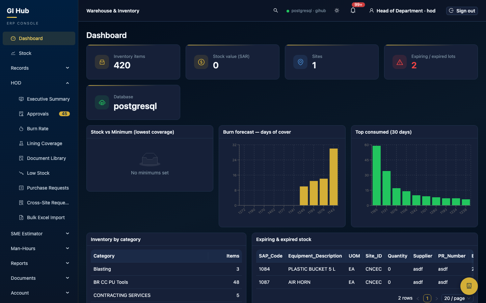
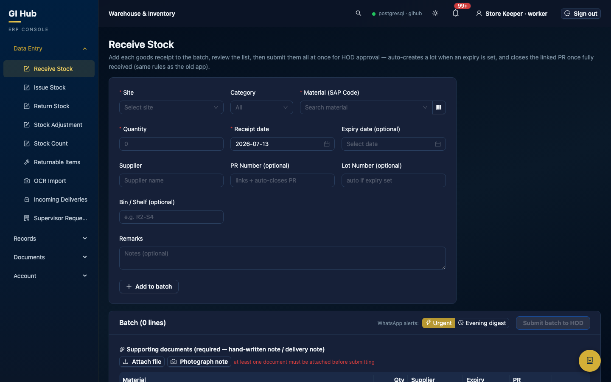
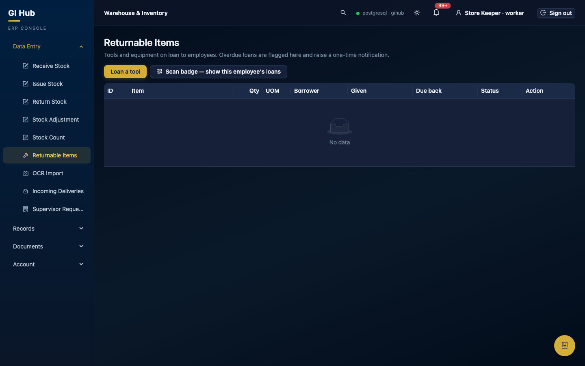
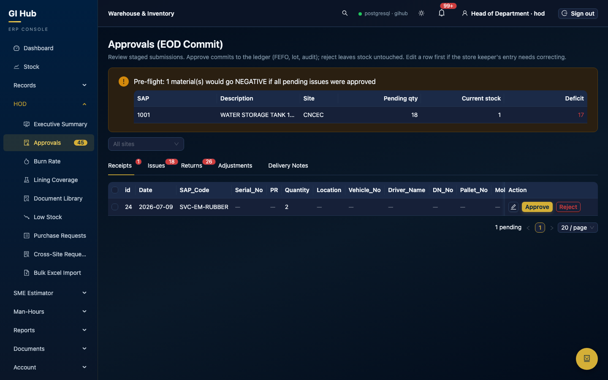
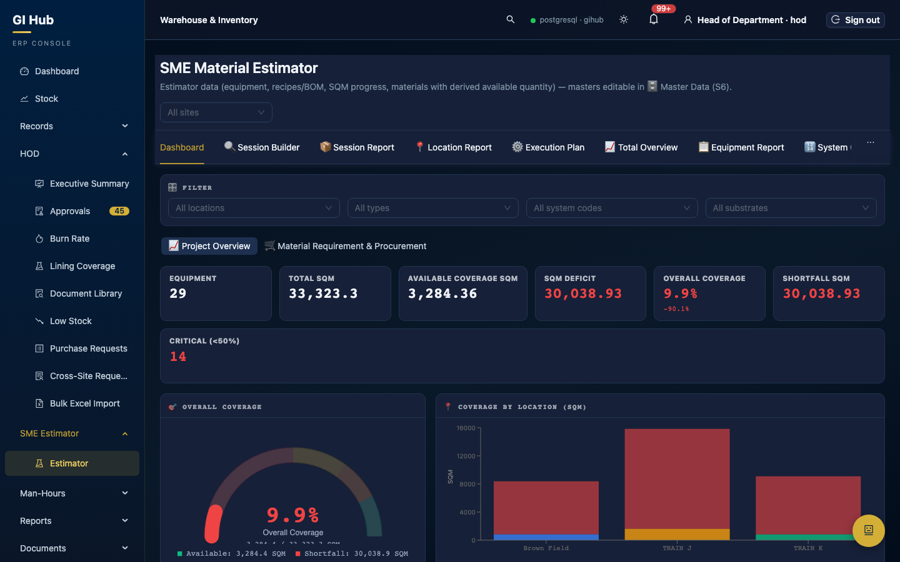
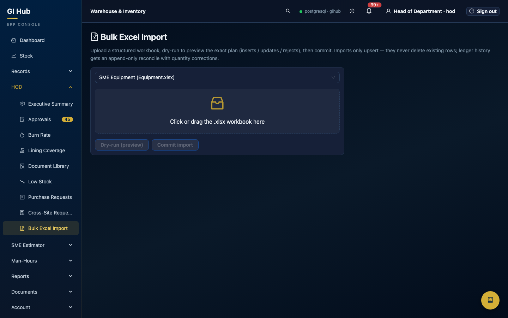
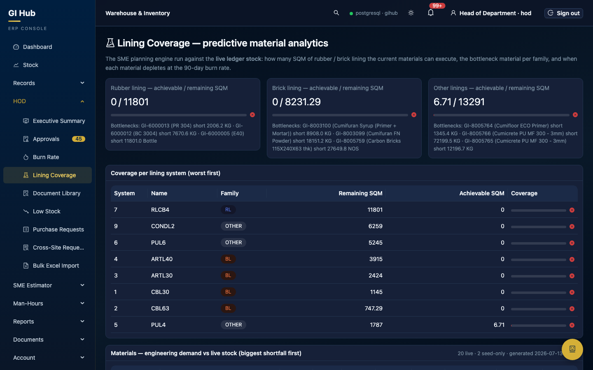
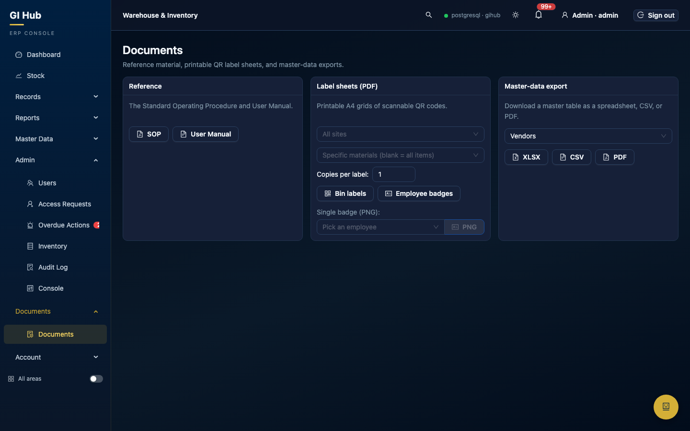

# GI Hub — User Manual (React / FastAPI stack)

> **Version 2.1 · 2026-07-18 (pre-deploy final).** This manual covers the NEW
> web application (React + FastAPI + PostgreSQL) that replaced the Streamlit app.
> It is organised by role — read §1–§2 first (everyone), then your role's
> chapter. The legacy manual for the retired Streamlit app remains at the
> repository root (`USER_MANUAL.md`) for historical reference.

**Roles at a glance**

| Role | Level | Home page | Chapter |
|---|---|---|---|
| Store Keeper (SK) | 0 | Data Entry → Issue | §3 |
| Supervisor | 1 | Supervisor → Material Requests | §7 |
| Warehouse User | 1 | Warehouse | §6 |
| Head of Department (HOD) | 2 | HOD → Approvals | §4 |
| Logistics | 3 | Logistics → Procurement | §5 |
| Admin | 4 | Admin → Console | §8 |

Admin can open every portal (an "All areas" sidebar toggle reveals the
operational ones). Every other role sees only its own pages — both in the
sidebar and at the API.

---

## 1. Getting started (everyone)

### 1.1 Signing in
Open the site (production: `https://gi.giinventory.com`), enter your
username and password. If your account has two-factor enabled you will be
asked for the 6-digit code from your authenticator app. New colleagues use
**Request access** on the login page — an admin approves the request and the
login starts working.

Sessions refresh silently in the background; you stay signed in across
reloads until you **Sign out** (top-right) or an admin revokes the session.

### 1.2 Installing the app on your phone (PWA)
The site is an installable Progressive Web App:

- **Android/Chrome:** menu ⋮ → *Add to Home screen* → *Install*.
- **iPhone/Safari:** Share □↑ → *Add to Home Screen*.

The installed app opens full-screen, keeps you signed in, and caches the
read pages for offline viewing.

### 1.3 Working offline (Store Keepers)
Read pages (stock, records, notifications) show the **last good copy** when
the connection drops. The four material-entry forms (Issue / Receive /
Return / Adjust) keep working fully offline: a submission with no network is
saved to the device's **sync queue** — you'll see an amber "saved offline"
toast and a cloud-sync badge in the header with the queued count. When the
connection returns (or you tap the badge) the queue replays automatically;
rows the server rejects are dropped and reported, so one bad row never
blocks the rest. Approvals, admin and auth actions deliberately stay
online-only.

### 1.4 Common chrome

- **Health dot** (header): green + `postgresql · gihub` = connected.
- **🔔 Bell**: every action that concerns you (approvals, rejections, DNs,
  loans, alerts) lands here; clicking a row marks it read and jumps to the
  right page. Significant events are ALSO WhatsApp'd to the concerned person.
- **⌘K / Ctrl-K**: command palette — fuzzy-search every page your role can
  open and jump to it.
- **Theme toggle**: dark ⇄ light, remembered per device.
- **Profile → phone number**: self-service change with a dual WhatsApp OTP —
  a code to your OLD number authorises the change, a second code to the NEW
  number proves it can receive messages before anything is saved. (Admins can
  override a number directly.)
- **Urgent / Evening toggle** (on the entry forms only): "Evening" batches
  your notification into the 16:00 daily digest instead of an immediate
  WhatsApp; critical alerts always go out immediately.
- **WhatsApp commands** (send to the company number): `STOCK <SAP>` returns
  the live stock of an item at your site; `RESET PASSWORD` issues a temporary
  credential and signs out all your sessions.
- **Tables**: column headers stay **frozen at the top** while you scroll long
  lists, and quantities show clean numbers — `5`, not `5.00` (real fractions
  keep their decimals).
- **Feedback** (everyone): file a 🐞 bug or ✨ feature request from the
  Feedback page — give it a short title and pick how urgent it is. You are
  notified when an admin responds; track yours in "My reports".

---

## 2. Documents, gates and the AI — concepts used everywhere

### 2.1 Supporting-document gate
While the admin setting `require_entry_documents` is ON (the production
default), every Issue / Receive / Return submission **must carry at least one
uploaded supporting document** — photograph the hand-written note or delivery
note with the 📷 *Photograph note* button, or attach a file. Uploads are
filed per site and date and appear in the HOD **Document Library** with
inline preview; approvers see a 📎 on every pending row.

Additional gates, independent of that switch:
- **MTC** — receipts of materials in the **Surface Shields** category are
  hard-blocked until an MTC certificate is uploaded (missing MTCs also email
  Logistics automatically).
- **WBS** — once the HOD configures active WBS numbers for a site, every
  Issue/Receive at that site must carry one.
- **Returns** — a return needs a **Return DN No.** and must reference the
  source receipt (last 30 days; older needs an override justification that
  shows as a red **>30d** flag in HOD approvals). Quantity is capped to the
  source receipt.

### 2.2 Reading documents with the AI (OCR doc assist)
After attaching a photo on the Issue or Receive form, press **⚡ Read (AI)**
on the attachment chip. The vision model reads the note and pre-fills what it
finds — on Receive: the date, supplier and delivery-note header (DN No.,
vehicle, driver — these ride along into the ledger); on Issue: the material,
quantity and recipient when the note has one confidently-matched row. Notes
listing many materials are better handled by **Data Entry → OCR Import**,
which stages the whole grid at once (with a Paste tab that works even when
the AI is offline). The AI never submits anything — you always review first.

### 2.3 Asking your data (HOD/Admin/Logistics)
The Dashboard's **Ask your data** card answers plain-English questions:
*"How many issues in the last 30 days?"*, *"surface shields stock"*, *"what
was received on DN 15610?"*. Common questions are answered instantly by
built-in templates (site-scoped automatically — an HOD only ever sees their
own site, whatever they type); unscoped roles (Logistics/Admin) additionally
get AI-generated SQL for free-form questions, run on a read-only database
login. The executed SQL is always shown for transparency. The templates
search DEEP: *"current stock for surface shield category items"* filters to
exactly that category, and naming a material family (*"furan materials"*,
*"remafix"*) finds the items through both the ERP descriptions and the SME
recipe names — the answer line shows which filters were applied.

### 2.4 The Hub Assistant
The floating 🤖 button opens a chat assistant that knows the user manual and
your role's pages. If the local AI is offline it says so gracefully — no
feature above stops working (paste lanes and manual entry always exist).

---

## 3. Store Keeper (SK)

Your portal is **Data Entry**. Everything you stage goes to your HOD for
approval before it touches the ledger.

### 3.1 Receive (goods in)

1. Pick the site and material — type to search, narrow by category, or press
   **Scan** and point the camera at the item's QR/barcode label.
2. Rubber items (Surface Shields) demand an **MTC upload** before the line
   can be added; the MTC number is kept with the document.
3. Quantities can be entered in the pack unit (e.g. drum) — the form shows
   the conversion and the base-unit result.
4. Attach the delivery note (📷) — then **⚡ Read (AI)** pre-fills the DN
   header and date for you (§2.2).
5. **Add to batch**, repeat for every line on the note, then **Submit batch
   to HOD**. Bin/Shelf and WBS fields appear when relevant.

### 3.2 Issue (consumption)
Same batch flow. The form shows the FEFO lot hint (oldest expiry first) —
issuing a different lot asks for a short override reason and alerts the HOD
(allowed, logged, never blocked). Over-issue beyond current stock is also
allow-and-log. `Issued To`, `Work Type`, `Tank No` feed the reports.

**Surface Shields items (lining materials) work system-first.** When your
category filter (or picked item) is Surface Shields, a **Lining System**
selector appears — pick the System Code FIRST:
1. the material picker narrows to exactly that recipe's SAP codes;
2. the system's progress shows live — **Done SQM**, **Pending SQM**, total
   and unit count for your site;
3. the batch line records the system automatically (`LS <code>` in Remarks)
   so the HOD sees which lining system consumed the material.
Trying to add a Surface Shields material *without* a selected system is
refused with a hint — this is deliberate: lining consumption is only
meaningful against a system.

### 3.3 Return / Adjust / Count sheet
Returns follow §2.1's source-receipt rules. Adjust stages a correction with a
reason; the Count sheet lets you enter counted quantities and stages the
variances in one go.

### 3.4 Returnable items (tool loans)

- **Loan a tool:** *Scan badge* identifies the borrower from their employee
  QR badge (name + phone pre-fill); *Identify tool (photo)* names the tool
  from a photo. Set the due-back time — the borrower gets a WhatsApp with the
  details, and another when the tool is marked returned.
- **Returns:** *Scan badge — show this employee's loans* filters the table to
  the person standing in front of you; **Mark returned** closes the loan.
- Overdue loans turn red, notify you once, and WhatsApp the borrower.

### 3.5 OCR Import, incoming deliveries, SK requests
- **OCR Import**: photograph a full hand-written log → review the recognised
  grid (green = matched automatically, orange = pick from candidates) → stage
  everything to HOD in one click.
  **Validate (handwritten spec)** runs the full daily-consumption-form
  rulebook over the grid: known handwriting fixes ("Yloues"→"Gloves"…),
  ditto-mark (`"`) resolution, quantity rules (`2+3` sums; a blank quantity
  next to a product means 1), the approved substitution list for
  out-of-stock items, and a whole-batch stock simulation — rows that would
  drive stock negative are **blocked** with a 🚨 marker ([?] = check,
  ⚠️ = heads-up). **TSV export** then downloads the legacy 17-column
  tab-separated file for the old Excel/VBA sheet (blocked rows are never
  exported). Struck-through rows on the paper are counted but never staged.
- **Incoming deliveries**: warehouse shipments to your site appear here —
  **Receive** stages the pending receipt for HOD approval.
- **SK requests**: supervisors' material requests (SMRs) land here — adjust
  quantities (0 = withdraw a line), approve to mirror into the HOD issue
  queue, or reject.

---

## 4. Head of Department (HOD)

### 4.1 Approvals

Tabs per entry type with live counts. Per row: **Edit** (whitelisted fields),
**Approve**, **Reject** (reason required — the SK is notified either way),
plus **bulk approve** (≤200). The 📎 button previews the supporting
documents; returns older than 30 days carry a red **>30d** tag (hover for the
justification). A banner warns when an approval would drive stock negative
(allowed, logged). The DN tab is stage 2 of warehouse deliveries (§5).

### 4.2 Executive Summary, Burn Rate, Low Stock
- **Executive Summary**: date presets, 13 sections, **Download PDF**
  (server-rendered, nothing clipped) and **Excel** (14 sheets). Admins get a
  site selector. Every Friday 17:00 the system mails admins + HODs a secure
  72-hour download link via WhatsApp automatically.
- **Burn rate**: consumption trends per site/period.
- **Low stock**: items under minimum — **Auto-draft PR** creates a purchase
  request from the shortfall in one click.

### 4.3 Purchase Requests
Create PRs (or import from a PDF), edit/rename lines while draft, **Submit to
Logistics**, download the PR PDF at any stage. Track everything under
Records → Purchase Requests.

### 4.4 Document Library & site configuration
- `/hod/documents`: every SK upload for your site — type tabs, doc-number and
  date filters, inline image/PDF preview, download.
- **WBS config** (Site config): add/close the WBS numbers that gate entries
  (§2.1).

### 4.5 SME Material Estimator

All the estimator tabs are yours: Dashboard (filters + KPI drill-downs),
Session Builder (drag priorities — numbers recompute instantly), reports,
Execution Plan, Total Overview, exports. **🗄️ Master Data (S6)** edits the
masters directly: Equipment (adding one also seeds its SQM-progress baseline;
deleting removes it), Recipes/BOM, Materials seed (live availability stays
derived from ERP movements), SQM Progress, and the Location/Type dropdowns.
The estimator and the **Lining Coverage** page (live ledger stock vs
remaining SQM, with depletion forecasts) recompute immediately after any
master-data change.

**🧮 Smart Calculator** (HOD/Admin, same SME page): pick a lining system and
type a target SQM — you get the fully segregated component list from the
recipes: per-SQM factor, **exact required quantity**, pack counts (from the
package size), and **live stock coverage** per line (green ✓ or a red
"short N" tag), each with a plain-language explanation row like
`2.5 KG/SQM × 40 SQM = 100 KG → 4 × 25 KG pack(s) · in stock: 150 ✓`.
Use it to sanity-check a job before issuing or raising a PR. Recipes are
SAP-exact since 2026-07-18 — PU systems list Comp-A/B/C/D lines separately.

### 4.6 Bulk Excel Import (HOD kinds)

`HOD → Bulk Excel Import` accepts the three SME workbooks — Equipment.xlsx,
For_1_SQM.xlsx (recipes), Materials_DetailsAvailable_Qty.xlsx — with the same
column layout as the originals. **Dry-run first** (shows exactly what would
be inserted/updated/rejected and why), then **Commit**. Imports only upsert —
nothing is ever deleted — and equipment re-imports preserve recorded
Done-SQM progress. See §9 for the format rules.

### 4.7 Man-Hours
Employee roster, timesheet import (dry-run first), SQM distribution,
estimates with auto-draft, variance + scorecard exports.

---

## 5. Logistics

- **Incoming PRs**: create POs from submitted PRs (PR → in-PO), force-close
  with a reason (24 h undo).
- **Purchase Orders**: KPI hero cards filter on click; per-line force-close;
  **Assign to warehouse** starts the delivery pipeline; manual POs and
  inline vendor creation supported; PO PDF import available.
- **DN approvals (stage 1)**: approve warehouse delivery notes onward to the
  HOD, or reject them back.
- **Vendor returns**: send goods back to a vendor (reopens the PO line) and
  close the loop.
- **Reschedules / Force-closures**: decide warehouse date-change requests;
  undo a force-close within 24 h.
- **Lining Coverage**: the same live RL/BL coverage page the HOD sees (§4.5).
- You also receive the automatic emails: missing MTCs and approved returns.

---

## 6. Warehouse

Assignments arrive from Logistics: **Acknowledge → Receive** (partial
supported) → **Prepare DN** (quantities + lots per line) → submit. The DN
passes Logistics (stage 1) then the site HOD (stage 2); **Ship** unlocks
after both approve. The destination SK receives it (§3.5), and their HOD's
approval writes the ledger. Returns-from-site are recorded with a
disposition (restock / scrap / return to vendor). You are pinned to your own
warehouse; Logistics/Admin can pick any.

---

## 7. Supervisor

**New request**: pick the worker (must be an active employee at your site),
add lines — live stock hints show availability — flag old-PPE returns, and
submit. The SK reviews (may adjust quantities), then the HOD approves the
issue. **My requests** lets you cancel while still pending; the **intent vs
actual** table shows requested vs finally-issued quantities.

---

## 8. Admin

Everything above (via "All areas") plus:

- **Users**: create (scoped roles need a site), edit, reset password/2FA,
  delete (self-delete and last-admin are blocked). **Access requests**:
  approve registrations into real logins.
- **Console**:
  - *Settings*: `require_entry_documents` (the §2.1 master switch),
    `mtc_required_category` (default **Surface Shields**), maintenance mode
    (blocks non-admin logins), thresholds.
  - *WhatsApp / Email consoles*: outbox status + retry.
  - *Lots*: quarantine ⇄ release → dispose (terminal).
  - *Sites, Sessions (revoke one/all), Backup (pg_dump), Oversight.*
  - *Feedback — the Bug Tracking Engine*: every user-filed report arrives
    with its severity. **Triage** captures the analysis, the **safety
    constraints** (what must not break) and a **rollback plan** BEFORE any
    change is attempted; the submitter is notified on every status change.
    **📋 Prompt** copies a self-contained implementation brief (the report +
    your triage + the project's mandatory test gates) ready to paste into a
    maintainer's coding session — the portal itself never changes code, so
    filing and triaging reports can never destabilise the system. *Export
    open reports* downloads a Markdown digest for batch analysis.
- **Bulk Excel Import (admin kinds)**: the full CNCEC inventory workbook —
  the **Inventory master** sheet (upsert on SAP; categories are canonicalised
  so the MTC gate keeps matching) and the **Ledger backfill** (Receipt /
  Consumption / Return Log sheets; append-only with automatic duplicate
  matching and quantity corrections — it never deletes ledger history).
  Always dry-run first; §9 has the rules.
- **Audit log**: filterable, append-only record of every write.
- **Reports**: every report card in xlsx/pdf/csv, schedules (create / toggle
  / run-now), archive. The Friday executive PDF runs itself (§4.2).
  

- **Documents**: SOP + manual downloads, **QR label sheets** (pick specific
  materials and copies per label), **employee badge sheets**, and
  **single-badge PNG** downloads for new hires.

---

## 9. Excel bulk import — format rules

All kinds: `.xlsx` only, ≤8 MB, header names as in the original workbooks
(a title banner row above the header is fine). **Dry-run first, always** —
the commit applies exactly the previewed plan, and every commit is audited.

| Kind (who) | Sheet | Key | Behaviour |
|---|---|---|---|
| Inventory master (admin) | `Inventory` | `SAP CODE` | Upsert of master fields (description, UOM, category, opening stock, minimum). Aggregate columns (Receipt/…/Current Stock) are ignored — stock is always ledger-derived. "Surface Shield" is canonicalised to "Surface Shields". A Material_Code already owned by another SAP is only reassigned when that owner is re-mapped in the same file; otherwise the row imports without it (warning). |
| Ledger backfill (admin) | `Receipt Log`, `Consumption Log`, `Return Log` | date + SAP + qty + DN/ref | Append-only reconcile: exact rows are matched (never duplicated); the same day+SAP+DN with a different quantity is treated as a workbook correction and updated; rows for unknown SAPs are rejected; database rows missing from the workbook are reported but never deleted. |
| SME Equipment (HOD) | `Data Input` | site + tag + code | Area-split rows are summed per (tag, code); tag-less civil areas use their Name as identity; non-numeric lining codes are skipped; re-imports re-baseline Original-SQM but preserve Done-SQM. |
| SME Recipes (HOD) | first sheet | code + material + **SAP** | With the `SAP_Code` column (2026-07-18 layout) a line's identity is (code, material, SAP) — PU component lines (Comp-A/B/C/D) sharing one material stay separate, and a repeated identity is a deliberate coat line whose For-1-SQM values **sum**. Legacy files without the SAP column keep the old first-wins rule. Comma-separated material cells still split into one line per material. |
| SME Materials (HOD) | first sheet | `Material_Code` | Multiple PO lines per code are aggregated (quantities summed, latest document date wins); with the `SAP_Code` column the distinct variant SAPs are recorded per material. |

Columns are matched **by header name** — reordering or adding columns in a
workbook is safe; anything unrecognised is listed in a dry-run warning
instead of being silently dropped.

---

## 10. Troubleshooting quick answers

| Symptom | Answer |
|---|---|
| "supporting document…" error on submit | Attach the note first (§2.1) — or the admin has the gate ON on purpose. |
| Receive blocked with an MTC message | The item is Surface Shields — upload the MTC certificate on the line. |
| "WBS Number required" | Your HOD configured active WBS numbers — pick one from the select. |
| Amber "saved offline" toast | No network; the entry is queued and will sync automatically (§1.3). |
| AI buttons say offline/unavailable | The local model is down — paste lanes and manual entry always work. |
| 429 "try again in Ns" toast | Rate limit hit — the countdown tells you exactly when to retry. |
| Stock looks wrong | Stock = receipts − consumption − returns (approved rows only). Check pending approvals first, then Records. |

*Maintained with the code: update this manual in the same commit as any
user-facing change. The role-based PDF slices served in-app are generated
from the legacy manual until the doc pipeline is repointed post-deploy.*
